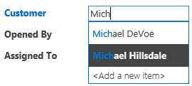

# How to: Create and customize a web app in Access

 **Last modified:** September 17, 2015

 _ **Applies to:** Access 2013 | Access 2016_

 **In this article**
[Introduction](#ac15_CreateAndCustomizeWebApp_Introduction)
[Prerequisites for building an app with Access 2013 ](#ac15_CreateAndCustomizeWebApp_Prerequisites)
[Create the app](#ac15_CreateAndCustomizeWebApp_CreateTheApp)
[Explore the app](#ac15_CreateAndCustomizeWebApp_ExploreTheApp)
[Customize the app](#ac15_CreateAndCustomizeWebApp_CustomizeTheApp)
[Conclusion](#ac15_CreateAndCustomizeWebApp_Conclusion)
[Additional resources](#ac15_CreateAndCustomizeWebApp_AdditionalResources)

## Introduction

Access 2013 features a new application model that enables subject matter experts to quickly create web-based applications. Included with Access are a set of templates that you can use to jump start creating your application.

## Prerequisites for building an app with Access 2013

To follow the steps in this example, you need the following:

- Access 2013
    
- A SharePoint 2013 development environment
    
For more information about setting up your SharePoint development environment, see [Set up a general development environment for SharePoint 2013](http://msdn.microsoft.com/library/08e4e4e1-d960-43fa-85df-f3c279ed6927%28Office.15%29.aspx). 

For more information about obtaining Access 2013 and SharePoint 2013, see [Downloads](http://msdn.microsoft.com/en-US/office/apps/fp123627).

## Create the app

Suppose you want to create an Access app that tracks issues for your business. Before you start creating the tables and view from scratch, you should search for a schema template that meets your needs.

### To create the issue tracking app

1. Open Access and choose  **Custom web app**.
    
2. Enter a name and the web location for your app. You can also choose a location from the  **Locations** list and choose **Create**.
    
3. Type  **Issues** into the **What would you like to track?** box and then press ENTER.
    
    A list of templates that might be useful for tracking issues is displayed in Figure 1.
    

    **Figure 1. Templates that match the search for issues**

    

4. Choose  **Issues**.
    
Access creates a set of tables and views.

## Explore the app

To understand whether the schema and views meet your needs, you should examine them.

The tables created by selecting the Issues schema are displayed in the Tile Pane. The Issues, Customer, and Employees tables are the main focus of the app. The Issues table stores information about each issue. Each issue is opened by and assigned to an employee on behalf of a customer. The Related Issues and Issue Comments tables play a supporting role in the app. The Related Issues table enables you to link one issue to another. The Issue Comments table stores multiple comments for a single issue.

In an Access desktop (.accdb) database, the relationships between tables are managed in the  **Relationships** window. Access 2013 apps manage relationships by using fields set to the **Lookup** data type. Let's examine the relationships for the Issues table by right-clicking the **Issues** tile and selecting **Edit Table**.

The  **Customer** field is related to the **Customers** table. To examine the relationship, select the **Customer** field and then select **Modify Lookups**. The  **Lookup Wizard** is displayed, as shown in Figure 2.

**Figure 2. Lookup Wizard displaying the relationship to the Customers table**

The Lookup Wizard dialog box shows that the  **Customer** field is linked to the **Customers** table and to return the **Display Name First Last** field from the **Customers** table.

The  **Opened By**, **Assigned To**, and **Changed By** fields are related to the **Employees** table. Several other fields are also set to the **Lookup** data type. In these cases, the Lookup data type is used to specify the specific values to allow for in the field.

Close the  **Issues** table and examine the Tile Pane. The top three tiles, for the **Issues**, **Customers**, and **Employees** tables, are displayed differently than the bottom two tiles for the **Related Issues** and **Issue Comments** table, as shown in Figure 3.

**Figure 3. Tile Pane for the Issues schema**

The  **Related Issues** and **Issue Comments** tables are dimmed because they are to be hidden from the user in the web browser.

Let's use the app to track some issues. To do this, click  **Launch App** to open the app in your web browser.

The app opens the  **Issues List** view of the Issues table. Before adding an issue, it would be a good idea to add some customers and employees. Click the **Customers** tile to start adding customers.

Use the View Selector to choose one of three views available for the  **Customers** table, labeled **List**,  **Datasheet**, and  **Groups** as shown in Figure 4.

**Figure 4. View Selector**

Choosing  **List** activates the **Customers List** view, which is a List Details view. List Details is one of the views Access automatically generates when you create a table. The main feature that distinguishes a List Details view is the list pane that appears on the left side of the view. The list pane is used to filter and navigate the records contained in the view. In an Access desktop database, implementing a searchable list view would require writing custom code.

Choosing  **Datasheet** opens the **Customers Datasheet** view. Datasheet is the other kind of view Access automatically generates when you create a table. Datasheet views are useful for those who find it easier to enter, sort, and filter data in a spreadsheet-like manner.

Choosing Groups opens a Summary view. Summary views can be used to group records based on a field and optionally calculate a sum or average.

As you're adding customers, use the Action Bar to add records, edit records, save records, delete records, and cancel edits. The Action Bar is a customizable toolbar that appears at the top of each view, as shown in Figure 5.

**Figure 5. Action Bar**

Once you've added some customers and employees open the Issues List view and start adding an issue. As you type the name of a customer into the into the Customer box, one or more of the customer names will appear, as shown in Figure 6.

**Figure 6. AutoComplete control**

The Customer box is an AutoComplete control. The AutoComplete control displays a list of records that match what you're typing into the box. This helps ensure the accuracy of data entry.

## Customize the app

Now that you've taken a tour of the app, you notice that the Issues List view doesn't contain contact information for the customer. Let's customize the app to add the customer's work phone to the Issues table as the issue is being created.

### To add a field to the Issues table

1. Open the app in Access.
    
2. Choose the  **Issues** tile, choose the **Settings/Action** icon, and then choose **Edit Table**.
    
3. Enter  **Contact Number** in the first blank cell in the **Field Name** column.
    
4. Choose  **Short Text** in the **Data Type** column.
    
5. Choose  **Save**.
    
6. Close the Issues table.
    
Now that we have field in which to store the phone number, let's create a data macro to look up the contact information.

### To create the data macro to look up contact information

1. In the  **Create** group, choose **Advanced**, and then choose  **Data Macro**.
    
2. Choose  **Create Parameter**.
    
3. In the  **Name** box, enter **CustID**. In the **Type** dropdown, choose **Number (Floating Decimal).**
    
4. From the  **Add New Action** dropdown, choose **LookupRecord**.
    
5. In the  **Look Up A Record In** dropdown, choose **Customers**.
    
6. In the  **Where Condition** box, enter **[Customers].[ID]=[CustID]**.
    
7. Choose  **SetReturnVar** from the **Add New Action** dropdown.
    
     **Note**  You'll see two  **Add New Action** dropdowns, one within the **LookupRecord** block, and another outside the **LookupRecord** block. You should choose the **Add New Action** dropdown within the **LookupRecord** block, as shown in Figure 7.

    **Figure 7. Add New Action dropdown**

    

8. In the  **Name** box, enter **ContactPhone**.
    
9. In the  **Expression** box, enter **[Customers].[Work Phone]**.
    
10. Choose  **Save**. Enter  **GetContactPhone** in the **Macro Name** box and then choose **OK**.
    
    The macro should resemble the macro shown in Figure 8.
    

    **Figure 8. GetContactPhone data macro**

    

11. Close macro Design View.
    
Now we're ready to add the  **Contact Number** field to the Issues List form.

### To add the Contact Number field to the Issues List form

1. Choose the  **Issues** table. This chooses the Issues list form.
    
2. In the View selector, choose  **List**, choose the **Settings/Action** icon, and then choose **Edit**.
    
3. Drag the  **Contact Number** field form the **Field List** pane to the location on the form where you want the contact number to be displayed.
    
4. Choose the  **Contact Number** text box, and then click **Data**. 
    
5. In the  **Control Name** box, enter **CustomerContact** and then close the **Data** popup.
    
6. Choose  **Save**.
    
Now we should write a user interface (UI) macro that copies the  **Work Phone** field from the **Customers** table into the **Contact Phone** field of the **Issues** table. The **After Update** event of the **CustomerAutocomplete** control is a good location for the macro.

### To create the AfterUpdate macro

1. Choose the  **CustomerAutocomplete** control, choose the **Actions** button, and then choose **After Update**. 
    
    A blank macro is opened in macro Design View.
    
2. From the  **Add New Action** dropdown, choose **RunDataMacro**.
    
3. In the  **Macro Name** dropdown, choose **GetContactPhone**.
    
4. In the  **CustID** box, enter **[CustomerAutocomplete]**.
    
5. In the  **SetLocalVar** box, enter **Phone**.
    
    When you chose the GetContactPhone data macro that was created earlier, Access automatically filled in the parameter name and return variable for the macro.
    
    The phone number for the customer is stored in a variable named Phone.
    
6. From the  **Add New Action** dropdown, choose **SetProperty**.
    
7. In the  **Control Name** box, enter **CustomerContact**.
    
8. In the  **Property** dropdown, choose **Value**.
    
9. In the  **Value** box, enter **=[Phone]**.
    
10. Choose  **Save**.
    
    The macro should resemble the macro shown in Figure 9.
    

    **Figure 9. After Update macro**

    

11. Close macro Design View.
    
12. Close the Issues List view. Choose  **Yes** when you are prompted to save your changes.
    
Now we're ready to text the customization. Click  **Launch App** to open the app in your web browser and then add a new issue. The Contact Number bosx will update automatically after the customer name is entered as shown in Figure 10.

**Figure 10. Issues view updated with phone number**

## Conclusion

Using one of the schema templates included with is a good way to jump start the creation of an Access web app. The views that are automatically created for you contain advanced functionally that requires custom code to implement in a Access desktop database. 

## Additional resources

[New in Access for developers](http://msdn.microsoft.com/library/df778f51-d65e-4c30-b618-65003ceb39b3%28Office.15%29.aspx)

[Access custom web app reference](8d696fa4-a6f2-4fb1-8662-a313bf0b5989.md)

