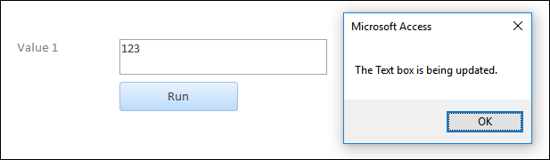

# TextBox Object (Access)

This object represents a text box control on a form or report.
Text boxes are used to either display data from a record source, or to display the results of a calculation, or to accept input from a user.

## Example

The following code example uses a form with a text box to receive user input.
The code displays a message when the user inputs data and then presses Return.
   
```vb
Private Sub txtValue1_BeforeUpdate(Cancel As Integer)

MsgBox "The Text box is being updated."

End Sub
```



## Remarks

Text boxes can be either bound or unbound.
You use a bound text box to display data from a particular field.
You use an unbound text box to display the results of a calculation, or to accept input from a user (as in the code example above). 

## See also

#### Other resources


[Access Object Model Reference](http://msdn.microsoft.com/library/2de134a4-6c5c-d2a3-8377-f4dd973ba650%28Office.15%29.aspx)

[TextBox Object Members](bb55abbc-902e-fc2d-bdff-063c55426cd0.md)
