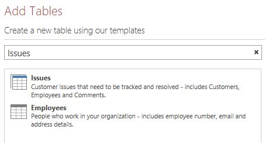

# How to: Filter a view by using a macro in an Access app
Learn how to filter a view in an Access app by using the RequeryRecords macro action and a data macro.

 **Last modified:** September 17, 2015

 _ **Applies to:** Access 2013 | Access 2016_

 **In this article**
[Introduction](#Access2013FilterViewByUsingMacro_Introduction)
[Prerequisites for building an app with Access](#Access2013FilterViewByUsingMacro_Prerequisites)
[Create the app](#Access2013FilterViewByUsingMacro_CreateApp)
[Plan the customizations](#Access2013FilterViewByUsingMacro_PlanCustomizations)
[Customize the app](#Access2013FilterViewByUsingMacro_CustomizeApp)
[Conclusion](#Access2013FilterViewByUsingMacro_Conclusion)
[Additional resources](#bk_addresources)


## Introduction
<a name="Access2013FilterViewByUsingMacro_Introduction"> </a>

The default list view in an Access app enables you to filter the issues on values that are contained in the fields. There may be instances where you'd like to filter a view based on a set of conditions instead of by matching a value. To do that you must create a macro. This article shows you how to create a macro that filter a view to display tasks that are past due or due in the next 7 days.


## Prerequisites for building an app with Access
<a name="Access2013FilterViewByUsingMacro_Prerequisites"> </a>

To follow the steps in this example, you need:


- Access 2013
    
- A SharePoint 2013 development environment
    

 **Note**  


## Create the app
<a name="Access2013FilterViewByUsingMacro_CreateApp"> </a>

Suppose you want to create an Access app that tracks tasks for your business. Before you start creating the tables and view, you should search for a schema template.


### To create the task tracking app


1. Open Access and choose  **Custom web app**.
    
2. Enter a name and the web location for your app. You can also choose a location from the  **Locations** list and choose **Create**.
    
3. Type  **tasks** into the **Search** box and then press ENTER.
    
    A list of templates that might be useful for tracking tasks is displayed in Figure 1.
    

    **Figure 1. Templates that match the search for tasks**

    

4. Choose  **Tasks**.
    
Access creates a set of tables and views.

Enter several sample tasks and employees in your app. To do this, choose  **Launch App** to open the app in your web browser. Enter a value in the **Due Date** field for each task. Return to Access when you're done.


## Plan the customizations
<a name="Access2013FilterViewByUsingMacro_PlanCustomizations"> </a>

You now have an app that contains several tasks. The default view enables you to search for any tasks using items that are stored in the fields displayed in the view. For example, you can search for high-priority issues or issues in progress. Suppose you want to prioritize your work by displaying active issues that are due in the coming week. To do this, you should create a user interface (UI) macro.

The UI macro command that you can use to filter the view is the [RequeryRecords Macro Action (Access custom web app)](1dab102f-24af-4984-8020-a9fb06355639.md). The  **RequeryRecords** macro action filters the view based on the _Where_ argument, which is provided in the form of a SQL WHERE clause. To filter the view, you must supply several facts in a specific format to filter the view.

The relevant facts are:


- The field or fields to compare
    
- How to refer to today's date
    
- How to refer to a particular day relative to today's date
    
- How to determine which on tasks are in progress
    
The  **Due Date** field provides information about when a task is due. The **Status** field provides status information about each task. To refer to a field in a macro, use the format **[ _TableName_ ].[ _FieldName_ ].** Use **[Tasks].[Due Date]** to refer to the **Due Date** field and **[Tasks].[Status]** to refer to the **Status** field.

The [Today Function (Access custom web app)](8dbcb871-e133-4c98-91bd-b3a00b93bc0b.md) function returns today's date. The[DateAdd Function (Access custom web app)](7174c585-86e1-42a3-bb7f-d6641001b0f2.md) function can be used to calculate a date that's a certain number of days after a specified date.

The  **Status** field contains several possible values. A value of **Completed** indicates that the task is no longer active.

These facts can be combined into the following SQL WHERE clause.


```sql
[Tasks].[Due Date]<DateAdd(Day,7,Today()) AND [Tasks].[Status]<>"Completed"
```

This SQL WHERE clause is used in the macro to filter the view to display active issues that are due in the next 7 days or are past due.

To run the UI macro, it must be attached to an item or an event that occurs in the view. The  **Action Bar** is a convenient place to add a custom command to the view. The **Action Bar** is a customizable toolbar that appears at the top of each view. By default, the **Action Bar** contains buttons to add, edit, save, delete, and cancel edits. You can add buttons that perform custom actions, such as filtering the view.

If the view contains records that meet the specified criteria, then  **RequeryRecords** filters the view. However, if the view doesn't contain any records that meet the criteria, than a new, blank record is displayed. If you don't want a blank record to be displayed if no tasks are due in the next week, then you must find a method to check the tasks before you call the **RequeryRecords** macro action. To do this, create a data macro to check for records that meet the criteria.

The UI macro will call the data macro, which will try to find a task that's due in the next week. If the data macro finds the task then customize the app.


## Customize the app
<a name="Access2013FilterViewByUsingMacro_CustomizeApp"> </a>

Now that you've determined the customizations, implement them. The data macro should be created first. Some data macros are attached directly to tables. However, this data macro is a stand-alone data macro.


### To create the data macro


1. Open the app in Access.
    
2. In the  **Create** group, choose **Advanced**, and then choose  **Data Macro**.
    
    A blank data macro is opened in macro Design View.
    
3. From the  **Add New Action** list box, choose **LookupRecord**.
    
4. In the  **Look Up A Record In** list box, choose **Tasks**.
    
5. In the  **Where Condition** box, enter **[Tasks].[Due Date]<DateAdd(Day,7,Today()) AND [Tasks].[Status]<>"Completed"**.
    
6. Choose  **SetReturnVar** from the **Add New Action** list box.
    
     **Note**  You'll see two  **Add New Action** list boxes, one within the **LookupRecord** block, and another outside the **LookupRecord** block. You should choose the **Add New Action** list box within the **LookupRecord** block, as shown in Figure 1.

    **Figure 1. Add New Action list box**

    

7. In the  **Name** box, enter **TaskFound**.
    
8. In the  **Expression** box, enter **"Yes"**.
    
9. Choose  **Save**. Enter  **TasksDueSoon** in the **Macro Name** box and then choose **OK**.
    
    The macro should resemble the macro shown in Figure 2.
    

    **Figure 2. TasksDueSoon data macro**

    

10. Close macro Design View.
    
Now, we're ready to add a custom button to the Action Bar.


### To add a custom button to the Action Bar


1. Choose the  **Tasks** table. This chooses the Tasks List form.
    
2. In the View selector, choose  **List**, choose the **Settings/Action** icon, and then choose **Edit**.
    
    The view is opened in Design View.
    
3. Now, we're ready to add a custom button to the Action Bar. To do this, choose  **Add custom action** as shown in Figure 3.
    
    **Figure 3. Add custom action button**

    
    The new action is displayed as a button with a star icon as shown in Figure 4.
    

    **Figure 4. New Action Bar button**

    

4. Choose the custom Action Bar Button, and then choose the  **Data** icon.
    
    The  **Data** dialog box appears.
    
5. In the  **Control Name** box, enter **FilterTasks**.
    
6. In the  **Tooltip** box, enter **Display tasks past due or due in the next week**.
    
Now, we're ready to create the UI macro that will filter the view.


### To create the UI macro to filter the view


1. In the  **Data** dialog box, choose **On Click** as shown in Figure 5.
    
    **Figure 5. Data dialog box**

    
    A blank UI macro is opened in macro Design View.
    
2. From the  **Add New Action** list box, choose **RunDataMacro**.
    
3. In the Macro Name box, enter  **TasksDueSoon**.
    
    In the  **SetLocalVar** box, enter **FilterRecords**.
    
    The  **RunDataMacro** action calls the **TasksDueSoon** data macro we created earlier and stores its result in a variable named **FilterRecords**.
    
4. From the  **Add New Action** list box, choose **If**.
    
5. In the  **If** box, enter **[FilterRecords]="Yes"**.
    
6. From the  **Add New Action** list box, choose **RequeryRecords**.
    
     **Note**  You'll see two  **Add New Action** list boxes, one within the **If** block, and another outside the **If** block. You should choose the **Add New Action** list box within the **If** block, as shown in Figure 6.

    **Figure 6. Add New Action list box**

    

7. In the  **Where** box, enter **[Tasks].[Due Date]<DateAdd(Day,7,Today()) AND [Tasks].[Status]<>"Completed"**.
    
8. In the  **Order By** box, enter **[Due Date]**.
    
9. Choose the  **Add Else** link that appears to the right side of the **Add New Action** box as shown in Figure 7.
    
    **Figure 7. Add Else link**

    
    An Else clause is added to the If block.
    
10. From the  **Add New Action** list box, choose **MessageBox**.
    
11. In the  **Message** box, enter **No tasks are overdue or due in the next 7 days!**.
    
12. Choose  **Save**.
    
    The macro should resemble the macro shown in Figure 8.
    

    **Figure 8. UI macro to filter the view**

    

13. Close macro Design View.
    
At this point, we've created the UI macro that filters the Tasks List view to display the urgent tasks. It wouldn't be polite to leave the view in a filtered state without providing a method to remove the filter. To do this, add another Action Bar button and UI Macro.


### To add an Action Bar Button to remove the filter


1. Choose  **Add custom action**.
    
    The new action is displayed as a button with a star icon
    
2. Choose the custom Action Bar button, and then choose the  **Data** icon.
    
    The  **Data** dialog box appears.
    
3. In the  **Control Name** box, enter **RemoveFilter**.
    
4. In the  **Tooltip** box, enter **Remove all filter applied to the view**.
    
Now, we're ready to create the UI macro that will remove the filter form the view.


### To create the UI macro to remove the filter from the view


1. In the  **Data** dialog box, choose **On Click**.
    
    A blank UI macro is opened in macro Design View.
    
2. From the  **Add New Action** list box, choose **RequeryRecords**.
    
    This time, we'll leave the  **Where** and **Order By** boxes empty. Then the **RequeryRecords** action is called without any parameters, all filters are removed from the view.
    
3. Choose  **Save**.
    
4. Close macro Design View.
    
5. Close the Tasks List view. Choose  **Yes** when you are prompted to save your changes.
    
Now, we're ready to text the customization. Choose  **Launch App** to open the app in your web browser and then choose the custom FilterTasks Action Bar button. Any tasks past due or due in the next 7 days are displayed. A message is displayed if the app contains no urgent tasks.


## Conclusion
<a name="Access2013FilterViewByUsingMacro_Conclusion"> </a>

You can use the  **RequeryRecords** macro action in a UI macro to filter the view based on the criteria that you choose. Depending on the behavior that you want, you may want to create a data macro to verify that a record meets the criteria before you use the **RequeryRecords** macro action.


## Additional resources
<a name="bk_addresources"> </a>


- [New in Access for developers](http://msdn.microsoft.com/library/df778f51-d65e-4c30-b618-65003ceb39b3%28Office.15%29.aspx)
    
