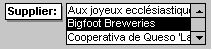

# ListBox Object (Access)

This object corresponds to a list box control. The list box control displays a list of values or alternatives.


## Remarks

In many cases, it's quicker and easier to select a value from a list than to remember a value to type. A list of choices also helps ensure that the value that's entered in a field is correct.


|||
|:-----|:-----|
|**Control**:|**Tool**:|
|||

 **Note**  The list in a list box consists of rows of data. Rows can have one or more columns, which can appear with or without headings.


If a multiple-column list box is bound, Microsoft Access stores the values from one of the columns.

You can use an unbound list box to store a value that you can use with another control. For example, you could use an unbound list box to limit the values in another list box or in a custom dialog box. You could also use an unbound list box to find a record based on the value you select in the list box.

If you don't have room on your form to display a list box, or if you want to be able to type new values as well as select values from a list, use a combo box instead of a list box.

 **Links provided by:**
 The[UtterAccess](http://www.utteraccess.com) community


- [Create a Query that uses a Multi-select Listbox as Criteria](http://www.utteraccess.com/forum/Creating-Query-Multi-t414388.html)
    
- [ListBox Picker](http://www.utteraccess.com/forum/ListBox-Picker-t426483.html)
    
- [Move/Change Order of List Box Items with Up/Down Buttons](http://www.utteraccess.com/wiki/index.php/List_Box:_Reorder_Items)
    
- [Populate a Listbox with Files from a Directory](http://www.utteraccess.com/forum/Populate-Listbox-Files-t1209291.html)
    

## Example

This example demonstrates how to filter the contents of a list box while you are typing in a text box.

In this example, a list box named ColorID displays a list of colors stored in the Colors table. As you type in the FilterBy text box, the items in ColorID are filtered dynamically

To do this, use the Change event of the text box to build a SQL statement that will serve as the new RowSource of the list box.

 **Sample code provided by:**
 The [UtterAccess](http://www.utteraccess.com) community


```
Private Sub FilterBy_Change()

    Dim sql As String
    
    'This will match any entry in the list that begins with what the user 
    'has typed in the FilterBy control
    sql = "SELECT ColorID, ColorName FROM Colors WHERE ColorName Like '" &amp; Me.FilterBy.Text &amp; "*' ORDER BY ColorName"
    
    'If you want to match any part of the string then add wildcard (*) before
    'the FilterBy.Text, too:
    'sql = "SELECT ColorID, ColorName FROM Colors WHERE ColorName Like '*" &amp; Me.FilterBy.Text &amp; "*' ORDER BY ColorName"
    
    Me.ColorID.RowSource = sql
    
End Sub
```


## Events


|**Name**|
|:-----|
|[AfterUpdate](http://msdn.microsoft.com/library/b95d98c8-0899-c555-14b4-d8e853b5dce3%28Office.15%29.aspx)|
|[BeforeUpdate](http://msdn.microsoft.com/library/2a0c1046-4d40-87f8-7ecc-4ef262ae90f0%28Office.15%29.aspx)|
|[Click](http://msdn.microsoft.com/library/92e2a86b-c21d-9ca2-099f-b3f254940791%28Office.15%29.aspx)|
|[DblClick](http://msdn.microsoft.com/library/fe1b9c61-012e-96b7-ea89-8a8c4b47f483%28Office.15%29.aspx)|
|[Enter](http://msdn.microsoft.com/library/58f29589-8754-2323-c044-09dbea35fd83%28Office.15%29.aspx)|
|[Exit](http://msdn.microsoft.com/library/6a95f727-673a-0f8f-fc61-435398c35195%28Office.15%29.aspx)|
|[GotFocus](http://msdn.microsoft.com/library/b451f0a6-7017-124f-44e3-7f64b9a049ef%28Office.15%29.aspx)|
|[KeyDown](http://msdn.microsoft.com/library/5f1c019a-0a21-d640-d872-e2775ced3c43%28Office.15%29.aspx)|
|[KeyPress](http://msdn.microsoft.com/library/1112052d-c5b4-75fd-b76e-79c247910201%28Office.15%29.aspx)|
|[KeyUp](http://msdn.microsoft.com/library/2e4d0bed-8c2c-967d-e7b4-dc9de12ad570%28Office.15%29.aspx)|
|[LostFocus](http://msdn.microsoft.com/library/075bb519-5f53-88b2-f46a-b2c5eb067150%28Office.15%29.aspx)|
|[MouseDown](http://msdn.microsoft.com/library/bc55d5f4-b475-2f7d-2434-a5d71bada0f3%28Office.15%29.aspx)|
|[MouseMove](http://msdn.microsoft.com/library/f54e529c-0b5e-73ea-286f-3430057bb86c%28Office.15%29.aspx)|
|[MouseUp](http://msdn.microsoft.com/library/8d2d5ca3-e93f-9021-341c-769948432d2a%28Office.15%29.aspx)|

## Methods


|**Name**|
|:-----|
|[AddItem](http://msdn.microsoft.com/library/dab0c3e4-8ecc-774b-4c7e-f973eb4c1516%28Office.15%29.aspx)|
|[Move](http://msdn.microsoft.com/library/a16304f5-891c-b80c-80b3-1f75692cb30f%28Office.15%29.aspx)|
|[RemoveItem](http://msdn.microsoft.com/library/5a2f010b-9888-9aff-fee1-1e9e596464e8%28Office.15%29.aspx)|
|[Requery](http://msdn.microsoft.com/library/8daf0608-a2ce-75c3-2601-4071f6f498a5%28Office.15%29.aspx)|
|[SetFocus](http://msdn.microsoft.com/library/a8d0c774-095c-34f5-7905-f67c48886832%28Office.15%29.aspx)|
|[SizeToFit](http://msdn.microsoft.com/library/0b74f6d0-d33d-368c-d991-2b219072eae2%28Office.15%29.aspx)|
|[Undo](http://msdn.microsoft.com/library/ec3947ec-69f2-ec23-ef25-1a9b50e1f901%28Office.15%29.aspx)|

## Properties


|**Name**|
|:-----|
|[AddColon](http://msdn.microsoft.com/library/f1abcc52-671a-c187-071e-e16e4588f57d%28Office.15%29.aspx)|
|[AfterUpdate](http://msdn.microsoft.com/library/b71e1b7a-6893-505b-6de8-b877190c76d6%28Office.15%29.aspx)|
|[AllowValueListEdits](http://msdn.microsoft.com/library/cab2ec6f-affb-5111-af5e-6f3638189dff%28Office.15%29.aspx)|
|[Application](http://msdn.microsoft.com/library/de3a7634-a31b-0455-3807-eb1163eb052d%28Office.15%29.aspx)|
|[AutoLabel](http://msdn.microsoft.com/library/f5e6e01e-55be-21f8-339b-bb546eaf0151%28Office.15%29.aspx)|
|[BackColor](http://msdn.microsoft.com/library/85d7d802-76d3-0a4f-debc-51dda0f81910%28Office.15%29.aspx)|
|[BackShade](http://msdn.microsoft.com/library/6608aa85-9301-1c3f-fbac-825010ade03e%28Office.15%29.aspx)|
|[BackThemeColorIndex](http://msdn.microsoft.com/library/d738236a-d635-7ef6-7626-71494a4811fc%28Office.15%29.aspx)|
|[BackTint](http://msdn.microsoft.com/library/822bb0ff-5439-8150-5c3d-1738160ae654%28Office.15%29.aspx)|
|[BeforeUpdate](http://msdn.microsoft.com/library/b7e75906-839b-2518-bc02-a313cbd8c232%28Office.15%29.aspx)|
|[BorderColor](http://msdn.microsoft.com/library/552b81f2-a811-7582-4e60-0c4903da7a9b%28Office.15%29.aspx)|
|[BorderShade](http://msdn.microsoft.com/library/f44dc9fc-344f-35a9-4293-44db0e1ac6df%28Office.15%29.aspx)|
|[BorderStyle](http://msdn.microsoft.com/library/6b57a863-b521-0cd3-933d-bb50f25ece19%28Office.15%29.aspx)|
|[BorderThemeColorIndex](http://msdn.microsoft.com/library/3dac9a1c-4a8b-1b01-9937-6dc8e5018fb5%28Office.15%29.aspx)|
|[BorderTint](http://msdn.microsoft.com/library/76bcaf37-6c2c-a3cf-6126-effbe218ba11%28Office.15%29.aspx)|
|[BorderWidth](http://msdn.microsoft.com/library/3e0ddff1-7e60-5fbd-7680-6d9da7baead8%28Office.15%29.aspx)|
|[BottomPadding](http://msdn.microsoft.com/library/80de2112-a66c-9d53-0d17-54ca2ff90a98%28Office.15%29.aspx)|
|[BoundColumn](http://msdn.microsoft.com/library/f6a742a4-40ff-bb83-8946-7e8bb71e5690%28Office.15%29.aspx)|
|[Column](http://msdn.microsoft.com/library/d393326a-4114-9ec2-fcfe-1ce74003e86c%28Office.15%29.aspx)|
|[ColumnCount](http://msdn.microsoft.com/library/a1712119-2afe-f389-ff68-ed6aa1f7dde4%28Office.15%29.aspx)|
|[ColumnHeads](http://msdn.microsoft.com/library/cd779d07-d35b-03b2-df3a-7934615675d0%28Office.15%29.aspx)|
|[ColumnHidden](http://msdn.microsoft.com/library/54d9c895-3f65-6d13-2b47-93e541a6c1d4%28Office.15%29.aspx)|
|[ColumnOrder](http://msdn.microsoft.com/library/846b745a-0818-a312-dc60-774dce7ec059%28Office.15%29.aspx)|
|[ColumnWidth](http://msdn.microsoft.com/library/759b1c74-77f0-8ee1-7fc9-8268104a207e%28Office.15%29.aspx)|
|[ColumnWidths](http://msdn.microsoft.com/library/4ac2a001-8084-37aa-9f8e-ec3d373f7161%28Office.15%29.aspx)|
|[Controls](http://msdn.microsoft.com/library/16356c09-4509-c774-1fd6-9ba5b330eaa5%28Office.15%29.aspx)|
|[ControlSource](http://msdn.microsoft.com/library/3122f8ec-d7d6-18b2-5a68-2c175d2b0d85%28Office.15%29.aspx)|
|[ControlTipText](http://msdn.microsoft.com/library/27abccf5-e3f2-2c0c-06ee-4160eb447374%28Office.15%29.aspx)|
|[ControlType](http://msdn.microsoft.com/library/3002d198-961a-69d4-58b5-c0b096747232%28Office.15%29.aspx)|
|[DefaultValue](http://msdn.microsoft.com/library/dd8104db-7d24-2b1f-aac7-bc17f7b9002b%28Office.15%29.aspx)|
|[DisplayWhen](http://msdn.microsoft.com/library/d8a82522-97db-1b8d-2089-6e808be7889f%28Office.15%29.aspx)|
|[Enabled](http://msdn.microsoft.com/library/f6e95fea-f038-e190-ee8c-1ab088e27828%28Office.15%29.aspx)|
|[EventProcPrefix](http://msdn.microsoft.com/library/28f4d70b-8206-2481-9b83-c1bbc2767b82%28Office.15%29.aspx)|
|[FontBold](http://msdn.microsoft.com/library/b1060b7d-36ca-3048-a046-90e9bdf8f402%28Office.15%29.aspx)|
|[FontItalic](http://msdn.microsoft.com/library/0d7b2ec0-70a9-e325-2ff3-58f73d9654b3%28Office.15%29.aspx)|
|[FontName](http://msdn.microsoft.com/library/9bcab0c1-7a13-2b1a-91c1-56f784451bdf%28Office.15%29.aspx)|
|[FontSize](http://msdn.microsoft.com/library/4abc5ab0-8d34-1f87-6e23-706e4d3c9e88%28Office.15%29.aspx)|
|[FontUnderline](http://msdn.microsoft.com/library/1b89f608-9d05-015c-b7a5-8f7f9e3ec271%28Office.15%29.aspx)|
|[FontWeight](http://msdn.microsoft.com/library/7c5ea418-3b2d-9ec9-3418-250d1496903c%28Office.15%29.aspx)|
|[ForeColor](http://msdn.microsoft.com/library/bbc345ab-fd78-3e30-b2d6-d0a43291f576%28Office.15%29.aspx)|
|[ForeShade](http://msdn.microsoft.com/library/4917e73f-595e-7286-adc0-05d3a9e44b34%28Office.15%29.aspx)|
|[ForeThemeColorIndex](http://msdn.microsoft.com/library/9338e883-4a8d-c2b9-e4ea-dc654dd86f40%28Office.15%29.aspx)|
|[ForeTint](http://msdn.microsoft.com/library/3d2d2e77-5819-673b-8e9c-d2d94d06a1bd%28Office.15%29.aspx)|
|[GridlineColor](http://msdn.microsoft.com/library/296db594-3edc-e32f-c4c1-d854b4f9a922%28Office.15%29.aspx)|
|[GridlineShade](http://msdn.microsoft.com/library/261c89f0-e1d8-41a0-6d8b-97332a6a01db%28Office.15%29.aspx)|
|[GridlineStyleBottom](http://msdn.microsoft.com/library/1a47a068-aedb-b60e-dbda-42a7f569a099%28Office.15%29.aspx)|
|[GridlineStyleLeft](http://msdn.microsoft.com/library/c9b37e7e-653f-68fd-40b0-6f601b91fa86%28Office.15%29.aspx)|
|[GridlineStyleRight](http://msdn.microsoft.com/library/5169d8a9-9263-a30f-bb00-da2b6b4ee130%28Office.15%29.aspx)|
|[GridlineStyleTop](http://msdn.microsoft.com/library/d4da57f4-f67b-5759-0e52-bd61b2ce9d18%28Office.15%29.aspx)|
|[GridlineThemeColorIndex](http://msdn.microsoft.com/library/62339876-c58b-6636-5a3d-1fadee6a5c3c%28Office.15%29.aspx)|
|[GridlineTint](http://msdn.microsoft.com/library/409eec01-384c-742c-f1d4-59a54fbaa4d6%28Office.15%29.aspx)|
|[GridlineWidthBottom](http://msdn.microsoft.com/library/bf5457cf-a762-2f12-7468-0372aedbe9b1%28Office.15%29.aspx)|
|[GridlineWidthLeft](http://msdn.microsoft.com/library/61276c61-f39a-b094-99a4-0118cab9b08a%28Office.15%29.aspx)|
|[GridlineWidthRight](http://msdn.microsoft.com/library/a795a6d9-e881-94a5-f7b8-d7df63166403%28Office.15%29.aspx)|
|[GridlineWidthTop](http://msdn.microsoft.com/library/bef39115-4e27-f291-3ae5-d9eab3a04ace%28Office.15%29.aspx)|
|[Height](http://msdn.microsoft.com/library/b8ef3b9c-58bc-e30c-b754-3a3cf574c840%28Office.15%29.aspx)|
|[HelpContextId](http://msdn.microsoft.com/library/df459501-09ff-cdae-4903-526d62e1c05b%28Office.15%29.aspx)|
|[HideDuplicates](http://msdn.microsoft.com/library/a67c6d19-3064-9909-1242-a764b8732cde%28Office.15%29.aspx)|
|[HorizontalAnchor](http://msdn.microsoft.com/library/f21376e7-55e3-03a2-4687-f02ee5b40a18%28Office.15%29.aspx)|
|[Hyperlink](http://msdn.microsoft.com/library/fa85ede7-5845-cde8-c945-6a68beff196c%28Office.15%29.aspx)|
|[IMEHold](http://msdn.microsoft.com/library/22d6bd7c-704b-2b27-6b04-c6628cd83f02%28Office.15%29.aspx)|
|[IMEMode](http://msdn.microsoft.com/library/82f9dc6e-7132-d98c-7c5f-6ed2f0b1e552%28Office.15%29.aspx)|
|[IMESentenceMode](http://msdn.microsoft.com/library/877e1766-c378-cf7b-b452-bb8f536980f3%28Office.15%29.aspx)|
|[InheritValueList](http://msdn.microsoft.com/library/7b5e0af5-4648-ff09-04a6-25b050dc1861%28Office.15%29.aspx)|
|[InSelection](http://msdn.microsoft.com/library/4c0d3434-752e-c96e-32ce-78a29d4da1e7%28Office.15%29.aspx)|
|[IsVisible](http://msdn.microsoft.com/library/6105ef5f-5c92-c7c0-748d-3d8a1efb9050%28Office.15%29.aspx)|
|[ItemData](http://msdn.microsoft.com/library/a0c1ab24-089e-6279-96dc-ef490096d06a%28Office.15%29.aspx)|
|[ItemsSelected](http://msdn.microsoft.com/library/c2403562-00c4-12ec-4d31-9b83d081cb4d%28Office.15%29.aspx)|
|[LabelAlign](http://msdn.microsoft.com/library/b3fa2e58-3390-57cf-88c8-b346c77cf488%28Office.15%29.aspx)|
|[LabelX](http://msdn.microsoft.com/library/12335d2b-92e1-185b-df3e-db1e9002f757%28Office.15%29.aspx)|
|[LabelY](http://msdn.microsoft.com/library/79a1486b-4f51-fabd-e56e-51cb2868c0c2%28Office.15%29.aspx)|
|[Layout](http://msdn.microsoft.com/library/18453d2c-d719-1433-124e-2e05e3009cd1%28Office.15%29.aspx)|
|[LayoutID](http://msdn.microsoft.com/library/0926d2c9-dc23-76ac-29a2-07a800f5fba3%28Office.15%29.aspx)|
|[Left](http://msdn.microsoft.com/library/3272daef-8241-3305-4623-abfcb6aaffdb%28Office.15%29.aspx)|
|[LeftPadding](http://msdn.microsoft.com/library/63a94bd3-7929-c204-3612-080bbb5869bc%28Office.15%29.aspx)|
|[ListCount](http://msdn.microsoft.com/library/09383f86-888e-1708-9e05-504c49eeb5a6%28Office.15%29.aspx)|
|[ListIndex](http://msdn.microsoft.com/library/4d75f753-f6a9-d362-7281-2c0460f4272b%28Office.15%29.aspx)|
|[ListItemsEditForm](http://msdn.microsoft.com/library/f744fc52-4c50-f740-7a2f-eeccb12de7c9%28Office.15%29.aspx)|
|[Locked](http://msdn.microsoft.com/library/b820438b-1ebf-780f-9fe9-e51d90bbf326%28Office.15%29.aspx)|
|[MultiSelect](http://msdn.microsoft.com/library/7115a913-1696-03b4-c88b-0626da1d587a%28Office.15%29.aspx)|
|[Name](http://msdn.microsoft.com/library/86162898-8107-c6c8-7249-463ff4312671%28Office.15%29.aspx)|
|[NumeralShapes](http://msdn.microsoft.com/library/b89bf0e9-7cd2-0676-ca07-0d813cd175e9%28Office.15%29.aspx)|
|[OldBorderStyle](http://msdn.microsoft.com/library/4da79825-91df-d731-ec39-c1d304972077%28Office.15%29.aspx)|
|[OldValue](http://msdn.microsoft.com/library/53b18c22-b86e-9b99-8480-08b1f2ddd620%28Office.15%29.aspx)|
|[OnClick](http://msdn.microsoft.com/library/1afb8ebd-c22b-1978-1eb4-a18d75f7f6c0%28Office.15%29.aspx)|
|[OnDblClick](http://msdn.microsoft.com/library/4271eff9-1d13-209a-9d7b-965893e36f59%28Office.15%29.aspx)|
|[OnEnter](http://msdn.microsoft.com/library/390d7350-3a93-d9f8-e377-f83102e8b5f1%28Office.15%29.aspx)|
|[OnExit](http://msdn.microsoft.com/library/87ac5b4f-85d0-7edb-28d6-253f44496946%28Office.15%29.aspx)|
|[OnGotFocus](http://msdn.microsoft.com/library/ded32fef-1821-5288-9265-c1e1f4819efe%28Office.15%29.aspx)|
|[OnKeyDown](http://msdn.microsoft.com/library/f1136953-16b3-9628-9411-b13b143725d0%28Office.15%29.aspx)|
|[OnKeyPress](http://msdn.microsoft.com/library/f7d0c300-d3dc-78e3-0e2d-825bd7088ad7%28Office.15%29.aspx)|
|[OnKeyUp](http://msdn.microsoft.com/library/efc5b93f-ddbc-4fc0-2c2e-6a3fd13b2b97%28Office.15%29.aspx)|
|[OnLostFocus](http://msdn.microsoft.com/library/ce4b1917-c986-3059-69cb-830345c5f25a%28Office.15%29.aspx)|
|[OnMouseDown](http://msdn.microsoft.com/library/2290e2ef-956a-4178-0de5-03fb8b7470aa%28Office.15%29.aspx)|
|[OnMouseMove](http://msdn.microsoft.com/library/2a173ef5-4c63-98e1-aa24-dbb106fcc8cd%28Office.15%29.aspx)|
|[OnMouseUp](http://msdn.microsoft.com/library/a0f93909-a3d6-255f-6c9d-77259155741b%28Office.15%29.aspx)|
|[Parent](http://msdn.microsoft.com/library/c588debe-db0f-46a0-a2f4-ff86e4eddc75%28Office.15%29.aspx)|
|[Properties](http://msdn.microsoft.com/library/ff0caafd-dc7c-21fc-a3d2-f6caf63899be%28Office.15%29.aspx)|
|[ReadingOrder](http://msdn.microsoft.com/library/9af8afab-e253-01d4-f79c-01bfa9d8e60b%28Office.15%29.aspx)|
|[Recordset](http://msdn.microsoft.com/library/ead14d35-eb76-6487-ac9e-329b5d38366c%28Office.15%29.aspx)|
|[RightPadding](http://msdn.microsoft.com/library/aacb7180-a9f3-9450-dd2f-35f21768a9c7%28Office.15%29.aspx)|
|[RowSource](http://msdn.microsoft.com/library/7f6c8b99-36b2-3bd3-af8f-f93d67d20f39%28Office.15%29.aspx)|
|[RowSourceType](http://msdn.microsoft.com/library/a98a44d4-b2a5-d591-9295-3222d708ee88%28Office.15%29.aspx)|
|[ScrollBarAlign](http://msdn.microsoft.com/library/6eb9b2d1-e306-5980-7ad0-ff0b9c1cd0c6%28Office.15%29.aspx)|
|[Section](http://msdn.microsoft.com/library/297d3e45-8072-e31b-5462-badf2027ebe5%28Office.15%29.aspx)|
|[Selected](http://msdn.microsoft.com/library/db30f166-c82b-2a77-6feb-bf03810fc36d%28Office.15%29.aspx)|
|[ShortcutMenuBar](http://msdn.microsoft.com/library/5da48eb8-b4ce-a3e5-323b-18f1ec76e00c%28Office.15%29.aspx)|
|[ShowOnlyRowSourceValues](http://msdn.microsoft.com/library/35fc7924-ba76-d322-99ae-f5e355536bc0%28Office.15%29.aspx)|
|[SmartTags](http://msdn.microsoft.com/library/1f35ca6b-fde1-6dc8-4b1b-f3089eee9204%28Office.15%29.aspx)|
|[SpecialEffect](http://msdn.microsoft.com/library/7cd56728-559d-ffd8-8230-fa570c4633e9%28Office.15%29.aspx)|
|[StatusBarText](http://msdn.microsoft.com/library/281baa24-d32f-72fe-a57d-201ce4bd8777%28Office.15%29.aspx)|
|[TabIndex](http://msdn.microsoft.com/library/50db3c8f-5bc6-d663-3e07-7014f80188b5%28Office.15%29.aspx)|
|[TabStop](http://msdn.microsoft.com/library/0581f18a-7d23-2836-0959-88f84dc1a4ad%28Office.15%29.aspx)|
|[Tag](http://msdn.microsoft.com/library/85ee226a-3f66-820d-e90c-3e47ddb8d2d4%28Office.15%29.aspx)|
|[ThemeFontIndex](http://msdn.microsoft.com/library/7fa3a5ef-c59b-8ce5-1d7f-6b00991dc12b%28Office.15%29.aspx)|
|[Top](http://msdn.microsoft.com/library/1b1606ca-01df-1c5b-5865-51dc257d62c0%28Office.15%29.aspx)|
|[TopPadding](http://msdn.microsoft.com/library/b453cfc4-d059-395a-7c62-ae07f12e1677%28Office.15%29.aspx)|
|[ValidationRule](http://msdn.microsoft.com/library/d3a605d6-cb17-fc4a-0e01-72a21416f980%28Office.15%29.aspx)|
|[ValidationText](http://msdn.microsoft.com/library/be52194b-be06-9a85-30f6-718211038213%28Office.15%29.aspx)|
|[Value](http://msdn.microsoft.com/library/4427ed24-3255-13a2-5b42-6a3d93ed76a9%28Office.15%29.aspx)|
|[VerticalAnchor](http://msdn.microsoft.com/library/2c38763c-5b90-9219-8a3b-3bfef035a9bb%28Office.15%29.aspx)|
|[Visible](http://msdn.microsoft.com/library/76361c20-b6b4-6d75-e732-2e63b2c8485e%28Office.15%29.aspx)|
|[Width](http://msdn.microsoft.com/library/3c57661f-34a3-c8d7-c8ca-076bf73610b0%28Office.15%29.aspx)|

## About the Contributors
<a name="AboutContributors"> </a>

UtterAccess is the premier Microsoft Access wiki and help forum. Click here to join. 


## See also
<a name="AboutContributors"> </a>


#### Concepts


[Access Object Model Reference](object-model-access-vba-reference.md)

