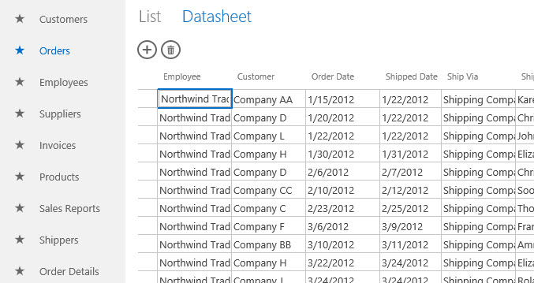
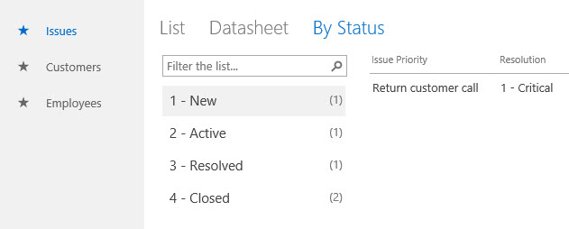
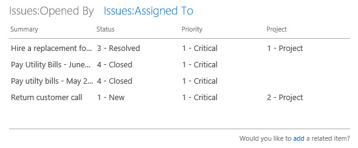

# New in Access for developers
Learn about the features in Access 2013 that make it easy to create, deploy, and manage collaborative web-based applications on premise or in the cloud.

  

**Applies to:** Access 2013 | Access 2016

 **In this article** 
[Introduction](#ac15_WhatsNew_Introduction) 
[New application model](#ac15_WhatsNew_NewAppModel) 
[Views](#ac15_WhatsNew_Views) 
[Programmability in Access apps](#ac15_WhatsNew_Programmability) 
[Publishing your Access app](#ac15_WhatsNew_PublishApp) 
[Conclusion](#ac15_WhatsNew_Conclusion) 
[Additional Resources](#ac15_WhatsNew_AdditionalResources2) 

## Introduction

Access 2013 features a new application model that is designed for one purpose―to simplify web development much like earlier versions of Access with Windows development. Access 2013 enables subject matter experts to quickly create an application that can be used to run their business. By using Microsoft SharePoint 2013 to host the front end of the app and Microsoft SQL Server 2012 as its data storage technology, Access 2013 significantly improves the manageability and scalability of Access applications. Compatibility with Office 365 and SQL Azure significantly expand the reach of Access applications.

## New application model

In an on-premise environment, Access 2013 apps are hosted by SharePoint 2013 while the data is stored in SQL Server 2012. SharePoint 2013 provides authentication, authorization, and security for Access 2013 apps. The back-end tables, views, macros, and queries are stored in a SQL Server 2012 database. The following figure provides an overview of Access 2013 architecture: 

 
When a new Access application is created, Access Services in SharePoint Server 2013 creates a new Application database that stores the data, view, queries and macros contained in the app. The Access Services 2013 System database can be configured to create new Application databases on a separate SQL Server 2012 server.

Using SQL Server 2012 to store data provides manageability and scalability previously unknown to Access applications. Gone are the days when an Access application would have to be redesigned and reimplemented in a more powerful environment.

An Access 2013 app is online the moment it's created. You can decide to share the app with other users, deploy to the private corporate catalog, or deploy to the Office Store.

## Views

Views (known as  _"forms"_ in Access desktop databases) provide the means by which users will interact with your Access app. Views in Access 2013 apps contain a common set of user interface elements that enable rapid creation of new apps.

Access 2013 is designed to enable you to create functional views with little intervention. When you create a new table, Access automatically creates two views. The folloiwng figure shows a new table with the automatically-created views:

 
Views are organized by the tables they're bound to in the Tile Pane. By default, each table is represented by a tile in the Tile Pane. The folloiwng figure shows the Orders table selected in the Tile Pane:

 
You can rearrange the tables in the Tile Pane. You can change the name displayed on a tile, which doesn't rename its underlying table. However, deleting the tile deletes the table.

You can hide tiles that you don't want to be displayed in the web browser. When you hide a tile, you can still edit the underlying table and views in Access. Although the user can't access the views of hidden tiles directly, you can use the  **ChangeView** or **OpenPopup** macro actions to display a view associated with a hidden tile. The following figure shows that the Related Issues and Issue Comments tiles have been hidden:

 
Once a tile is selected, the View Selector opens the particular view that you want to work with. The following figure shows that the Orders Datasheet view is selected:

 
You can remove the default views and add custom views to any tile.

### View Types

There are four kinds of views that you can create in yourAccess 2013 app: List Details, Datasheet, Summary, and Blank.

List Details is one of the views Access automatically generates when you create a table. The main feature that distinguishes a list view is the list pane that appears on the left side of the view. The list pane is used to filter and navigate the records contained in the view.

The list pane can display up to three items from each record by setting its  **Primary**, **Secondary**, and **Thumbnail** properties. The following figure shows that the list pane in the Employees List view is configured to display the **FullName** and **Job Title** fields.

 
The search box, located at the top of the list pane, filters the view by searching all values in the view.

Datasheet is the other kind of view Access automatically generates when you create a table. Datasheet views are useful for those who find it easier to enter, sort, and filter data in a spreadsheet-like manner. The following figure shows that the Orders Datasheet view is filtered to display the orders that have not yet shipped:

 
Summary views can be used to group records based on a field and optionally calculate a sum or average. The field to group by displays its values in a list view. When a group is selected, the record contained in the group is displayed in a related items control. The related items control can be configured to display up to four fields that have information about the record. A popup view can be specified if you want to drill down on the item. The following figure shows the  **Issues By Status** view, a Summary view that groups the **Issues** table by the **Status** field:

 
Blank views are, as you might expect, blank when you create them. Blank views are useful for creating popup view that will contain a single record when you open it. Alternatively, you could use a Blank view to create a custom switchboard for the user to navigate your app.

### Customizing a view

The Access 2013 view designer doesn't provide the pixel-perfect approach offered when you design forms in client databases. The view and its controls in Access 2013 apps support a smaller set of controls, properties and events.

The view designer is laid out as a table grid. As you add, move, and resize a control on a view, it snaps to the invisible grid. To configure a control property, select the control. One or more icons are displayed next to the control. Selecting an icon displays a popup that contains a category of properties. Access displays only the properties that are relevant in the current context. The following figure shows the  **Data** properties for the **ProjectComboBox** control.

 
When bound to a data source, List Detail, Datasheet, and Blank views contain an Action Bar. The Action Bar is a customizable toolbar that appears at the top of each view. By default, the Action Bar contains buttons to add, edit, save, delete, and cancel edits. You can add buttons that perform custom actions. You can also delete the default buttons, or hide the Action Bar altogether.

### New controls

Access 2013 apps support two controls that are new to Access; the AutoComplete control and the Related Items control.

The AutoComplete control displays a list of records that match what you're typing into the box. The following figure shows an AutoComplete control bound to a list of employees.
 
As you type, the AutoComplete control displays up to eight matching records. The AutoComplete control is a good alternative to the Combo Box control when the list of items is long.

The Related Items control displays a set of records from tables related to the view's underlying table. The following figure shows a related items control on a view. The control is configured to have two tabs. The first tab displays issues opened by the selected employee. The second tab displays issues assigned to the selected employee.

 
To edit the items in a Related Items tab, you must assign a view to its  **Popup view** property. The specified view will open in a popup window when you choose an item.

## Programmability in Access apps

Programmability in Access 2013 apps is provided by a custom macro language authored in the Access client. There are two kinds of macros, user interface (UI) macros and data macros. UI macros can perform actions that affect the user interface of your app, whereas data macros can work directly with the records contained in the app.

### User Interface macros

UI macros let you perform actions such as opening another view, applying a filter, or creating a new record. "Embedded" UI macros are attached directly to user interface objects such as command buttons, combo boxes, or the Action Bar button object, whereas "standalone" UI macros are contained in macro objects.

The following table lists the events that you can attach a UI macro to in a control or view.

 **TEvents supported in UI macros**

|**Event Type**|**When it occurs**|
|:-----|:-----|
|After Update|Occurs after you type data into a control or choose data from a control.|
|On Click|Occurs when a control is selected.|
|On Current|Occurs when the user moves to a different record in the view.|
|On Load|Occurs when a view is opened.|

The following table lists the events supported by each control.

 **Events supported by each control**

|**Control or object type**|**Supported events**|
|:-----|:-----|
|Action Bar Button|On Click|
|AutoComplete|After Update, On Click|
|Button|On Click|
|Check Box|After Update|
|Combo Box|After Update|
|Hyperlink|After Update, On Click|
|Image|On Click|
|Label|On Click|
|Multiline Textbox|After Update, On Click|
|Text Box|After Update, On Click|
|View|On Current, On Load|
Reuse standalone UI macros by calling them from other macros, helping you avoid duplicate code. Standalone UI macros are visible in the Navigation Pane, under  **Macros**. However, you can't run them directly from the Navigation Pane. Use the  **RunMacro** action to run a standalone UI macro from an embedded UI macro.

### Data macros
Data macros provide a method for implementing business rules at the data layer. Unlike UI macros, data macros can create, edit, and delete records.

"Embedded" data macros are attached to a table event. "Standalone" data macros are contained in macro objects.

The following table lists the events that you can attach a data macro to in a table.
**Table 3. Events supported in data macros**
|**Event type**|**When it occurs**|
|:-----|:-----|
|On Insert|Occurs after a new record is added to the table.|
|On Update|Occurs after an existing record is changed.|
|On Delete|Occurs after a record is deleted|
The following figure shows a data macro embedded in the  **On Update** event of the Issues table. The data macro verifies that a resolution is selected when an issue is resolved or closed.

 
If no resolution is selected, the **RaiseError** macro action is used to display an error message to the user and the record is not saved.

Standalone data macros can be called from UI macros and data macros by using the **RunDataMacro** action. Standalone data macros can contain one or more parameters. In the data macro, use the **SetReturnVar** action to set a return value that the calling macro can use to determine what to do next.

## Publishing your Access app

Access 2013 provides the ability for users to discover solutions directly from a private corporate catalog on SharePoint 2013 or the Office Store hosted on Office.com. The Office Store provides a convenient location for developers to upload new Access web apps aimed at both consumers and businesses. As a developer, when you upload your app to the Office Store, Microsoft runs some validation checks on it. If all tests are passed, the app package is wrapped into a file and signed by Microsoft.

## Conclusion

Access 2013 introduces a new application model that enables subject matter experts to quickly create and share applications that can be used to run their business. A new interactive view designer makes it easy for users who have little or no programming experience to build apps. By using SharePoint 2013 to host the app and SQL Server 2012 to store data, Access apps are more manageable and scalable than ever. Compatibility with Office 365 and SQL Azure significantly expand the reach of Access apps.

## See also

[Create and customize a web app in Access](http://msdn.microsoft.com/library/628745f4-82e9-4838-9726-6f3e506a654f%28Office.15%29.aspx)

[What's new for Office 2013 developers](http://msdn.microsoft.com/library/d76ae308-555e-4147-8900-956d3eb8ba23%28Office.15%29.aspx)

 **More Access support resources** 
[Access for developers forum on MSDN](https://social.msdn.microsoft.com/Forums/office/en-US/home?forum=accessdev) 
[Access help on support.office.com](https://support.office.com/search/results?query=Access) 
[Access help on answers.microsoft.com](http://answers.microsoft.com/en-us/office/forum/access?page=1&;tab=question&;status=all&;auth=1) 
[Search for specific Access error codes on Bing](http://www.bing.com/) 
[Access forums on UtterAccess](http://www.utteraccess.com/forum/index.php?act=idx) 
[Access wiki on UtterAcess](http://www.utteraccess.com/forum/index.php?act=idx) 
[Access developer and VBA programming help center (FMS)](http://www.fmsinc.com/MicrosoftAccess/developer/) 
[Access posts on StackOverflow](http://stackoverflow.com/questions/tagged/ms-access)

