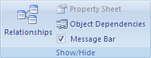
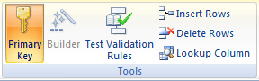

# The changes you requested to the table were not successful because they would create duplicate values in the index, primary key, or relationship. (Error 3022)

  

**Applies to:** Access 2013 | Access 2016

 **In this article**
[What Is a Primary Key?](#sectionSection0)
[What Is an Index?](#sectionSection1)
[Solution](#sectionSection2)
[To remove the primary key](#sectionSection3)

You tried to duplicate a value in a field that is the underlying table's primary key or an index that does not allow duplicates.

## What Is a Primary Key?

A primary key is a field or set of fields in your table that provide Microsoft Access with a unique identifier for every row. In a relational database, such as an Access database, you divide your information into separate, subject-based tables. You then use table relationships and primary keys to tell Access how to bring the information back together again. Access uses primary key fields to quickly associate data from multiple tables and combine that data in a meaningful way.

Often, a unique identification number, such as an ID number or a serial number or code, serves as a primary key in a table. For example, you might have a Customers table where each customer has a unique customer ID number. The customer ID field is the primary key.

An example of a poor choice for a primary key would be a name or address. Both contain information that might change over time.

Access ensures that every record has a value in the primary key field, and that the value is always unique.

## What Is an Index?

You can use an index to help Access find and sort records faster. An index stores the location of records based on the field or fields that you choose to index. After Access obtains the location from the index, it can then retrieve the data by moving directly to the correct location. In this way, using an index can be considerably faster than scanning through all of the records to find the data.

If you create a unique index, Access does not allow you to enter a new value in the field if that value already exists in the same field in another record. Access automatically creates a unique index for primary keys.

## Solution

To solve the problem, you must design your tables to eliminate the possibility of entering duplicate values in a primary key field or a field that uses a unique index.

If the current primary key field needs to support duplicate values, you should remove the current primary key and add an AutoNumber field to your table to act as its primary key. 

## To remove the primary key

When you remove the primary key, the field or fields that previously served as primary key no longer provide the primary means of identifying a record. However, removing the primary key does not delete the field or fields from your table, Rather, it removes the primary key designation from those fields. Removing the primary key also removes the index that was created for the primary key.

1. Before you can remove a primary key, you must ensure that it does not participate in any table relationships. If you try to remove a primary key for which relationships exist, Access warns you that you must delete the relationship first.
    
2. 
      - If the tables that participate in the table relationship are open, close them. You cannot delete a table relationship between open tables.
    
  - On the  **Database Tools** tab, in the **Show/Hide** group, click **Relationships**.

    
  - If the tables that participate in the table relationship are not visible, on the  **Design** tab, in the **Relationships** group, click **Show Table**. Then select the tables to add in the  **Show Table** dialog box, click **Add**, and then click  **Close**.
    
  - Click the table relationship line for the table relationship that you want to delete (the line becomes bold when it is selected), and then press the DELETE key.
    
  - On the  **Design** tab, in the **Relationships** group, click **Close**.

    
3. In the Navigation Pane, right click the table in which you want to remove the primary key and then click  **Design View**.
    
4. Click the row selector for the current primary key.
    
5. 
      - If the primary key consists of a single field, click the row selector for that field.
    
  - If the primary key consists of multiple fields, click the row selector for any field in the primary key.
    
6. On the  **Design** tab, in the **Tools** group, click **Primary Key**.
The key indicator is removed from the field or fields that you previously specified as the primary key.
    
 **ACCESS SUPPORT RESOURCES** 
[Access for developers forum on MSDN](https://social.msdn.microsoft.com/Forums/office/en-US/home?forum=accessdev) 
[Access help on support.office.com](https://support.office.com/search/results?query=Access) 
[Access help on answers.microsoft.com](http://answers.microsoft.com/en-us/office/forum/access?page=1&;tab=question&;status=all&;auth=1) 
[Search for specific Access error codes on Bing](http://www.bing.com/) 
[Access forums on UtterAccess](http://www.utteraccess.com/forum/index.php?act=idx) 
[Access wiki on UtterAcess](http://www.utteraccess.com/forum/index.php?act=idx) 
[Access developer and VBA programming help center (FMS)](http://www.fmsinc.com/MicrosoftAccess/developer/) 
[Access posts on StackOverflow](http://stackoverflow.com/questions/tagged/ms-access)

