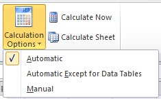
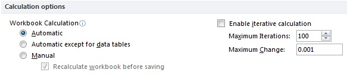
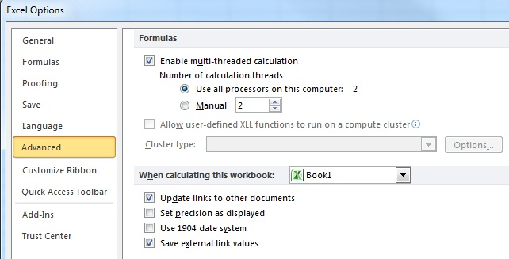
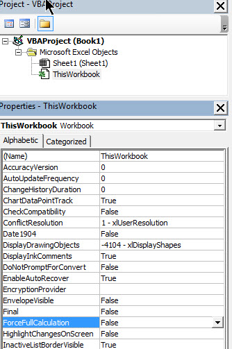
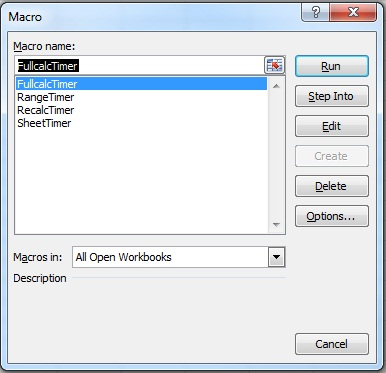
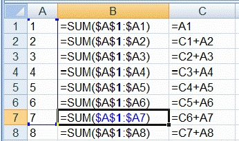
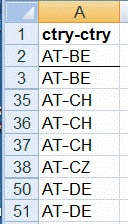

# Excel Performance: Improving Calculation Performance

 **Summary:** This article discusses how to improve workbook performance by focusing on calculation improvements. This article is one of three companion articles about techniques that you can use to improve performance in Excel as you design and create worksheets.For more information about how to improve performance in Excel, see  [Excel Performance: Performance and Limit Improvements](excel-performance-and-limit-improvements.md) and [Excel Performance: Tips for Optimizing Performance Obstructions](excel-tips-for-optimizing-performance-obstructions.md).

**Applies to:** Excel | Excel 2013 | Excel 2016 | VBA

**In this article**

[Overview](#ExcelPerf_Overview)

[The Importance of Calculation Speed](#ExcelPerf_WhyCalculationSpeedImportant)

[Understanding Calculation Methods in Excel](#ExcelPerf_UnderstandingCalculationMethodsExcel)

[Calculating Workbooks, Worksheets, and Ranges](#ExcelPerf_CalculatingWorkbooksWorksheetsRanges)

[Controlling Calculation Options](#ExcelPerf_ControllingCalculationOptions)

[Making Workbooks Calculate Faster](#ExcelPerf_MakingWorkbooksCalculateFaster)

[Finding and Prioritizing Calculation Obstructions](#ExcelPerf_FindingPrioritizingCalculationBottlenecks)

[Conclusion](#Excelperf_Conclusion)


[Additional Resources](#Excelperf_AdditionalResources)


## Overview
<a name="ExcelPerf_Overview"> </a>

The "Big Grid" of 1 million rows and 16,000 columns in Microsoft Office Excel,  together with many other limit increases, greatly increases the size of worksheets that you can build compared to earlier versions of Excel. A single worksheet in Excel can now contain over 1,000 times as many cells as earlier versions.
  
    
    
In earlier versions of Excel, many people created slow-calculating worksheets, and larger worksheets usually calculate more slowly than smaller ones. With the introduction of the "Big Grid" in Excel 2007, performance really matters. Slow calculation and data manipulation tasks like sorting and filtering make it more difficult for users to concentrate on the task at hand, and lack of concentration increases errors.
  
    
    
 Recent Excel versions introduced several features to help you handle this capacity increase, such as the ability to use more than one processor at a time for calculations and common data set operations like refresh, sorting, and opening workbooks. Multi-threaded calculation can substantially reduce worksheet calculation time. However, the most important factor that influences Excel calculation speed is still the way your worksheet is designed and built.
  
    
    
You can modify most slow-calculating worksheets to calculate tens, hundreds, or even thousands of times faster. This article reviews how you can speed up calculation by identifying, measuring, and then improving the calculation obstructions in your worksheets.
  
    
    

## The Importance of Calculation Speed
<a name="ExcelPerf_WhyCalculationSpeedImportant"> </a>

Poor calculation speed affects productivity and increases user error. User productivity and ability to focus on a task deteriorates as response time lengthens.
  
    
    
Excel has two main calculation modes, which let you control when calculation occurs:
  
    
    

- **Automatic calculation -** Formulas are automatically recalculated when you make a change.
    
  
- **Manual calculation -** Formulas are recalculated only when you request it (for example, by pressing F9).
    
  
For calculation times of less than about a tenth of a second, users feel that the system is responding instantly. They can use automatic calculation even when they enter data.
  
    
    
Between a tenth of a second and one second, users can successfully keep a train of thought going, although they will notice the response time delay. 
  
    
    
As calculation time increases, users must switch to manual calculation when they enter data.
  
    
    
Between 1 and 10 seconds, users will probably switch to manual calculation. User errors and annoyance levels start to increase, especially for repetitive tasks, and it becomes difficult to maintain a train of thought.
  
    
    
For calculation times greater than 10 seconds, users become impatient and usually switch to other tasks while they wait. This can cause problems when the calculation is one of a sequence of tasks and the user loses track.
  
    
    

## Understanding Calculation Methods in Excel
<a name="ExcelPerf_UnderstandingCalculationMethodsExcel"> </a>

To improve the calculation performance in Excel, you must understand both the available calculation methods and how to control them.
  
    
    

### Full Calculation and Recalculation Dependencies

The smart recalculation engine in Excel tries to minimize calculation time by continuously tracking both the precedents and dependencies for each formula (the cells referenced by the formula) and any changes that were made since the last calculation. Then, at the next recalculation, Excel recalculates only the following:
  
    
    

- Cells, formulas, values, or names that have changed or are flagged as needing recalculation. 
    
  
- Cells dependent on other cells, formulas, names, or values that need recalculation.
    
  
- Volatile functions and visible conditional formats.
    
  
Excel continues calculating cells that depend on previously calculated cells even if the value of the previously calculated cell does not change when it is calculated.
  
    
    
Because you change only part of the input data or a few formulas between calculations in most cases, this smart recalculation usually takes only a fraction of the time that a full calculation of all the formulas would take.
  
    
    
In manual calculation mode, you can trigger this smart recalculation by pressing F9. You can force a full calculation of all the formulas by pressing CTRL+ALT+F9, or you can force a complete rebuild of the dependencies and a full calculation by pressing SHIFT+CTRL+ALT+F9.
  
    
    

### Calculation Process

Excel formulas that reference other cells can be put before or after the referenced cells (forward referencing or backward referencing). This is because Excel does not calculate cells in a fixed order, or by row or column. Instead, Excel dynamically determines the calculation sequence based on a list of all the formulas to calculate (the calculation chain) and the dependency information about each formula.
  
    
    
Excel has distinct calculation phases:
  
    
    

1. Build the initial calculation chain and determine where to begin calculating. This phase occurs when the workbook is loaded into memory.
    
  
2. Track dependencies, flag cells as uncalculated, and update the calculation chain. This phase executes at each cell entry or change, even in manual calculation mode. Ordinarily this executes so fast that you do not notice it, but in complex cases response can be slow.
    
  
3. Calculate all formulas. As a part of the calculation process, Excel reorders and restructures the calculation chain to optimize future recalculations.

4. Update the visible parts of the Excel Windows.
    
  
The third phase executes at each calculation or recalculation. Excel tries to calculate each formula in the calculation chain in turn, but if a formula depends on one or more formulas that have not yet been calculated, the formula is sent down the chain to be calculated again later. This means that a formula can be calculated multiple times per recalculation. 
  
 
    
    
The second time that you calculate a workbook is often significantly faster than the first time. This occurs for several reasons:
  
    
    

- Excel usually recalculates only cells that have changed, and their dependents.
    
  
- Excel stores and reuses the most recent calculation sequence so that it can save most of the time used to determine the calculation sequence.
    
  
- With multiple core computers, Excel tries to optimize the way the calculations are spread across the cores based on the results of the previous calculation.
    
  
- In an Excel session, both Microsoft Windows and Excel cache recently used data and programs for faster access.
    
  

## Calculating Workbooks, Worksheets, and Ranges
<a name="ExcelPerf_CalculatingWorkbooksWorksheetsRanges"> </a>

You can control what is calculated by using the different Excel calculation methods.
  
    
    

### Calculate All Open Workbooks

Each recalculation and full calculation calculates all the workbooks that are currently open, resolves any dependencies within and between workbooks and worksheets, and resets all previously uncalculated (dirty) cells as calculated.
  
    
    

### Calculate Selected Worksheets

You can also recalculate only the selected worksheets by using SHIFT+F9. This does **not** resolve any dependencies between worksheets, and does **not** reset dirty cells as calculated.
  
    
    

### Calculate a Range of Cells

Excel also allows for the calculation of a range of cells using the Visual Basic for Applications (VBA) methods **Range.Calculate** and **Range.CalculateRowMajorOrder**. 
  

**Range.CalculateRowMajorOrder** calculates the range left to right and top to bottom, ignoring all dependencies.

**Range.Calculate** calculates the range resolving all dependencies within the range.
    
  Because **CalculateRowMajorOrder** does not resolve any dependencies within the range that is being calculated, it is usually significantly faster than **Range.Calculate**. However, it should be used with care because it may not give the same results as **Range.Calculate**. For more information, see  [Excel Performance: Performance and Limit Improvements](excel-performance-and-limit-improvements.md).
    
**Range.Calculate** is one of the most useful tools in Excel for performance optimization because you can use it to time and compare the calculation speed of different formulas.
    
  

### Volatile Functions

A volatile function is always recalculated at each recalculation even if it does not seem to have any changed precedents. Using many volatile functions slows down each recalculation, but it makes no difference to a full calculation. You can make a user-defined function volatile by including **Application.Volatile** in the function code.
  
    
    
Some of the built-in functions in Excel are obviously volatile: **RAND()**, **NOW()**, **TODAY()**. Others are less obviously volatile: **OFFSET()**, **CELL()**, **INDIRECT()**, **INFO()**.
  
    
    
Some functions that have previously been documented as volatile are not in fact volatile: **INDEX()**, **ROWS()**, **COLUMNS()**, **AREAS()**.
  
    
    

### Volatile Actions

Volatile actions are actions that trigger a recalculation. These include the following:
  
    
    

- Clicking a row or column divider when in automatic mode.
    
  
- Inserting or deleting rows, columns, or cells on a sheet.
    
  
- Adding, changing, or deleting defined names.
    
  
- Renaming worksheets or changing worksheet position when in automatic mode.
    
  
- Filtering, hiding, or un-hiding rows.
    
  
- Opening a workbook when in automatic mode. If the workbook was last calculated by a different version of Excel, opening the workbook usually results in a full calculation.
    
  
- Saving a workbook in manual mode if the **Calculate before Save** option is selected.
    
  

### Formula and Name Evaluation Circumstances

A formula or part of a formula is immediately evaluated (calculated), even in manual calculation mode, when you do one of the following:
  
    

- Enter or edit the formula.
    
  
- Enter or edit the formula by using the **Function Wizard**.
    
  
- Enter the formula as an argument in the **Function Wizard**.
    
  
- Select the formula in the formula bar and press F9 (press ESC to undo and revert to the formula), or click **Evaluate Formula**.
    
  
A formula is flagged as uncalculated when it refers to (depends on) a cell or formula that has one of these conditions:
    

- It was entered.
    
  
- It was changed.
    
  
- It is in an AutoFilter list and the criteria drop-down list was enabled.
    
  
- It is flagged as uncalculated.
    
  
A formula that is flagged as uncalculated is evaluated when the worksheet, workbook, or Excel instance that contains it is calculated or recalculated. 
  
    
The circumstances that cause a defined name to be evaluated differ from those for a formula in a cell:
    

- A defined name is evaluated every time that a formula that refers to it is evaluated so that using a name in multiple formulas can cause the name to be evaluated multiple times. 
    
  
- Names that are not referred to by any formula are not calculated even by a full calculation. 
    
  

### Data Tables

Excel data tables (on the **Data** tab, in the **Data Tools** group, click **What-If Analysis**, and then click **Data Table**) should not be confused with the table feature (on the **Home** tab, in the **Styles** group, click **Format as Table**, or, on the **Insert** tab, in the **Tables** group, click **Table**). Excel data tables do multiple recalculations of the workbook, each driven by the different values in the table. Excel first calculates the workbook normally. Then, for each pair of row and column values, it substitutes the values, does a single-threaded recalculation, and stores the results in the data table. 

*Data Table recalculation always uses only a single processor. *
  
    
    
Data tables give you a convenient way to calculate multiple variations and view and compare the results of the variations. Use the **Automatic except Tables** calculation option to stop Excel from automatically triggering the multiple calculations at each calculation, but still calculate all dependent formulas except tables.
  
    
    

## Controlling Calculation Options
<a name="ExcelPerf_ControllingCalculationOptions"> </a>

Excel has a range of options that enable you to control the way it calculates. You can change the most frequently used options in Excel by using the **Calculation** group on the **Formulas** tab on the Ribbon.
  
    
    

**Figure 1. Calculation group on the Formulas tab**

  
    
    

  

    
 
    
    
To see more Excel calculation options, click the **File** tab, and click **Options**. In the **Excel Options** dialog box, click the **Formulas** tab.
  
    
    

**Figure 2. Calculation options on the Formulas tab in Excel Options**

  
    
    

  
    
    

  
    
    
Many calculation options ( **Automatic**, **Automatic except for data tables**, **Manual**, **Recalculate workbook before saving**) and the iteration settings ( **Enable iterative calculation**, **Maximum Iterations**, **Maximum Change**) operate at the application level instead of at the workbook level (they are the same for all open workbooks). 
  
    
    
To find advanced calculation options, click the **File** tab, and click **Options**. In the **Excel Options** dialog box, click **Advanced**. Under the **Formulas** section set calculation options.
  
    
    

**Figure 3. Advanced calculation options**

  
    
    

  
    
    

  
    
    
When you start Excel, or when it is running without any workbooks open, the initial calculation mode and iteration settings are set from the first non-template, non-add-in workbook that you open. This means that the calculation settings in workbooks opened later are ignored, although, of course, you can manually change the settings in Excel at any time. When you save a workbook, the current calculation settings are stored in the workbook.
  
    
    

### Automatic Calculation

Automatic calculation mode means that Excel automatically recalculates all open workbooks at every change, and when you open a workbook. Usually when you open a workbook in automatic mode and Excel recalculates, you do not see the recalculation because nothing has changed since the workbook was saved.
  
    
    
You might notice this calculation when you open a workbook in a later version of Excel than you used the last time that the workbook was calculated (for example, Excel 2016 versus Excel 2013). Because the Excel calculation engines are different, Excel performs a full calculation when it opens a workbook that was saved using an earlier version of Excel.
  
    
    

### Manual Calculation

Manual calculation mode means that Excel recalculates all open workbooks only when you request it by pressing F9 or CTRL+ALT+F9, or when you save a workbook. For workbooks that take more than a fraction of a second to recalculate, you must set calculation to manual mode to avoid an irritating delay when you make changes.
  
    
    
Excel tells you when a workbook in manual mode needs recalculation by displaying **Calculate** in the status bar. The status bar also displays **Calculate** if your workbook contains circular references and the iteration option is selected. 
  
    
    

### Iteration Settings

If you have intentional circular references in your workbook, the iteration settings enable you to control the maximum number of times the workbook is recalculated (iterations) and the convergence criteria (maximum change: when to stop). Usually you should clear the iteration box so that if you have accidental circular references, Excel will warn you and will not try to solve them.
  
    
### Workbook ForceFullCalculation Property
When you set this workbook property to True Excel's Smart Recalculation is turned off and every recalculation recalculates all the formulas in all the open workbooks.
For some complex workbooks the time taken to build and maintain the dependency trees needed for Smart Recalculation is larger than the time saved by Smart Recalculation.
If your workbook takes an excessively long time to open or making small changes takes a long time even in manual calculation mode it may be worth trying ForceFullCalculation.
**Calculate** will appear in the Status Bar if the workbook **ForceFullCalculation** property has been set to True. 

You can control this setting using the **VBE** (Alt-F11), selecting **ThisWorkbook** in the **Project Explorer** (Ctrl-R) and showing the **Properties Window** (F4).

**Figure 4. Setting the Workbook.ForceFullCalculation property**



## Making Workbooks Calculate Faster
<a name="ExcelPerf_MakingWorkbooksCalculateFaster"> </a>

This section shows you the steps and methods that you can use to make your workbooks calculate faster.
  
    
    

### Processor Speed and Multiple Cores

For most versions of Excel, a faster processor will, of course, enable faster Excel calculation.
   
The multithreaded calculation engine introduced in Excel 2007 enables Excel to make excellent use of multiprocessor systems, and you can expect significant performance gains with most workbooks. 
  
For most large workbooks the calculation performance gains from multiple processors scale almost linearly with the number of physical processors. However hyper-threading of physical processors only produces a small performance gain.
    
For more information, see  [Excel Performance: Performance and Limit Improvements](excel-performance-and-limit-improvements.md).
  
    
    

### RAM

Paging to a virtual-memory paging file is slow. You must have enough physical RAM for the operating system, Excel, and your workbooks. If you have more than occasional hard disk activity during calculation, and you are not running user-defined functions that trigger disk activity, you need more RAM.
  
    
    
As mentioned, recent versions of Excel can make effective use of large amounts of memory, and 32-bit Excel 2007 and Excel 2010 can handle a single workbook or a combination of workbooks using up to 2 GB of workbook memory. 

32-bit Excel 2013 and 2016 using the Large Address Aware (LAA) feature can handle 3 or 4 GB of workbook data, depending on the version of Windows installed. 
64-bit Excel can handle larger workbooks. For more information, see the "Large Data Sets, LAA and 64-bit Excel" section of  [Excel Performance: Performance and Limit Improvements](excel-performance-and-limit-improvements.md).
  
    
    
A rough guideline for efficient calculation is to have enough RAM to hold the largest set of workbooks you need to have open at the same time, plus 1 to 2 Gigabytes for Excel and the operating system, plus additional RAM for any other running applications. 

    
For more information, see the "Large Data Sets, LAA and 64-bit Excel" section of  [Excel Performance: Performance and Limit Improvements](excel-performance-and-limit-improvements.md).
  
    
    

### Measuring Calculation Time

To make workbooks calculate faster, you must be able to accurately measure calculation time. You need a timer that is faster and more accurate than the VBA **Time** function. The **MICROTIMER()** function shown in the following code example uses Windows API calls to the system high-resolution timer. It can measure time intervals down to small numbers of microseconds. Be aware that because Windows is a multitasking operating system, and because the second time that you calculate something, it may be faster than the first time, the times that you get usually do not repeat exactly. To achieve the best accuracy, time calculation tasks several times and average the results.
  
    
    
For more information about how the Visual Basic Editor can significantly affect VBA user-defined function performance, see the Faster VBA User-Defined Functions section in  [Excel Performance: Tips for Optimizing Performance Obstructions](excel-tips-for-optimizing-performance-obstructions.md).
  
    
    


```
#If VBA7 Then
    Private Declare PtrSafe Function getFrequency Lib "kernel32" Alias _
        "QueryPerformanceFrequency" (cyFrequency As Currency) As Long
    Private Declare PtrSafe Function getTickCount Lib "kernel32" Alias _
         "QueryPerformanceCounter" (cyTickCount As Currency) As Long
#Else
    Private Declare Function getFrequency Lib "kernel32" Alias _                                         	"QueryPerformanceFrequency" (cyFrequency As Currency) As Long
    Private Declare Function getTickCount Lib "kernel32" Alias _
    	"QueryPerformanceCounter" (cyTickCount As Currency) As Long
#End If
Function MicroTimer() As Double
'

' Returns seconds.
    Dim cyTicks1 As Currency
    Static cyFrequency As Currency
    '
    MicroTimer = 0

' Get frequency.
    If cyFrequency = 0 Then getFrequency cyFrequency

' Get ticks.
    getTickCount cyTicks1                            

' Seconds
    If cyFrequency Then MicroTimer = cyTicks1 / cyFrequency 
End Function
```

To measure calculation time, you must call the appropriate calculation method. These subroutines give you calculation time for a range, recalculation time for a sheet or all open workbooks, or full calculation time for all open workbooks.
  
   
You should copy all these subroutines and functions into a standard VBA module. To open the VBA editor, press ALT+F11. On the **Insert** menu, select **Module**, and then copy the code into the module.


```
Sub RangeTimer()
    DoCalcTimer 1
End Sub
Sub SheetTimer()
    DoCalcTimer 2
End Sub
Sub RecalcTimer()
    DoCalcTimer 3
End Sub
Sub FullcalcTimer()
    DoCalcTimer 4
End Sub

Sub DoCalcTimer(jMethod As Long)
    Dim dTime As Double
    Dim dOvhd As Double
    Dim oRng As Range
    Dim oCell As Range
    Dim oArrRange As Range
    Dim sCalcType As String
    Dim lCalcSave As Long
    Dim bIterSave As Boolean
    '
    On Error GoTo Errhandl

' Initialize
    dTime = MicroTimer              

    ' Save calculation settings.
    lCalcSave = Application.Calculation
    bIterSave = Application.Iteration
    If Application.Calculation <> xlCalculationManual Then
        Application.Calculation = xlCalculationManual
    End If
    Select Case jMethod
    Case 1

        ' Switch off iteration.

        If Application.Iteration <> False Then
            Application.Iteration = False
        End if
        
        ' Max is used range.

        If Selection.Count > 1000 Then
            Set oRng = Intersect(Selection, Selection.Parent.UsedRange)
        Else
            Set oRng = Selection
        End If

        ' Include array cells outside selection.

        For Each oCell In oRng
            If oCell.HasArray Then
                If oArrRange Is Nothing Then 
                    Set oArrRange = oCell.CurrentArray
                End If
                If Intersect(oCell, oArrRange) Is Nothing Then
                    Set oArrRange = oCell.CurrentArray
                    Set oRng = Union(oRng, oArrRange)
                End If
            End If
        Next oCell

        sCalcType = "Calculate " &amp; CStr(oRng.Count) &amp; _
            " Cell(s) in Selected Range: "
    Case 2
        sCalcType = "Recalculate Sheet " &amp; ActiveSheet.Name &amp; ": "
    Case 3
        sCalcType = "Recalculate open workbooks: "
    Case 4
        sCalcType = "Full Calculate open workbooks: "
    End Select

' Get start time.
    dTime = MicroTimer
    Select Case jMethod
    Case 1
        If Val(Application.Version) >= 12 Then
            oRng.CalculateRowMajorOrder
        Else
            oRng.Calculate
        End If
    Case 2
        ActiveSheet.Calculate
    Case 3
        Application.Calculate
    Case 4
        Application.CalculateFull
    End Select

' Calculate duration.
    dTime = MicroTimer - dTime
    On Error GoTo 0

    dTime = Round(dTime, 5)
    MsgBox sCalcType &amp; " " &amp; CStr(dTime) &amp; " Seconds", _
        vbOKOnly + vbInformation, "CalcTimer"

Finish:

    ' Restore calculation settings.
    If Application.Calculation <> lCalcSave Then
         Application.Calculation = lCalcSave
    End If
    If Application.Iteration <> bIterSave Then
         Application.Calculation = bIterSave
    End If
    Exit Sub
Errhandl:
    On Error GoTo 0
    MsgBox "Unable to Calculate " &amp; sCalcType, _
        vbOKOnly + vbCritical, "CalcTimer"
    GoTo Finish
End Sub
```

To run the subroutines in Excel, press ALT+F8. Select the subroutine you want, and then click **Run**.
  
    
    

**Figure 5. The Excel Macro window showing the calculation timers**

  
    
    

  
    
    

  
    
    

  
    
    

  
    
    

## Finding and Prioritizing Calculation Obstructions
<a name="ExcelPerf_FindingPrioritizingCalculationBottlenecks"> </a>

Most slow-calculating workbooks have only a few problem areas or obstructions that consume most of the calculation time. If you do not already know where they are, use the drill-down approach outlined in this section to find them. If you do know where they are, you must measure the calculation time that is used by each obstruction so that you can prioritize your work to remove them.
  
    
    

### Drill-Down Approach to Finding Obstructions

The drill-down approach starts by timing the calculation of the workbook, the calculation of each worksheet, and then blocks of formulas on slow-calculating sheets. Do each step in order and note the calculation times.
  
    
    

### To find obstructions using the drill-down approach


1. Ensure that you have only one workbook open and no other tasks are running.
    
  
2. Set calculation to manual.
    
  
3. Make a backup copy of the workbook.
    
  
4. Open the workbook that contains the Calculation Timers macros, or add them to the workbook.
    
  
5. Check the used range by pressing CTRL+END on each worksheet in turn. 
    
    This shows where the last used cell is. If this is beyond where you expect it to be, consider deleting the excess columns and rows and saving the workbook. For more information, see the Minimizing the Used Range section in  [Excel Performance: Tips for Optimizing Performance Obstructions](excel-tips-for-optimizing-performance-obstructions.md).
    
  
6. Run the **FullCalcTimer** macro.
    
    The time to calculate all the formulas in the workbook is usually the worst-case time.
    
  
7. Run the **RecalcTimer** macro.
    
    A recalculation immediately after a full calculation usually gives you the best-case time.
    
  
8. Calculate workbook volatility as the ratio of recalculation time to full calculation time. 
    
    This measures the extent to which volatile formulas and the evaluation of the calculation chain are obstructions.
    
  
9. Activate each sheet and run the **SheetTimer** macro in turn.
    
    Because you just recalculated the workbook, this gives you the recalculate time for each worksheet. This should enable you to determine which ones are the problem worksheets.
    
  
10. Run the **RangeTimer** macro on selected blocks of formulas.
    
1. For each problem worksheet, divide the columns or rows into a small number of blocks.
    
  
2. Select each block in turn, and then run the **RangeTimer** macro on the block.
    
  
3. If necessary, drill down further by subdividing each block into a smaller number of blocks.
    
  
11. Prioritize the obstructions.
    
  

### Speeding up Calculations and Reducing Obstructions

It is not the number of formulas or the size of a workbook that consumes the calculation time. It is the number of cell references and calculation operations, and the efficiency of the functions being used.
  
    
    
Because most worksheets are constructed by copying formulas that contain a mixture of absolute and relative references, they usually contain a large number of formulas that contain repeated or duplicated calculations and references.
  
    
    
Avoid complex mega-formulas and array formulas. In general, it is better to have more rows and columns and fewer complex calculations. This gives both the smart recalculation and the multithreaded calculation in Excel a better opportunity to optimize the calculations. It is also easier to understand and debug. The following are a few rules to help you speed up workbook calculations.
  
    
    

#### First Rule: Remove Duplicated, Repeated, and Unnecessary Calculations

Look for duplicated, repeated, and unnecessary calculations, and figure out approximately how many cell references and calculations are required for Excel to calculate the result for this obstruction. Then think how you might obtain the same result with fewer references and calculations.
  
    
    
Usually this involves one or more of the following steps:
  
    
    

- Reduce the number of references in each formula. 
    
  
- Move the repeated calculations to one or more helper cells, and then reference the helper cells from the original formulas.
    
  
- Use additional rows and columns to calculate and store intermediate results once so that you can reuse them in other formulas.
    
  

#### Second Rule: Use the Most Efficient Function Possible

When you find an obstruction that involves a function or array formulas, determine whether there is a more efficient way to achieve the same result. For example: 
  
    
    

- Lookups on sorted data can be tens or hundreds of times more efficient than lookups on unsorted data.
    
  
- VBA user-defined functions are usually slower than the built-in functions in Excel (although carefully written VBA functions can be fast).
    
  
- Minimize the number of used cells in functions like **SUM** and **SUMIF**. Calculation time is proportional to the number of used cells (unused cells are ignored).
    
  
- Consider replacing slow array formulas with user-defined functions.
    
  

#### Third Rule: Make Good Use of Smart Recalculation and Multithreaded Calculation

The better use you make of multithreaded smart recalculation in Excel, the less processing has to be done every time that Excel recalculates, so:

- Avoid volatile functions like **INDIRECT** and **OFFSET** where you can, unless they are significantly more efficient than the alternatives. (Well-designed use of **OFFSET** is often fast.)
    
  
- Minimize the size of the ranges that you are using in array formulas and functions.
    
  
- Break array formulas and mega-formulas out into separate helper columns and rows.
    
Avoid single-threaded functions:

- PHONETIC
- CELL when either the "format" or "address" argument is used
- INDIRECT
- GETPIVOTDATA
- CUBEMEMBER
- CUBEVALUE
- CUBEMEMBERPROPERTY
- CUBESET
- CUBERANKEDMEMBER
- CUBEKPIMEMBER
- CUBESETCOUNT
- ADDRESS where the fifth parameter (the sheet_name) is given
- Any database function (DSUM, DAVERAGE, and so on) that refers to a pivot table
- ERROR.TYPE
- HYPERLINK
- VBA and COM Addin User Defined Functions

Avoid iterative use of Data Tables and Circular References: both of these always calculate single-threaded.

#### Fourth Rule: Time and Test Each Change

Some of the changes that you make might surprise you, either by not giving the answer that you thought they would, or by calculating more slowly than you expected. Therefore, you should time and test each change, as follows:
  
    
    

1. Time the formula that you want to change by using the **RangeTimer** macro.
    
  
2. Make the change.
    
  
3. Time the changed formula by using the **RangeTimer** macro.
    
  
4. Check that the changed formula still gives the correct answer. 
    
  

### Rule Examples

The following sections provide examples of how to use the rules to speed up calculation.
  
    
    

#### Period-to-Date Sums

For example, you need to calculate the period-to-date sums of a column that contains 2000 numbers. Assume that column A contains the numbers, and that column B and column C should contain the period-to-date totals.
  
    
    
You could write the formula using **SUM**, which is an efficient function.
  
    
    


```
B1=SUM($A$1:$A1)
B2=SUM($A$1:$A2)
```


**Figure 6. Example of period-to-date SUM formulas**

  
    
    

  
    
    

  
    
    
Then copy the formula down to B2000.
  
    
    
How many cell references are added up by **SUM** in total? B1 refers to one cell, and B2000 refers to 2000 cells. The average is 1000 references per cell, so the total number of references is 2 million. Selecting the 2000 formulas and using the **RangeTimer** macro shows you that the 2000 formulas in column B calculate in 80 milliseconds. Most of these calculations are duplicated many times: **SUM** adds A1 to A2 in each formula from B2:B2000.
  
    
You can eliminate this duplication if you write the formulas as follows.


```
C1=A1
C2=C1+A1
```

Then copy this formula down to C2000.
  
    
    
Now how many cell references are added up in total? Each formula, except the first formula, uses two cell references. Therefore, the total is 1999*2+1=3999. This is a factor of 500 fewer cell references. 
  
    
    
 **RangeTimer** indicates that the 2000 formulas in column C calculate in 3.7 milliseconds compared to the 80 milliseconds for column B. This change has a performance improvement factor of only 80/3.7=22 instead of 500 because there is a small overhead per formula.
  
    
    

#### Error Handling

If you have a calculation-intensive formula where you want the result to be shown as zero if there is an error (this frequently occurs with exact match lookups), you can write this in several ways.
  

- You can write it as a single formula, which is slow:
    
    B1=IF(ISERROR(time expensive formula),0,time expensive formula)

- You can write it as two formulas, which is fast:
    
    A1=time expensive formula
    B1=IF(ISERROR(A1),0,A1)

- Or you can use the **IFERROR** function, which is designed to be fast and simple, and it is a single formula:
    
    B1=IFERROR(time expensive formula,0)


#### Dynamic Count Unique


**Figure 7. Example list of data for Count Unique**

  
    
    

  
    
    

  
    
    
If you have a list of 11,000 rows of data in column A, which frequently changes, and you need a formula that dynamically calculates the number of unique items in the list, ignoring blanks, here are several possible solutions.
  
    
    

#### Array Formulas

You can do it with the following array formula (use CTRL+SHIFT+ENTER).
  
    
    

```
{=SUM(IF(LEN(A2:A11000)>0,1/COUNTIF(A2:A11000,A2:A11000)))}
```

 **RangeTimer** indicates that this takes 13.8 seconds.
  
    
    

#### SUMPRODUCT

 **SUMPRODUCT** usually calculates faster than an equivalent array formula.
  
    
    

```
=SUMPRODUCT((A2:A11000<>"")/COUNTIF(A2:A11000,A2:A11000&amp;""))
```

This formula takes 10.0 seconds. This gives an improvement factor of 13.8/10.0=1.38, which is better, but not good enough.
  
    
    

#### User-Defined Functions

The following code example shows a VBA user-defined function that uses the fact that the index to a collection must be unique. For an explanation of some techniques that are used, see the section about user-defined functions in the Using Functions Efficiently section in  [Excel Performance: Tips for Optimizing Performance Obstructions](excel-tips-for-optimizing-performance-obstructions.md).
  
    
    

```
Public Function COUNTU(theRange As Range) As Variant
    Dim colUniques As New Collection
    Dim vArr As Variant
    Dim vCell As Variant
    Dim vLcell As Variant
    Dim oRng As Range

    Set oRng = Intersect(theRange, theRange.Parent.UsedRange)
    vArr = oRng
    On Error Resume Next
    For Each vCell In vArr
    If vCell <> vLcell Then
        If Len(CStr(vCell)) > 0 Then
             colUniques.Add vCell, CStr(vCell)
        End If
    End If
    vLcell = vCell
    Next vCell
    
    COUNTU = colUniques.Count
End Function
```

This formula,  `=COUNTU(A2:A11000)`, takes only 0.061 seconds. This gives an improvement factor of 13.8/0.061=226.
  
    
    

#### Adding a Column of Formulas

If you look at the previous sample of the data, you can see that it is sorted (Excel takes 0.5 seconds to sort the 11,000 rows). You can exploit this by adding a column of formulas that checks if the data in this row is the same as the data in the previous row. If it is different, the formula returns 1. Otherwise, it returns 0. 
  
    
    
Add this formula to cell B2.
  
    
    


```

=IF(AND(A2<>"",A2<>A1),1,0)
```

Then copy the formula down. Then add a formula to add up column B.
  
    
    


```
=SUM(B2:B11000)
```

A full calculation of all these formulas takes 0.027 seconds. This gives an improvement factor of 13.8/0.027=511.
  
    
    

## Conclusion
<a name="Excelperf_Conclusion"> </a>

Excel enables you to effectively manage much larger worksheets, and it provides significant improvements in calculation speed compared with early versions. When you create large worksheets, it is easy to build them in a way that causes them to calculate slowly. Slow-calculating worksheets increase errors because users find it difficult to maintain concentration while calculation is occurring.
  
    
    
By using a straightforward set of techniques, you can speed up most slow-calculating worksheets by a factor of 10 or 100. You can also apply these techniques as you design and create worksheets to ensure that they calculate quickly.
   

## Additional Resources
<a name="Excelperf_AdditionalResources"> </a>

For more information about Excel Performance, see the following resources:
  

-  [Excel Performance: Performance and Limit Improvements](excel-performance-and-limit-improvements.md)
    
  
-  [Excel Performance: Tips for Optimizing Performance Obstructions](excel-tips-for-optimizing-performance-obstructions.md)
    
  
-  [Excel Developer Portal](http://msdn.microsoft.com/en-us/office/aa905411.aspx)
    

    
  
