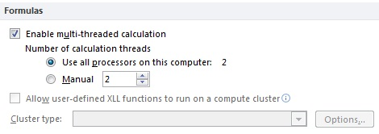

# Excel Performance: Performance and Limit Improvements
 **Summary:** This article discusses performance improvements in Microsoft Excel 2010 and Microsoft Office Excel 2007. This article is one of three companion articles about techniques that you can use to improve performance in Excel as you design and create worksheets.For more information about how to improve performance in Excel, see  [Excel Performance: Improving Calculation Performance](excel-improving-calcuation-performance.md) and [Excel Performance: Tips for Optimizing Performance Obstructions](excel-tips-for-optimizing-performance-obstructions.md).

**Applies to:** Excel | Excel 2010 | Office 2010 | SharePoint Server 2010 | VBA

**In this article**

[Excel Performance Improvements](#xl2010PerfImp)

[Excel 2007 Performance Improvements](#office2007excelperf_ExcelPerformanceImprovements)

[Conclusion](#office2007excelperf_Conclusion)

[About the Authors](#xlAboutAuthors)

[Additional Resources](#office2007excelperf_AdditionalResources)

**Provided by:**  Charles Williams,  [Decision Models Limited](http://www.decisionmodels.com/) │ Allison Bokone, Microsoft Corporation │ Chad Rothschiller, Microsoft Corporation │ [About the Authors](excel-improving-calcuation-performance.md#xlAboutAuthor)

## Excel 2010 Performance Improvements
<a name="xl2010PerfImp"> </a>

The following sections discuss some features that are introduced in Excel 2010 that you can use to improve performance.
  
    
    

### Feature Improvements

Based on user feedback about Excel 2007, Excel 2010 introduces improvements to several features.
  
    
    


|**Feature**|**Improvement**|
|:-----|:-----|
|**Printer and Page Layout View** <br/> |To improve performance of basic user interactions in page layout view, such as entering data, working with formulas or setting margins, Excel 2010 caches the printer settings and introduces optimized rendering calculations. Caching the printer settings reduces the number of network calls and reduces the dependency on a slow or unresponsive printer. In addition, connecting to the printer is cancelable so that the user does not have to wait for a slow or unresponsive printer.  <br/> |
|**Charts** <br/> |Starting in Excel 2010, the rendering speed of charts has increased, especially with large data sets, and text-rendering performance has improved. In addition, Excel 2010 caches an image of a chart and uses the cached version when possible, to avoid unnecessary calculations and rendering.  <br/> |
|**VBA Solutions** <br/> |Improvements to the object model and the way it interacts with Excel increases the performance speed of many VBA solutions when run in Excel 2010 compared with Excel 2007.  <br/> |
   

  
    
    

### Large Data Sets and 64-bit Excel

The 64-bit version of Excel 2010 is not constrained to 2 GB of RAM like 32-bit applications. Therefore, 64-bit Excel 2010 enables users to create much larger workbooks. 64-bit Windows enables a larger addressable memory capacity, and 64-bit Excel is designed to take advantage of that capacity. For example, users are able to fill more of the grid with data than was possible in previous versions of Excel. As more RAM is added to the computer, Excel uses that additional memory, allows larger and larger workbooks, and scales with the amount of RAM available.
  
    
    
In addition, because 64-bit Excel enables larger data sets, both 32-bit and 64-bit Excel 2010 introduce improvements to common large data set tasks such as entering and filling down data, sorting, filtering, and copying and pasting data. Memory usage is also optimized to be more efficient, in both the 32-bit and 64-bit versions of Excel. 
  
    
    
For more information about the "Big Grid," see  [The "Big Grid" and Increased Limits in Excel 2007](28d47a27-06c3-4ac0-ae9b-18de73624669.md#Office2007excelPerf_BigGridIncreasedLimitsExcel). For more information about the 64-bit version of Office 2010, see  [Compatibility Between the 32-bit and 64-bit Versions of Office 2010](http://msdn.microsoft.com/library/24acd0f0-1d3a-435e-8b76-44820648ab54%28Office.14%29.aspx).
  
    
    

### Shapes
<a name="Shapes"> </a>

Excel 2010 introduces significant improvements in the performance of graphics in Excel. At a high level, these improvements are in two areas: scalability and rendering. The scalability improvements have a large impact in Excel scenarios because of the large number of graphics contained on worksheets. Often, this large number of shapes is created accidentally by copying and pasting data from a website, or by commonly run automation that creates shapes, but never removes them. This large number of graphics, combined with the way that graphics relate to the data grid in Excel, presents several unique performance challenges. Improvements in Excel 2010 increase the performance speed for worksheets that contain many shapes. In addition, support for hardware acceleration improves rendering starting in Excel 2010. Excel 2010 also introduces performance improvements to the **Select** method of the **Shape** object in the VBA object model.
  
    
    


|**Feature**|**Improvement**|
|:-----|:-----|
|**Basic Use** <br/> |The first set of improvements made in Excel 2010 surrounds basic use scenarios. These scenarios include operations and features such as sorting, filtering, inserting or resizing rows or columns, or merging cells. When these operations occur, it may be necessary to update the position of a graphic object on the grid. In the worst-case scenario, it is necessary to make an update to every single object on the worksheet. In Excel 2010, performance of these basic scenarios improves even when there are thousands of objects on the worksheet. These improvements were not achieved with a single feature or fix, but through a dedicated focus on performance that included improving the shape lookup mechanism, testing stress files, and investigating obstructions.  <br/> |
|**Text Links** <br/> |A text link on a shape is created when the user specifies a formula, for example "=A1", that defines the text for a given shape. These particular shapes were prone to cause performance issues on sheets with a large number of objects and/or when changes were made to cell content. Starting in Excel 2010, the way Excel tracks and updates these shapes has improved to optimize performance for changing cell content. This work improves scenarios such as typing a new value in a cell or performing complex object model operations.  <br/> |
|**Big Grid** <br/> |Starting in Excel 2007, the size of the grid expanded from 65,000 rows to over one million rows. This increase caused some performance and rendering issues when working with graphics objects in the new regions of the larger grid. Starting in Excel 2010, Excel optimizes functionality that relies on using the top left of the grid as the origin in order to improve the experience of working with graphics in the new regions of the grid. Rendering fidelity and performance are improved relative to Excel 2007.  <br/> |
|**Rendering: Hardware Acceleration** <br/> |Starting in Excel 2010, improvements were made to the graphics platform by adding support for hardware acceleration when rendering 3-D objects. While the GPU can render these objects faster than the CPU, the experience in Excel 2010 depends on the content on your worksheet. If you have a sheet full of 3-D shapes, you will see more benefit from the hardware acceleration improvements than on a worksheet with only 2-D shapes (which do not leverage the GPU).  <br/> |
   

  
    
    

### Calculation Improvements
<a name="Shapes"> </a>

Starting in Excel 2007, multithreaded calculation improved calculation performance. For more information, see  [Multithreaded Calculation](28d47a27-06c3-4ac0-ae9b-18de73624669.md#MultithreadedCalculation). Starting in Excel 2010, additional performance improvements were made to further increase calculation speed. Excel 2010 can call user-defined functions asynchronously. Calling functions asynchronously improves performance by allowing several calculations to run at the same time. When you run user-defined functions on a compute cluster, calling functions asynchronously enables several computers to be used to complete the calculations. For more information about asynchronous user-defined functions, see  [Asynchronous User-Defined Functions](http://msdn.microsoft.com/library/142eb27e-fb6f-4da3-bfb7-a88115bbb5d5%28Office.14%29.aspx).
  
    
    

### Multi-Core Processing
<a name="Shapes"> </a>

Additional investments were made to take advantage of multi-core processors and increase performance for routine tasks. Starting in Excel 2010, the following features use multi-core processors: saving a file, opening a file, refreshing a PivotTable (for external data sources, except OLAP and SharePoint), sorting a cell table, sorting a PivotTable, and auto-sizing a column.
  
    
    
For operations that involve reading and loading or writing data, such as opening a file, saving a file or refreshing data, splitting the operation into two processes increases performance speed. The first process gets the data, and the second process loads the data into the appropriate structure in memory or writes the data to a file. In this way, as soon as the first process beings reading a portion of data, the second process can immediately start loading or writing that data, while the first process continues to read the next portion of data. Previously, the first process had to finish reading all the data in a certain section before the second process could load that section of the data into memory or write the data to a file.
  
    
    

### PowerPivot
<a name="Shapes"> </a>

PowerPivot refers to a collection of applications and services that provide an end-to-end approach for creating data-driven, user-managed business intelligence solutions in Excel workbooks. PowerPivot for Excel is a data analysis tool that delivers unmatched computational power directly within Excel. Leveraging familiar Excel features, users can transform large quantities of data from almost any source with amazing speed into meaningful information to get the answers they need in seconds.
  
    
    
PowerPivot also integrates with SharePoint. In a SharePoint farm, PowerPivot for SharePoint is the set of server-side applications, services, and features that support team collaboration on business intelligence data. SharePoint provides the platform for collaborating and sharing business intelligence across the team and larger organization. Workbook authors and owners publish and manage the business intelligence that they develop to their SharePoint sites.
  
    
    
For more information about PowerPivot, see  [PowerPivot Overview](http://msdn.microsoft.com/library/c4c393d3-4856-47ac-ab5f-15da2f240d1d.aspx).
  
    
    

### HPC Services for Excel 2010
<a name="Shapes"> </a>

With a wealth of statistical analysis functions, support for constructing complex analyses, and broad extensibility, Excel 2010 is the tool of choice for analyzing business data. As models grow larger and workbooks become more complex, the value of the information generated increases. However, more complex workbooks also require more time to calculate. For complex analyses, it is common for users to spend hours, days, or even weeks completing such complex workbooks.
  
    
    
One solution is to use Windows HPC Server 2008 to scale out Excel calculations across multiple nodes in a Windows high-performance computing (HPC) cluster in parallel. There are three methods for running Excel 2010 calculations in a Windows HPC Server 2008 based cluster: running Excel workbooks in a cluster, running Excel user-defined functions (UDFs) in a cluster, and using Excel as a cluster service-oriented architecture (SOA) client. For more information about HPC Services for Excel 2010, see  [Accelerating Excel 2010 with Windows HPC Server 2008](http://www.microsoft.com/downloads/details.aspx?displaylang=en&amp;FamilyID=a48ac6fe-7ea0-4314-97c7-d6875bc895c5)
  
    
    

## Excel 2007 Performance Improvements
<a name="office2007excelperf_ExcelPerformanceImprovements"> </a>

The following sections discuss some features that were introduced in Excel 2007 that you can use to improve performance.
  
    
    

### The "Big Grid" and Increased Limits in Excel 2007
<a name="Office2007excelPerf_BigGridIncreasedLimitsExcel"> </a>

Starting in Excel 2007, the "Big Grid" increases the maximum number of rows per worksheet from 65,536 to over 1 million, and the number of columns from 256 (IV) to 16,384 (XFD). 
  
    
    
If you work with large workbooks, you probably have found that the increased memory capacity of recent versions of Excel has meant that you hit some other Excel specification limits more frequently. Starting with Excel 2007, Excel includes many changes to these limits to accompany the large increase in row and column capacity (some of these limit increases can also significantly affect calculation speed). The following is a list of limit changes in Excel 2007:
  
    
    


|**Feature**|**Improvement**|
|:-----|:-----|
|**Memory** <br/> |Usable memory for formulas and pivot caches is increased to 2 GB from 1 GB in Microsoft Office Excel 2003, 128 MB in Microsoft Excel 2002, and 64 MB in Microsoft Excel 2000.  <br/> |
|**Smart recalculation limits** <br/> |The dependency limits that enable smart recalculation instead of full calculation are now limited only by available memory instead of 8,000 cells dependent on a single area and 64,000 areas having dependencies.  <br/> |
|**Array formulas** <br/> |Full column references are now allowed, and the limit on array formulas referring to another worksheet is increased from 65,000 to available memory.  <br/> |
|**PivotTables** <br/> |Maximum rows displayed in a PivotTable report is 1 million. Maximum columns displayed in a PivotTable report is 16,000. Maximum number of unique items in a single Pivot field is 1 million. Maximum number of fields visible in the Fields list is 16,000.  <br/> |
|**Sorting** <br/> |Levels increased from 3 to 64.  <br/> |
|**AutoFilter** <br/> |Drop-down list length changed from 1,000 items to 10,000 items.  <br/> |
|**Maximum formula length** <br/> |Increased from 1,000 to 8,000.  <br/> |
|**Formula nesting levels** <br/> |Increased from 7 to 64.  <br/> |
|**Arguments in a function** <br/> |Increased from 30 to 255.  <br/> |
|**Conditional formats per cell** <br/> |Increased from 3 to available memory.  <br/> |
|**Unique cell styles in a workbook** <br/> |Increased from 4,000 to 64,000.  <br/> |
|**Unique colors per workbook** <br/> |Increased from 56 to 4.3 billion.  <br/> |
|**Characters in a cell that can be displayed and printed** <br/> |Increased to 32,000.  <br/> |
   

  
    
    

### Multithreaded Calculation
<a name="MultithreadedCalculation"> </a>

Starting in Excel 2007, Excel can now split calculation across multiple processors or cores. When Excel loads a workbook, it determines from the operating system how many processors are available and then creates a separate calculation thread for each processor. These threads can then run in parallel. The beauty of this system is that it scales with the number of processors.
  
    
    
Most workbooks show a significant improvement in calculation speed on a system with multiple cores. The degree of improvement depends on how many independent calculation trees the workbook contains. If you make a workbook that contains one continuous chain of formulas, it will not show any multithreaded calculation (MTC) performance gain, whereas a workbook that contains several independent chains of formulas will show gains close to the number of processors available.
  
    
    
A test on a range of workbooks with between 840K and 23K formulas using Excel on a dual-core system showed improvement factors from using MTC ranging from 1.9 to no improvement, with the larger workbooks tending to show the most improvement. 
  
    
    
In collaboration with Intel Corporation, Microsoft conducted testing on a suite of user-created spreadsheets. Comparisons were done between Excel 2007 and Excel 2003. (A prerelease version of Excel 2007 was used, but little to no difference is expected with the final release version.)
  
    
    
Results showed calculation times ranging from no improvement to better than theoretical (2x/4x) improvement on both the dual-core and quad-core systems. Typical (median) improvement for a system with an Intel dual-core Pentium 4 at 3.0 GHz with 1 GB of RAM compared to the same file calculating in Excel 2003 was 48 percent, or a 1.92x speedup. Typical (median) speedup for a system with an Intel quad-core Xeon at 3.0 GHz with 4 GB of RAM was 76 percent, or a 4.17x speedup. Similar speed improvements were observed on other processors and platforms. Improvements beyond theoretical speedup (because of multithreading) are attributed to other performance improvements starting in Excel 2007, such as improvements to the speed of function execution.
  
    
    
Some Excel features do not use multithreaded calculation. For example:
  
    
    

- Data table calculation (however, structured references to tables do use MTC).
    
  
- User-defined functions (however, XLL functions can be multithread-enabled).
    
  
- XLM functions.
    
  
- INDIRECT, CELL functions that use either the **format2** or **address** options.
    
  
- GETPIVOTDATA and other functions referring to PivotTables or cubes.
    
  
- **Range.Calculate** and **Range.CalculateRowMajorOrder**.
    
  
- Cells in circular reference loops.
    
  
The first time that Excel calculates a workbook on a computer that has multiple processors, you incur some overhead while Excel examines dependencies. Therefore, you can see the maximum performance increase on the second and successive calculations (although there is still usually improvement on the first calculation versus running the same task on the same speed of computer that has a single processor).
  
    
    
You also incur this overhead the first time that you calculate a workbook on a multiple-processor computer that has a larger number of processors than the computer on which you last saved the workbook. If you turn off MTC, or run Excel on a system that has a single processor, there is no performance gain or loss from the MTC feature. You can use MTC in Excel, even in compatibility mode, and the information that is stored by the calculation can be reused even after the workbook is calculated and saved by using an earlier version of Excel.
  
    
    

**Figure 1. Controlling the number of calculation threads in Excel**

  
    
    

  
    
    

  
    
    
You can manually specify the number of threads to run at the same time. This number can be more than the number of processors on the computer. This is useful if, for example, you have XLL user-defined functions dependent on long-running external calls to a database server. If the database server can process multiple requests in parallel, you can effectively use multithreading even on a single-processor system.
  
    
    
To control multithreaded calculation options, click the **File** tab, and then click **Options**. In the **Excel Options** dialog box, click **Advanced**. Under the **Formulas** section set the multithreaded calculation options.
  
    
    

### Increased Memory Capacity and Limits
<a name="MultithreadedCalculation"> </a>

Earlier versions of Excel had several limits on the number of dependencies that were tracked for the smart recalculation feature. When you exceeded these limits, Excel always did a full calculation, and the status bar displayed **Calculate**.
  
    
    
Starting in Excel 2007, these limits were removed. Subject to the overall 2-GB Windows memory limit, large Excel workbooks can always use smart recalculation, which usually calculates significantly faster than a full calculation.
  
    
    

### Workbook.ForceFullCalculation
<a name="MultithreadedCalculation"> </a>

You can set the new workbook property, **Workbook.ForceFullCalculation**, programmatically by using the Excel object model. When this property is set to **True**, dependencies are not loaded at open, and every calculation of the workbook is a full calculation.
  
    
    
If you have a workbook that has so many complex dependencies that loading the dependencies at workbook open takes a long time or recalculation takes longer than full calculation, you can use this property to force Excel to skip loading the dependencies and always use full calculation.
  
    
    

### SUMIFS, COUNTIFS, and AVERAGEIFS
<a name="MultithreadedCalculation"> </a>

Starting in Excel 2007, Excel has three new functions that you can use to **SUM**, **COUNT**, or **AVERAGE** using multiple criteria. In earlier versions of Excel, you had to use slow-calculating, hard-to-understand array formulas or **SUMPRODUCT** to use multiple criteria. The new functions are designed to be easy to use and fast to calculate.
  
    
    

```

SUMIFS(sum_range, criteria_range1, criteria1 [,criteria_range2, _
    criteria2...])
COUNTIFS(criteria_range1, criteria1 [,criteria_range2, criteria2...])
AVERAGEIFS(average_range, criteria_range1, criteria1 _
    [,criteria_range2, criteria2...])
```

These functions handle full column references ($A:$A) efficiently by using special handling for the empty cells. The criteria that evaluates text cells can use the wildcard characters (*) (any set of characters) and (?) (any single character). Because these functions are so much faster to calculate than equivalent array formulas, use them to replace your array formulas when possible.
  
    
    

### IFERROR
<a name="MultithreadedCalculation"> </a>

The following **IFERROR** function simplifies and speeds up error checking.
  
    
    

```

IFERROR(Formula, value_if_error)
```

In earlier versions of Excel, it was common to see formulas that trapped errors by duplicating the formulas.
  
    
    


```
=IF(ISERROR(VLOOKUP("Charles",$A$1:$C$10000,3,False),"NotFound", _ VLOOKUP("Charles",$A$1:$C$10000,3,False))
```

Using this formula, if no error occurs in the **VLOOKUP**, Excel executes it two times. Starting in Excel 2007, you can avoid this duplication of calculation time by using **IFERROR**.
  
    
    


```
=IFERROR(VLOOKUP("Charles",$A$1:$C$10000,3,False),"NotFound")
```


### Named Tables and Structured Referencing
<a name="MultithreadedCalculation"> </a>

Excel 2007 introduced named tables to define a block of formulas and data. You can more easily reference named tables and their columns in formulas by using structured references like **Sales[2004]** to refer to the 2004 column in the Sales table, instead of ordinary Excel references such as **C2:C50**.
  
    
    
A major advantage of using this technique is that references to the table automatically adjust as you add data to the rows and columns of the table. Using structured referencing is more efficient than using dynamic ranges because it does not involve volatile functions like **OFFSET** together with counting functions like **COUNTA**. Another advantage is that you can have more than one named table on a worksheet and use AutoFilter on each named table.
  
    
    
If you currently use array formulas, try to use structured references wherever possible to reduce the number of cells that are calculated in the array formula.
  
    
    

### User-Defined Functions
<a name="MultithreadedCalculation"> </a>

Starting in Excel 2007, all user-defined functions, regardless of the language and add-in method that was used to develop them, can now support the increased limits introduced in Excel 2007. This includes the number of function arguments and the "Big Grid." Fully supporting the "Big Grid" may require changes to your user-defined functions wherever your code assumes a maximum of 256 columns or 65,536 rows, plus changes to XLLs may be required to support the new Excel C API.
  
    
    
The only kind of user-defined functions that are able to take advantage of multithreaded calculations are XLLs. By updating your XLL functions for multithreaded recalculation, you can enable your XLL to be run at the same time on different threads. All other user-defined functions (VBA, Automation add-ins, XLM functions, and XLLs not updated to work on multiple threads) are always run on the main thread, and so execute only one at a time regardless of how many processors or threads are used.
  
    
    
Starting in Excel 2007, Excel has an updated C API to provide support for the following features:
  
    
    

- The "Big Grid."
    
  
- Multithreaded calculation.
    
  
- More function arguments.
    
  
To use these new features, you must update your XLL functions. For more information, see  [Developing Excel 2010 XLLs](http://msdn.microsoft.com/library/dd27ae4d-ef97-47db-885c-ddd955816900%28Office.14%29.aspx). If you do not update your add-in functions, they will continue to work, but they will be unable to use the new features introduced in Excel 2007.
  
    
    

### Range Calculate
<a name="MultithreadedCalculation"> </a>

Starting in Excel 2007, Excel has two **Range** calculation methods. There is no standard user interface for running these calculation methods; you must call them by using VBA or some other programming language. These methods are useful when you want to calculate only a small block of cells while leaving all other formulas unchanged.
  
    
    

#### Range.Calculate

 **Range.Calculate** calculates the range one row at a time, left to right and top to bottom, and then resolves all dependencies within the range. This is the same method that Excel 2002 and Excel 2003 use, except that it was improved to handle iterative calculations in manual mode.
  
    
    

#### Range.CalculateRowMajorOrder

 **Range.CalculateRowMajorOrder** calculates the range one row at a time, left to right and top to bottom, but it completely ignores all dependencies. This is the same method that Microsoft Excel 97 and Excel 2000 use. Because **CalculateRowMajorOrder** does not try to resolve dependencies, it is usually significantly faster than **Range.Calculate**.
  
    
    
If you can ensure that any dependencies throughout a block of formulas always refer backward to cells to the left or above, the **Range.CalculateRowMajorOrder** can be the fastest calculation method in Excel on a single processor system.
  
    
    
 **Range.CalculateRowMajorOrder** is one of the most useful tools in Excel for performance optimization because you can use it to time and compare the calculation speed of different formulas while ignoring dependency effects.
  
    
    

### Excel Services
<a name="MultithreadedCalculation"> </a>

Starting in Excel 2007, Excel Services is a new server technology that is included in SharePoint Server. You can use Excel Services to offload a time-consuming calculation from a desktop to a more powerful (and expensive) server. By using multithreaded calculation on an eight-core server could produce major performance gains. For more information about Excel Services, see  [Excel Services in SharePoint Server 2010](http://msdn.microsoft.com/library/11433629-68f9-4ac6-8905-debad1766ed4%28Office.14%29.aspx).
  
    
    

## Conclusion
<a name="office2007excelperf_Conclusion"> </a>

Excel 2010 and Excel 2007 introduce performance and limitation improvements in several areas, from individual feature and object model improvements to the introduction of multithreaded calculation and multi-core processing. Starting in Excel 2010, the 64-bit version of Excel enables users to work with even larger data sets. PowerPivot provides a robust data analysis tool within Excel 2010, and HPC Services for Excel 2010 gives users the ability to offload workbooks or UDFs to a Windows high-performance computing cluster. All of these improvements allow Excel to scale along with hardware, improving performance as the CPU and RAM capacity of computers expand.
  
    
    

## About the Authors
<a name="xlAboutAuthors"> </a>

Charles Williams founded Decision Models in 1996 to provide advanced consultancy, decision support solutions, and tools that are based on Microsoft Excel and relational databases. Charles is the author of FastExcel, the widely used Excel performance profiler and performance tool set, and co-author of Name Manager, the popular utility for managing defined names. For more information about Excel calculation performance and methods, memory usage, and VBA user-defined functions, visit the  [Decision Models](http://www.decisionmodels.com/) website.
  
    
    
This technical article was produced in partnership with  [A23 Consulting](http://www.a23consulting.com/).
  
    
    
Allison Bokone, Microsoft Corporation, is a programming writer in the Office team.
  
    
    
Chad Rothschiller, Microsoft Corporation, is a program manager in the Office team.
  
    
    

## Additional Resources
<a name="office2007excelperf_AdditionalResources"> </a>

For more information about Excel 2010, see the following resources:
  
    
    

-  [Excel Performance: Improving Calculation Performance](excel-improving-calcuation-performance.md)
    
  
-  [Excel Performance: Tips for Optimizing Performance Obstructions](excel-tips-for-optimizing-performance-obstructions.md)
    
  
-  [Excel Developer Portal](http://msdn.microsoft.com/en-us/office/aa905411.aspx)
    
  
-  [Blog: Microsoft Excel 2010](http://blogs.msdn.com/excel/default.aspx)
    
  
