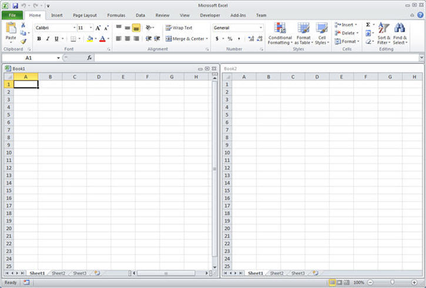
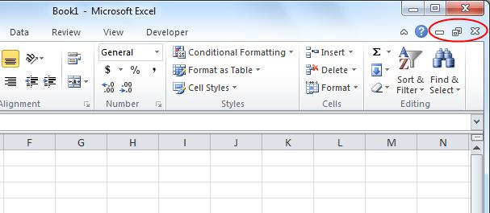
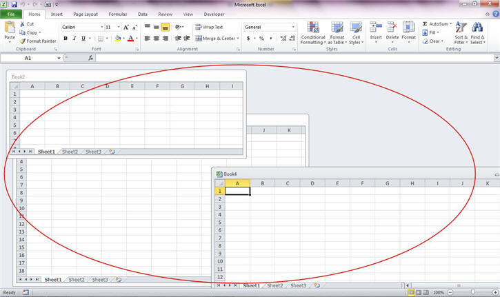
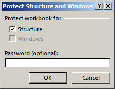

# Programming for the Single Document Interface in Excel
Learn about programming considerations for the Single Document Interface in Excel.


## Comparing Single and Multiple Document Interfaces in Excel 2010 and Excel 2013
<a name="odc_xl15_ta_ProgrammingtheSDIinExcel2013_Comparing"> </a>

A new feature in Excel 2013 is the single document interface (SDI). SDI is a method of organizing graphical user interface (UI) applications into individual windows that the operating system window manager handles separately. In Excel 2013, each Excel window can contain only one workbook, and each has its own ribbon UI (see Figure 1). By default when you open a new worbook, it will be displayed in another Excel window, even though it is the same Excel instance.


**Figure 1. Single Document Interface in Excel 2013**


This contrasts with a multiple document interface (MDI), in which a single parent window is used to contain multiple nested child windows, with only the parent window having a menu or tool bar. In Excel 2010, each workbook in a single instance of Excel utilizes a common ribbon UI (see Figure 2).


**Figure 2. Multiple Document Interface in Excel 2010**



Excel 2010 uses the MDI, which means that there is a single application-level window holding all the workbooks that are open in a particular instance of Excel. The windows of the workbook can be arranged inside the Excel app window, all sharing the same Ribbon UI. SDI in Excel means that each workbook will have its own top level app window, and has its own corresponding Ribbon UI.

|**Note**|
|:-----|  
|There is no MDI compatibility option in Excel.|
 

In dual-monitor systems, the SDI in Excel enables side-by-side comparisons of two workbooks by dragging each workbook to a different monitor. Each workbook works independently of the other.

To see SDI and MDI in action, if you have both Excel 2010 and Excel 2013 available, perform the following steps.


### To contrast the number of processes for MDI and SDI interfaces:

1. On the Windows Start menu, start Excel 2010.
    
2. Start a second occurrence of Excel. Verify that the two Excel windows are displayed.
    
3. On the Windows Task Bar, choose and then select  **Start Task Manager**.
    
4. Choose the  **Processes** tab and then scroll down until you see the two **Excel.exe** entries. This tells you that, by default, Excel opens a new instance each time it is called (two Excel instances).
    
5. Close the two instances of Excel.
   
6. On the Windows Start menu, choose Excel 2013.
    
7. Start a second occurrence of Excel. Verify that the two Excel windows are displayed.
    
8. Start the Task Manager again.
    
9. On the  **Processes** tab scroll down until you see **Excel.exe**. Be aware that although you opened two occurrences of Excel, the two workbooks are contained in the same single instance of Excel.
    
To see how SDI and MDI work inside of an instance of Excel, perform the following steps.


### To compare the number of Excel instances for MDI and SDI interfaces:

1. On the Windows Start menu, choose Excel 2010.
    
2. Choose the Excel window to make it active and verify that  **Book1** is the current workbook.
    
3. Press CTRL + N to open another workbook. Verify that  **Book2** is now the current workbook.
    
4. Minimize  **Book2** and then see Book1. Both workbooks are contained in the same instance of Excel.
    
5. Close Excel.

6. On the Windows Start menu, choose Excel 2013.
    
7. Choose the Excel window to make it active and verify that  **Book1** is the current workbook.
    
8. Press CTRL + N to open another workbook. Verify that  **Book2** is opened in a separate window (but still in the same instance of Excel).
    
9. Close Excel.
    

|**Note**|
|:-----|  
|You can open multiple instances of Excel by using the following command line switch:  **excel.exe /x**. This switch starts Excel in a new process.|  


In this article, we will discuss the implementation of the SDI in the Excel UI and how it impacts programmability in Excel.


## What's changed in the User Interface
<a name="odc_xl15_ta_ProgrammingtheSDIinExcel2013_Changed"> </a>

If you look closely after opening an Excel workbook, you no longer see the window state buttons ( _minimize_,  _maximize_, and  _restore_) in the upper-left corner of the ribbon. Figure 3 shows the window state buttons that are available in Excel and Excel 2007. Because the top-level window is now tied directly to a single workbook or workbook view, there is no longer a need for the windows management UI in Excel.


**Figure 3. Windows state UI in Excel 2010**



Additionally, starting in Excel, there are no longer multiple workbook windows inside of a single Excel instance window such as seen in Figure 4.


**Figure 4. Multiple workbooks in a single Excel instance window**




## Recalculation and Formulas
<a name="odc_xl15_ta_ProgrammingtheSDIinExcel2013_ReCalc"> </a>

Recalculations in Excel will still be "global" meaning that they occur across workbooks in the same instance of Excel. Formulas that reference across workbooks that are open in the same instance of Excel will participate in calculations together and will share the same workbook calculation mode (automatic, automatic except for data tables, and manual).

In MDI, there is only one formula bar to handle all open workbooks in that instance of Excel. In SDI, there is one formula bar per workbook. For SDI, when editing cross-book references in a formula, both the source and target workbook formula bars will show the formula currently being edited as shown in Figure 5.


**Figure 5. Updating cross-workbook formulas**


## Custom Task Panes
<a name="odc_xl15_ta_ProgrammingtheSDIinExcel2013_TaskPanes"> </a>

Custom Task Panes that attached to a top level window in MDI are now attached to a particular workbook's window in SDI. Switching to a different workbook will activate that workbook window, which won't necessarily have the custom task pane attached, unless the developer's code is updated to specifically display the custom task pane for that workbook.

To summarize, as a developer, you will want to:


- Ensure that for any workbooks where you want to want to show the custom task pane, you write code to explicitly do that.
    
- Ensure that you explicitly handle updating the custom task pane state across all instances, if you want all of the custom task panes to reflect the same state. For example, a check box is toggled to ON by the user, and you want that to be reflected across all of the custom task panes in all instances of Excel.
    

## Custom Ribbons
<a name="odc_xl15_ta_ProgrammingtheSDIinExcel2013_RibbonUI"> </a>

Custom ribbon tabs and controls that assumed a single ribbon UI per application instance in previous versions of Excel will now be propagated onto each workbook ribbon in Excel. Whereas in MDI the custom ribbon developer didn't need to consider multiple instances of their controls on different instances of Excel's ribbon UI, with SDI they will need to account for this situation.

If you want to keep all the ribbon UI controls in the same state across open workbooks, you will need to:


- Ensure that the code is able to cycle through the workbook windows and update the state of the controls.
    
OR


- Cache the state of the controls so that when the user switches to another workbook, that event can be captured and the controls updated as part of the window switch.
    
Additionally, consider the case where you develop code to add a custom UI control by using  `Application.Commandbar` to access the ribbon. When you try to access that control at a later time, your code will need to account for the fact that the active workbook may not be the same workbook where you added the control.


## Considerations for VBA code
<a name="odc_xl15_ta_ProgrammingtheSDIinExcel2013_Consideration"> </a>

With the shift to SDI, all of the Excel  _application-level_ window methods, events, and properties remain unaffected and work the way they have in previous versions of Excel (for example, `Application.ActiveWindow`,  `Application.Windows`, and so on).

In Excel, all of the  _workbook-level_ window methods, events, and properties now operate on the top level window (for example, the `Workbook.WindowActivate` event is still triggered when you switch to a particular workbook, the `Workbook.Resize` event is still triggered when that workbook is resized, and `ThisWorkbook.Windows(1).Height`,  `ThisWorkbook.Windows(1).Width`,  `ThisWorkbook.Windows(1).Left`,  `ThisWorkbook.Windows(1).Right`,  `ThisWorkbook.Windows(1).Minimize`,  `ThisWorkbook.Windows(1).Maximize` and so forth will operate on the top level window for the active workbook).

Special cases are listed in the following table.

 **Table 1. Object Model Behavior with the SDI**


|**Function**|**Description**|**SDI Implications**|
|:-----|:-----|:-----|
| `Application.Visible`|Returns or sets a  **Boolean** value that determines whether the object is visible. Read/write.|If all windows are hidden:<ul><li><p><span class="code">Application.Visible</span> becomes <span class="keyword">False</span></p></li><li><p>Setting <span class="code">Application.Visible</span> to <span class="keyword">True</span> displays all hidden windows</p></li><li><p>Opening a document via the shell only shows that window and <span class="code">Application.Visible</span> is now <span class="keyword">True</span></p></li></ul>Additionally:<ul xmlns:xlink="http://www.w3.org/1999/xlink" xmlns:mtps="http://msdn2.microsoft.com/mtps" xmlns:MSHelp="http://msdn.microsoft.com/mshelp" xmlns:mshelp="http://msdn.microsoft.com/mshelp" xmlns:ddue="http://ddue.schemas.microsoft.com/authoring/2003/5" xmlns:msxsl="urn:schemas-microsoft-com:xslt"><li><p><span class="code">Application.Visible = False</span> hides everything and <span class="code">Application.Visible = True</span> displays everything, ignoring any document-level settings</p></li><li><p>If all of the windows are hidden via the window-level setting then the application-level setting toggles as well</p></li><li><p>Having at least one window displayed means that the application-level setting is <span class="keyword">True</span></p></li></ul>|
| `Application.ShowWindowsInTaskbar`| **True** if there's a separate Windows taskbar button for each open workbook. The default value is **True**. Read/write  **Boolean**.|This setting is deprecated in Excel.|
| `Application.Caption`|Returns or sets a  **String** value that represents the name that appears in the title bar of the main Microsoft Excel window.|Updates all windows for that instance of Excel.|
| `Application.Hwnd`|Returns a  **Long** indicating the top-level window handle of the Microsoft Excel window. Read-only.|Will return the active window's handle.|
| `Application.FormulaBarHeight`|Enables the user to specify the height of the formula bar in lines. Read/write  **Long**.|Operates on the currently active workbook window; not all of the windows for this instance of Excel.|
| `Application.DisplayFormulaBar`| **True** if the formula bar is displayed. Read/write **Boolean**.|Operates on all windows for this instance of Excel.|
| `Workbook.Windows`|Returns a Windows collection that represents all the windows in the specified workbook. Read-only Windows  **Object**.|No change in behavior. Returns the collection of windows for this book such as task panes, additional views.|
| `Workbook.WindowResize`|Occurs when any workbook window is resized.|No change in behavior. Is triggered when a workbook window (the top-level) is resized.|
| `Window.Caption`|Returns or sets a  **Variant** value that represents the name that appears in the title bar of the document window.|No change in behavior.|
| `Workbook.Protect(Password, Structure, Windows)`|Protects a workbook so that it cannot be modified.|Regardless of the value for the  _Windows_ parameter ( **True** or **False**), the window structure protection will NOT be enabled. No runtime error is displayed if  **True** is specified, but that portion of the procedure call will return a **NO-OP**.|
 
|**Note**|
|:-----|  
|There are no changes required in custom code so that XLM commands continue to work as expected in SDI Excel.|


## Deprecating Protect Workbook Windows
<a name="odc_xl15_ta_ProgrammingtheSDIinExcel2013_Deprecating"> </a>

In SDI, each workbook has its own top-level window that you can restore, minimize, and close. To minimize any confusion you might encounter in not being about to move, resize, or close this top-level window, the Windows option in the Protect Workbook feature in Excel is no longer available (see Figure 6). Table 2 describes this action further.


**Figure 6. Windows option of the Protect Workbook dialog box is disabled**



|**Action**|**Behavior**|
|:-----|:-----|
|Open a workbook created in an earlier version of Excel, with Window Protection enabled|Excel will recognize the window location and size attributes, but will not prevent the user from arranging or closing these windows.|
|View the  **Protect Structure and Windows** dialog box|Excel will display the dialog box but with the  **Windows** option disabled.|

## Solutions for SDI Issues
<a name="odc_xl15_ta_ProgrammingtheSDIinExcel2013_Solutions"> </a>

The following section provides workarounds for issues you may encounter when using the SDI.


- A workbook cannot be closed by clicking the red "X"  **Close** button when that workbook is programmatically opened via a modal user form. To work around this issue, it is suggested that you add the following code to the user form **Layout** event procedure and then open the user form as modeless.
    
```vb
  Private Sub UserForm_Layout()
    Static fSetModal As Boolean
    If fSetModal = False Then
        fSetModal = True
        Me.Hide
        Me.Show 1
    End If
End Sub
```


   Another option is to open the workbook window, activate any other window, and then reactivate the workbook window. You should now be able to close the workbook using the  **Close** button.
    
- Assume that your VBA code opens multiple workbooks and uses the  **DataEntryMode** property to control data entry and workbook closure. In the Excel SDI model, because each workbook is contained in its own process, the **DataEntryMode** property used in one workbook does not recognize the existence of other workbook and therefore has little to no effect on their interaction. To work around this issue, there are a couple of options. You can hide the extra workbooks or worksheets by using `Window.Visible = False` or `Sheet.Visible = False`, respectively. You can also detect and cancel any closing events by using  `Workbook.BeforeClose(Cancel) = True`.
    
- Toolbars added to Excel workbooks via command bar code and XLA files will not be displayed until after you close and reopen the workbook. Using command bars to customize the UI was deprecated starting in Excel 2007. The optimal solution is to customize the ribbon UI by using XML files as described in detail in the article  [Customizing the 2007 Office Fluent Ribbon for Developers](http://msdn.microsoft.com/library/a4fd6d18-d4a8-4e64-bd89-f437208573d3.aspx)
    
    Another option is to use an application-level event to detect new workbooks opening and then use  `Application.Windows` instead of workbooks to add the ribbon control. The following is sample code that can be used to accomplish this.
    


```vb
  Private Sub Workbook_Open()
    ToolBarsAdd
End Sub

Sub ToolBarsAdd()
    Dim oBar As CommandBar
 
    ToolBarsDelete
    Set oBar = Application.CommandBars.Add(Name:="MyToolBar")
    '
    With oBar
        With .Controls.Add(Type:=msoControlButton)
            .OnAction = "SayHello"
            .FaceId = 800
        End With
    End With
    oBar.Visible = True
End Sub

Sub SayHello()
    MsgBox "Hello from '" &; ActiveWorkbook.Name &; "'"
End Sub
```


   The following code would then be used to remove the toolbar before closing the workbook.
    


```vb
  Private Sub Workbook_BeforeClose(Cancel As Boolean)
    ToolBarsDelete
End Sub

Sub ToolBarsDelete()
Dim wnd As Window
On Error Resume Next
    For Each wnd In Application.Windows
        wnd.Activate
        Application.CommandBars("MyToolBar ").Delete
    Next wnd
End Sub
```

- In Excel 2010, a modeless user form is displayed as the top-level window on top of all Excel windows by default. In Excel 2013, a modeless user form is only visible on top of the workbook window that was active when the user form was displayed. Excel Most Valuable Professional (MVP) Jan Karel Pieterse provides an explanation of the issue and a solution on his web page at  [http://www.jkp-ads.com/articles/keepuserformontop.asp](http://www.jkp-ads.com/articles/keepuserformontop.asp).
    

## Summary
<a name="odc_xl15_ta_ProgrammingtheSDIinExcel2013_Summary"> </a>

The new Single Document Interface in Excel 2013 makes it easy to work with multiple workbooks. You can even drag the workbooks to different monitors for convenience. You just need to remember that there is only one top-level window and one ribbon UI menu per workbook. This may require that you update any existing code to cache the state of controls and settings as you move from workbook to workbook.


## Additional resources
<a name="odc_xl15_ta_ProgrammingtheSDIinExcel2013_Additional"> </a>

Find addition information on the topics discussed in this article at the following locations.


-  [Open Excel workbooks in separate windows and view them side by side](http://blogs.office.com/b/microsoft-excel/archive/2013/02/07/open-multiple-excel-files-in-separate-windows-and-view-them-side-by-side.aspx)
    
-  [Excel 2013 single document interface (SDI): How to rebuild your task panes to support it](http://www.add-in-express.com/creating-addins-blog/2013/02/28/excel2013-single-document-interface-task-panes/)
    
    

