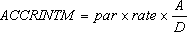

# WorksheetFunction.AccrIntM Method (Excel)

Returns the accrued interest for a security that pays interest at maturity.

## Syntax

 _expression_ . **AccrIntM**( **_Arg1_** , **_Arg2_** , **_Arg3_** , **_Arg4_** , **_Arg5_** )

 _expression_ A variable that represents a **WorksheetFunction** object.

### Parameters

|**Name**|**Required/Optional**|**Data Type**|**Description**|
|:-----|:-----|:-----|:-----|
| _Arg1_|Required| **Variant**|The security's issue date.|
| _Arg2_|Required| **Variant**|The security's maturity date.|
| _Arg3_|Required| **Variant**|The security's annual coupon rate.|
| _Arg4_|Required| **Variant**|The security's par value. If you omit par, ACCRINTM uses $1,000.|
| _Arg5_|Optional| **Variant**|The type of day count basis to use.|

### Return Value

Double 

## Remarks

 **Important**  Dates should be entered by using the DATE function, or as results of other formulas or functions. For example, use DATE(2008,5,23) for the 23rd day of May, 2008. Problems can occur if dates are entered as text.

The following table describes the values that can be used for  _Arg5_ .

|**Basis**|**Day count basis**|
|:-----|:-----|
|0 or omitted|US (NASD) 30/360|
|1|Actual/actual|
|2|Actual/360|
|3|Actual/365|
|4|European 30/360|

### 

- Microsoft Excel stores dates as sequential serial numbers so they can be used in calculations. By default, January 1, 1900 is serial number 1, and January 1, 2008 is serial number 39448 because it is 39,448 days after January 1, 1900.
    
     **Note**  Visual Basic for Applications (VBA) calculates serial dates differently than Excel. In VBA, serial number 1 is December 31, 1899, rather than January 1, 1900. 
- Issue, maturity, and basis are truncated to integers.
    
- If issue or maturity is not a valid date, ACCRINTM will generate an error.
    
- If rate = 0 or if par = 0, ACCRINTM will generate an error.
    
- If basis < 0 or if basis > 4, ACCRINTM will generate an error.
    
- If issue = maturity, ACCRINTM will generate an error.
    
- ACCRINTM is calculated as follows:
where: A = Number of accrued days counted according to a monthly basis. For interest at maturity items, the number of days from the issue date to the maturity date is used. D = Annual Year Basis. 
    

## See also

#### Concepts

[WorksheetFunction Object](worksheetfunction-object-excel.md)

