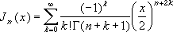

# WorksheetFunction.BesselJ Method (Excel)

Returns the Bessel function.

## Syntax

 _expression_ . **BesselJ**( **_Arg1_** , **_Arg2_** )

 _expression_ A variable that represents a **WorksheetFunction** object.

### Parameters

|**Name**|**Required/Optional**|**Data Type**|**Description**|
|:-----|:-----|:-----|:-----|
| _Arg1_|Required| **Variant**|The value at which to evaluate the function.|
| _Arg2_|Required| **Variant**|The order of the Bessel function. If n is not an integer, it is truncated.|

### Return Value

Double

## Remarks

- If x is nonnumeric, BesselJ generates an error value.
    
- If n is nonnumeric, BesselJ returns the generates an error value.
    
- If n < 0, BesselJ generates an error value.
    
- The n-th order Bessel function of the variable x is:
where: 
is the Gamma function. 
    

## See also

#### Concepts

[WorksheetFunction Object](worksheetfunction-object-excel.md)

