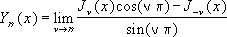

# WorksheetFunction.BesselY Method (Excel)

Returns the Bessel function, which is also called the Weber function or the Neumann function.

## Syntax

 _expression_ . **BesselY**( **_Arg1_** , **_Arg2_** )

 _expression_ A variable that represents a **WorksheetFunction** object.

### Parameters

|**Name**|**Required/Optional**|**Data Type**|**Description**|
|:-----|:-----|:-----|:-----|
| _Arg1_|Required| **Variant**|The value at which to evaluate the function.|
| _Arg2_|Required| **Variant**|The order of the function. If n is not an integer, it is truncated.|

### Return Value

Double

## Remarks

- If x is nonnumeric, BesselY generates an error value.
    
- If n is nonnumeric, BesselY generates an error value.
    
- If n < 0, BesselY generates an error value.
    
- The n-th order Bessel function of the variable x is:

    

## See also

#### Concepts

[WorksheetFunction Object](worksheetfunction-object-excel.md)

