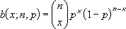
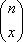
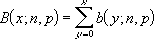

# WorksheetFunction.BinomDist Method (Excel)

Returns the individual term binomial distribution probability.

## Syntax

 _expression_ . **BinomDist**( **_Arg1_** , **_Arg2_** , **_Arg3_** , **_Arg4_** )

 _expression_ A variable that represents a **WorksheetFunction** object.

### Parameters

|**Name**|**Required/Optional**|**Data Type**|**Description**|
|:-----|:-----|:-----|:-----|
| _Arg1_|Required| **Double**|the number of successes in trials.|
| _Arg2_|Required| **Double**|the number of independent trials.|
| _Arg3_|Required| **Double**|the probability of success on each trial.|
| _Arg4_|Required| **Boolean**|a logical value that determines the form of the function. If cumulative is TRUE, then BinomDist returns the cumulative distribution function, which is the probability that there are at most number_s successes; if FALSE, it returns the probability mass function, which is the probability that there are number_s successes.|

### Return Value

Double

## Remarks

 Use BinomDist in problems with a fixed number of tests or trials, when the outcomes of any trial are only success or failure, when trials are independent, and when the probability of success is constant throughout the experiment. For example, BinomDist can calculate the probability that two of the next three babies born are male.

- Number_s and trials are truncated to integers.
    
- If number_s, trials, or probability_s is nonnumeric, BINOMDIST generates an error.
    
- If number_s < 0 or number_s > trials, BinomDist generates an error.
    
- If probability_s < 0 or probability_s > 1, BinomDist generates an error.
    
- The binomial probability mass function is:
where: 
is COMBIN(n,x). The cumulative binomial distribution is: 

    

## See also

#### Concepts

[WorksheetFunction Object](worksheetfunction-object-excel.md)

