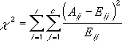

# WorksheetFunction.ChiTest Method (Excel)

Returns the test for independence. 

This function has been replaced with one or more new functions that may provide improved accuracy and whose names better reflect their usage. This function is still available for compatibility with earlier versions of Excel. However, if backward compatibility is not required, you should consider using the new functions from now on, because they more accurately describe their functionality.
For more information about the new function, see the [ChiSq_Test](worksheetfunction-chisq_test-method-excel.md) method.

## Syntax

 _expression_ . **ChiTest**( **_Arg1_** , **_Arg2_** )

 _expression_ A variable that represents a **[WorksheetFunction](worksheetfunction-object-excel.md)** object.

### Parameters

|**Name**|**Required/Optional**|**Data Type**|**Description**|
|:-----|:-----|:-----|:-----|
| _Arg1_|Required| **Variant**|The range of data that contains observations to test against expected values.|
| _Arg2_|Required| **Variant**|The range of data that contains the ratio of the product of row totals and column totals to the grand total.|

### Return Value

Double

## Remarks

ChiTest returns the value from the chi-squared ( 2 ) distribution for the statistic and the appropriate degrees of freedom. You can use ?2 tests to determine whether hypothesized results are verified by an experiment.

- If actual_range and expected_range have a different number of data points, ChiTest returns the #N/A error value.
    
- The ?2 test first calculates a 2 statistic using the formula:
where: A ij = actual frequency in the i-th row, j-th column Eij = expected frequency in the i-th row, j-th column r = number or rows c = number of columns
    
- A low value of  2 is an indicator of independence. As can be seen from the formula, 2 is always positive or 0, and is 0 only if Aij = Eij for every i,j.
    
- ChiTest returns the probability that a value of the 2 statistic at least as high as the value calculated by the above formula could have happened by chance under the assumption of independence. In computing this probability, ChiTest uses the ?2 distribution with an appropriate number of degrees of freedom, df. If r > 1 and c > 1, then df = (r - 1)(c - 1). If r = 1 and c > 1, then df = c - 1 or if r > 1 and c = 1, then df = r - 1. r = c= 1 is not allowed and generates an error.
    
- Use of ChiTest is most appropriate when E ij ?s are not too small. Some statisticians suggest that each Eij should be greater than or equal to 5.
    

## See also

#### Concepts

[WorksheetFunction Object](worksheetfunction-object-excel.md)

