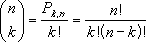
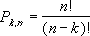

# WorksheetFunction.Combin Method (Excel)

Returns the number of combinations for a given number of items. Use Combin to determine the total possible number of groups for a given number of items.

## Syntax

 _expression_ . **Combin**( **_Arg1_** , **_Arg2_** )

 _expression_ A variable that represents a **WorksheetFunction** object.

### Parameters

|**Name**|**Required/Optional**|**Data Type**|**Description**|
|:-----|:-----|:-----|:-----|
| _Arg1_|Required| **Double**|The number of items.|
| _Arg2_|Required| **Double**|The number of items in each combination.|

### Return Value

Double

## Remarks

- Numeric arguments are truncated to integers.
    
- If either argument is nonnumeric, Combin generates an error.
    
- If number < 0, number_chosen < 0, or number < number_chosen, Combin generates an error.
    
- A combination is any set or subset of items, regardless of their internal order. Combinations are distinct from permutations, for which the internal order is significant.
    
- The number of combinations is as follows, where number = n and number_chosen = k:
where: 

    

## See also

#### Concepts

[WorksheetFunction Object](worksheetfunction-object-excel.md)

