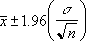

# WorksheetFunction.Confidence Method (Excel)

Returns a value that you can use to construct a confidence interval for a population mean.

 **Important**  This function has been replaced with one or more new functions that may provide improved accuracy and whose names better reflect their usage. This function is still available for compatibility with earlier versions of Excel. However, if backward compatibility is not required, you should consider using the new functions from now on, because they more accurately describe their functionality.

For more information about the new functions, see the [Confidence_Norm](worksheetfunction-confidence_norm-method-excel.md) and[Confidence_T](worksheetfunction-confidence_t-method-excel.md) methods.

## Syntax

 _expression_ . **Confidence**( **_Arg1_** , **_Arg2_** , **_Arg3_** )

 _expression_ A variable that represents a **[WorksheetFunction](worksheetfunction-object-excel.md)** object.

### Parameters

|**Name**|**Required/Optional**|**Data Type**|**Description**|
|:-----|:-----|:-----|:-----|
| _Arg1_|Required| **Double**|The significance level used to compute the confidence level. The confidence level equals 100*(1 - alpha)%, or in other words, an alpha of 0.05 indicates a 95 percent confidence level.|
| _Arg2_|Required| **Double**|The population standard deviation for the data range and is assumed to be known.|
| _Arg3_|Required| **Double**|The sample size.|

### Return Value

Double

## Remarks

The confidence interval is a range of values. Your sample mean, x , is at the center of this range and the range is x = Confidence. For example, if x is the sample mean of delivery times for products ordered through the mail, x = Confidence is a range of population means. For any population mean, = 0 , in this range, the probability of obtaining a sample mean further from =0 than x is greater than alpha; for any population mean, =0 , not in this range, the probability of obtaining a sample mean further from =0 than x is less than alpha. In other words, assume that we use x , standard_dev, and size to construct a two-tailed test at significance level alpha of the hypothesis that the population mean is =0 . Then we will not reject that hypothesis if =0 is in the confidence interval and will reject that hypothesis if =0 is not in the confidence interval. The confidence interval does not allow us to infer that there is probability 1 = alpha that our next package will take a delivery time that is in the confidence interval.

- If any argument is nonnumeric, Confidence generates an error.
    
- If alpha = 0 or alpha = 1, Confidence generates an error.
    
- If standard_dev = 0, Confidence generates an error.
    
- If size is not an integer, it is truncated.
    
- If size < 1, Confidence generates an error.
    
- If we assume alpha equals 0.05, we need to calculate the area under the standard normal curve that equals (1 - alpha), or 95 percent. This value is = 1.96. The confidence interval is therefore:

    

## See also

#### Concepts

[WorksheetFunction Object](worksheetfunction-object-excel.md)

