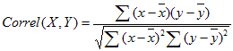

# WorksheetFunction.Correl Method (Excel)

Returns the correlation coefficient of the  _Arg1_ and _Arg2_ cell ranges.

## Syntax

 _expression_ . **Correl**( **_Arg1_** , **_Arg2_** )

 _expression_ A variable that represents a **WorksheetFunction** object.

### Parameters

|**Name**|**Required/Optional**|**Data Type**|**Description**|
|:-----|:-----|:-----|:-----|
| _Arg1_|Required| **Variant**|A cell range of values.|
| _Arg2_|Required| **Variant**|A second cell range of values.|

### Return Value

Double

## Remarks

 Use the correlation coefficient to determine the relationship between two properties. For example, you can examine the relationship between a location's average temperature and the use of air conditioners.

- If an array or reference argument contains text, logical values, or empty cells, those values are ignored; however, cells with the value zero are included.
    
- If  _Arg1_ and _Arg2_ have a different number of data points, Correl generates an error.
    
- If either  _Arg1_ or _Arg2_ is empty, or if s (the standard deviation) of their values equals zero, Correl generates an error.
    
- The equation for the correlation coefficient is:
where x and y are the sample means Average(Arg1) and Average(Arg2). 
    

## See also

#### Concepts

[WorksheetFunction Object](worksheetfunction-object-excel.md)

