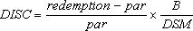

# WorksheetFunction.Disc Method (Excel)

Returns the discount rate for a security.

## Syntax

 _expression_ . **Disc**( **_Arg1_** , **_Arg2_** , **_Arg3_** , **_Arg4_** , **_Arg5_** )

 _expression_ A variable that represents a **WorksheetFunction** object.

### Parameters

|**Name**|**Required/Optional**|**Data Type**|**Description**|
|:-----|:-----|:-----|:-----|
| _Arg1_|Required| **Variant**|Settlement - the security's settlement date. The security settlement date is the date after the issue date when the security is traded to the buyer.|
| _Arg2_|Required| **Variant**|Maturity - the security's maturity date. The maturity date is the date when the security expires.|
| _Arg3_|Required| **Variant**|Pr - the security's price per $100 face value.|
| _Arg4_|Required| **Variant**|Redemption - the security's redemption value per $100 face value.|
| _Arg5_|Optional| **Variant**|Basis - the type of day count basis to use.|

### Return Value

Double

## Remarks

 **Important**  Dates should be entered by using the DATE function, or as results of other formulas or functions. For example, use DATE(2008,5,23) for the 23rd day of May, 2008. Problems can occur if dates are entered as text.

- Microsoft Excel stores dates as sequential serial numbers so they can be used in calculations. By default, January 1, 1900 is serial number 1, and January 1, 2008 is serial number 39448 because it is 39,448 days after January 1, 1900. Microsoft Excel for the Macintosh uses a different date system as its default.
    
     **Note**  Visual Basic for Applications (VBA) calculates serial dates differently than Excel. In VBA, serial number 1 is December 31, 1899, rather than January 1, 1900. 
- The settlement date is the date a buyer purchases a coupon, such as a bond. The maturity date is the date when a coupon expires. For example, suppose a 30-year bond is issued on January 1, 2008, and is purchased by a buyer six months later. The issue date would be January 1, 2008, the settlement date would be July 1, 2008, and the maturity date would be January 1, 2038, 30 years after the January 1, 2008, issue date.
    
- Settlement, maturity, and basis are truncated to integers.
    
- If settlement or maturity is not a valid serial date number, DISC returns the #VALUE! error value.
    
- If pr ? 0 or if redemption ? 0, DISC returns the #NUM! error value.
    
- If basis < 0 or if basis > 4, DISC returns the #NUM! error value.
    
- If settlement ? maturity, DISC returns the #NUM! error value.
    
- DISC is calculated as follows:
where: B = number of days in a year, depending on the year basis. DSM = number of days between settlement and maturity. 
    

## See also

#### Concepts

[WorksheetFunction Object](worksheetfunction-object-excel.md)

