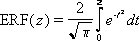

# WorksheetFunction.Erf Method (Excel)

Returns the error function integrated between lower_limit and upper_limit.

 **Important**  This function has been replaced with one or more new functions that may provide improved accuracy and whose names better reflect their usage. This function is still available for compatibility with earlier versions of Excel. However, if backward compatibility is not required, you should consider using the new functions from now on, because they more accurately describe their functionality.

For more information about the new function, see the [Erf_Precise](worksheetfunction-erf_precise-method-excel.md) method.

## Syntax

 _expression_ . **Erf**( **_Arg1_** , **_Arg2_** )

 _expression_ A variable that represents a **[WorksheetFunction](worksheetfunction-object-excel.md)** object.

### Parameters

|**Name**|**Required/Optional**|**Data Type**|**Description**|
|:-----|:-----|:-----|:-----|
| _Arg1_|Required| **Variant**|Lower_limit - the lower bound for integrating ERF.|
| _Arg2_|Optional| **Variant**|Upper_limit - the upper bound for integrating ERF. If omitted, ERF integrates between zero and lower_limit.|

### Return Value

Double

## Remarks

- If lower_limit is nonnumeric, ERF returns the #VALUE! error value.
    
- If lower_limit is negative, ERF returns the #NUM! error value.
    
- If upper_limit is nonnumeric, ERF returns the #VALUE! error value.
    
- If upper_limit is negative, ERF returns the #NUM! error value.

    

## See also

#### Concepts

[WorksheetFunction Object](worksheetfunction-object-excel.md)

