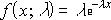
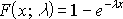

# WorksheetFunction.ExponDist Method (Excel)

Returns the exponential distribution. Use EXPONDIST to model the time between events, such as how long an automated bank teller takes to deliver cash. For example, you can use EXPONDIST to determine the probability that the process takes at most 1 minute.

 **Important**  This function has been replaced with one or more new functions that may provide improved accuracy and whose names better reflect their usage. This function is still available for compatibility with earlier versions of Excel. However, if backward compatibility is not required, you should consider using the new functions from now on, because they more accurately describe their functionality.

For more information about the new function, see the [Expon_Dist](worksheetfunction-expon_dist-method-excel.md) method.

## Syntax

 _expression_ . **ExponDist**( **_Arg1_** , **_Arg2_** , **_Arg3_** )

 _expression_ A variable that represents a **[WorksheetFunction](worksheetfunction-object-excel.md)** object.

### Parameters

|**Name**|**Required/Optional**|**Data Type**|**Description**|
|:-----|:-----|:-----|:-----|
| _Arg1_|Required| **Double**|X - the value of the function.|
| _Arg2_|Required| **Double**|Lambda - the parameter value.|
| _Arg3_|Required| **Boolean**|Cumulative - a logical value that indicates which form of the exponential function to provide. If cumulative is TRUE, EXPONDIST returns the cumulative distribution function; if FALSE, it returns the probability density function.|

### Return Value

Double

## Remarks

- If x or lambda is nonnumeric, EXPONDIST returns the #VALUE! error value.
    
- If x < 0, EXPONDIST returns the #NUM! error value.
    
- If lambda ? 0, EXPONDIST returns the #NUM! error value.
    
- The equation for the probability density function is:

    
- The equation for the cumulative distribution function is:

    

## See also

#### Concepts

[WorksheetFunction Object](worksheetfunction-object-excel.md)

