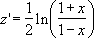

# WorksheetFunction.Fisher Method (Excel)

Returns the Fisher transformation at x. This transformation produces a function that is normally distributed rather than skewed. Use this function to perform hypothesis testing on the correlation coefficient.

## Syntax

 _expression_ . **Fisher**( **_Arg1_** )

 _expression_ A variable that represents a **WorksheetFunction** object.

### Parameters

|**Name**|**Required/Optional**|**Data Type**|**Description**|
|:-----|:-----|:-----|:-----|
| _Arg1_|Required| **Double**|x - a numeric value for which you want the transformation.|

### Return Value

Double

## Remarks

- If x is nonnumeric, FISHER returns the #VALUE! error value.
    
- If x ? -1 or if x ? 1, FISHER returns the #NUM! error value.
    
- The equation for the Fisher transformation is: 

    

## See also

#### Concepts

[WorksheetFunction Object](worksheetfunction-object-excel.md)

