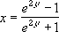

# WorksheetFunction.FisherInv Method (Excel)

Returns the inverse of the Fisher transformation. Use this transformation when analyzing correlations between ranges or arrays of data. If y = FISHER(x), then FISHERINV(y) = x.

## Syntax

 _expression_ . **FisherInv**( **_Arg1_** )

 _expression_ A variable that represents a **WorksheetFunction** object.

### Parameters

|**Name**|**Required/Optional**|**Data Type**|**Description**|
|:-----|:-----|:-----|:-----|
| _Arg1_|Required| **Double**|y - the value for which you want to perform the inverse of the transformation.|

### Return Value

Double

## Remarks

- If y is nonnumeric, FISHERINV returns the #VALUE! error value.
    
- The equation for the inverse of the Fisher transformation is: 

    

## See also

#### Concepts

[WorksheetFunction Object](worksheetfunction-object-excel.md)

