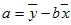

# WorksheetFunction.Forecast Method (Excel)

Calculates, or predicts, a future value by using existing values. The predicted value is a y-value for a given x-value. The known values are existing x-values and y-values, and the new value is predicted by using linear regression. You can use this function to predict future sales, inventory requirements, or consumer trends.

 **Note**  This member is deprecated in Office 2016 and later versions.

## Syntax

 _expression_ . **Forecast**( **_Arg1_** , **_Arg2_** , **_Arg3_** )

 _expression_ A variable that represents a **WorksheetFunction** object.

### Parameters

|**Name**|**Required/Optional**|**Data Type**|**Description**|
|:-----|:-----|:-----|:-----|
| _Arg1_|Required| **Double**|x - the data point for which you want to predict a value.|
| _Arg2_|Required| **Variant**|known_y's - the dependent array or range of data.|
| _Arg3_|Required| **Variant**|known_x's - the independent array or range of data.|

### Return Value

Double

## Remarks

- If x is nonnumeric, FORECAST returns the #VALUE! error value.
    
- If known_y's and known_x's are empty or contain a different number of data points, FORECAST returns the #N/A error value.
    
- If the variance of known_x's equals zero, then FORECAST returns the #DIV/0! error value.
    
- The equation for FORECAST is a+bx, where:
and: 
and where x and y are the sample means AVERAGE (known_x's) and AVERAGE(known_y's). 
    

## See also

#### Concepts

[WorksheetFunction Object](worksheetfunction-object-excel.md)

