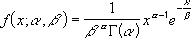

# WorksheetFunction.Gamma_Dist Method (Excel)

Returns the gamma distribution. You can use this function to study variables that may have a skewed distribution. The gamma distribution is commonly used in queuing analysis.

## Syntax

 _expression_ . **Gamma_Dist**( **_Arg1_** , **_Arg2_** , **_Arg3_** , **_Arg4_** )

 _expression_ A variable that represents a **[WorksheetFunction](worksheetfunction-object-excel.md)** object.

### Parameters

|**Name**|**Required/Optional**|**Data Type**|**Description**|
|:-----|:-----|:-----|:-----|
| _Arg1_|Required| **Double**|X - the value at which you want to evaluate the distribution.|
| _Arg2_|Required| **Double**|Alpha - a parameter to the distribution.|
| _Arg3_|Required| **Double**|Beta - a parameter to the distribution. If beta = 1, GAMMA_DIST returns the standard gamma distribution.|
| _Arg4_|Required| **Boolean**|Cumulative - a logical value that determines the form of the function. If cumulative is TRUE, GAMMA_DIST returns the cumulative distribution function; if FALSE, it returns the probability density function.|

### Return Value

Double

## Remarks

- If x, alpha, or beta is nonnumeric, GAMMA_DIST returns the #VALUE! error value.
    
- If x < 0, GAMMA_DIST returns the #NUM! error value.
    
- If alpha ? 0 or if beta ? 0, GAMMA_DIST returns the #NUM! error value.
    
- The equation for the gamma probability density function is:
The standard gamma probability density function is: 

    
- When alpha = 1, GAMMA_DIST returns the exponential distribution with:

    
- For a positive integer n, when alpha = n/2, beta = 2, and cumulative = TRUE, GAMMA_DIST returns (1 - CHIDIST(x)) with n degrees of freedom.
    
- When alpha is a positive integer, GAMMA_DIST is also known as the Erlang distribution.
    

## See also

#### Concepts

[WorksheetFunction Object](worksheetfunction-object-excel.md)

