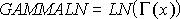
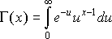

# WorksheetFunction.GammaLn_Precise Method (Excel)

Returns the natural logarithm of the gamma function, ?(x).

## Syntax

 _expression_ . **GammaLn_Precise**( **_Arg1_** )

 _expression_ A variable that represents a **[WorksheetFunction](worksheetfunction-object-excel.md)** object.

### Parameters

|**Name**|**Required/Optional**|**Data Type**|**Description**|
|:-----|:-----|:-----|:-----|
| _Arg1_|Required| **Double**|X - the value for which you want to calculate GAMMALN.|

### Return Value

Double

## Remarks

- If x is nonnumeric, the  **GammaLn_Precise** method generates an error.
    
- If x ? 0, the  **GammaLn_Precise** method generates an error.
    
- The number e raised to the GAMMALN(i) power, where i is an integer, returns the same result as (i - 1)!.
    
- GAMMALN is calculated as follows:
where: 

    

## See also

#### Concepts

[WorksheetFunction Object](worksheetfunction-object-excel.md)

