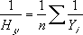

# WorksheetFunction.HarMean Method (Excel)

Returns the harmonic mean of a data set. The harmonic mean is the reciprocal of the arithmetic mean of reciprocals.

## Syntax

 _expression_ . **HarMean**( **_Arg1_** , **_Arg2_** , **_Arg3_** , **_Arg4_** , **_Arg5_** , **_Arg6_** , **_Arg7_** , **_Arg8_** , **_Arg9_** , **_Arg10_** , **_Arg11_** , **_Arg12_** , **_Arg13_** , **_Arg14_** , **_Arg15_** , **_Arg16_** , **_Arg17_** , **_Arg18_** , **_Arg19_** , **_Arg20_** , **_Arg21_** , **_Arg22_** , **_Arg23_** , **_Arg24_** , **_Arg25_** , **_Arg26_** , **_Arg27_** , **_Arg28_** , **_Arg29_** , **_Arg30_** )

 _expression_ A variable that represents a **WorksheetFunction** object.

### Parameters

|**Name**|**Required/Optional**|**Data Type**|**Description**|
|:-----|:-----|:-----|:-----|
| _Arg1 - Arg30_|Required| **Variant**|Number1, number2, ... - 1 to 30 arguments for which you want to calculate the mean. You can also use a single array or a reference to an array instead of arguments separated by commas.|

### Return Value

Double

## Remarks

- The harmonic mean is always less than the geometric mean, which is always less than the arithmetic mean.
    
- Arguments can either be numbers or names, arrays, or references that contain numbers.
    
- Logical values and text representations of numbers that you type directly into the list of arguments are counted. 
    
- If an array or reference argument contains text, logical values, or empty cells, those values are ignored; however, cells with the value zero are included.
    
- Arguments that are error values or text that cannot be translated into numbers cause errors.
    
- If any data point ? 0, HARMEAN returns the #NUM! error value.
    
- The equation for the harmonic mean is:

    

## See also

#### Concepts

[WorksheetFunction Object](worksheetfunction-object-excel.md)

