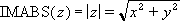

# WorksheetFunction.ImAbs Method (Excel)

Returns the absolute value (modulus) of a complex number in x + yi or x + yj text format.

## Syntax

 _expression_ . **ImAbs**( **_Arg1_** )

 _expression_ A variable that represents a **WorksheetFunction** object.

### Parameters

|**Name**|**Required/Optional**|**Data Type**|**Description**|
|:-----|:-----|:-----|:-----|
| _Arg1_|Required| **Variant**|Inumber - a complex number for which you want the absolute value.|

### Return Value

String

## Remarks

- Use COMPLEX to convert real and imaginary coefficients into a complex number.
    
- The absolute value of a complex number is:
where: z = x + yi 
    

## See also

#### Concepts

[WorksheetFunction Object](worksheetfunction-object-excel.md)

