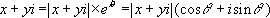
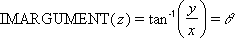

# WorksheetFunction.ImArgument Method (Excel)

Returns the argument 
 (theta), an angle expressed in radians, such that:

## Syntax

 _expression_ . **ImArgument**( **_Arg1_** )

 _expression_ A variable that represents a **WorksheetFunction** object.

### Parameters

|**Name**|**Required/Optional**|**Data Type**|**Description**|
|:-----|:-----|:-----|:-----|
| _Arg1_|Required| **Variant**|Inumber is a complex number for which you want the argument theta.|

### Return Value

String

## Remarks

- Use COMPLEX to convert real and imaginary coefficients into a complex number.
    
- IMARGUMENT is calculated as follows:
where: 
 and z = x + yi
    

## See also

#### Concepts

[WorksheetFunction Object](worksheetfunction-object-excel.md)

