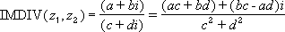

# WorksheetFunction.ImDiv Method (Excel)

Returns the quotient of two complex numbers in x + yi or x + yj text format.

## Syntax

 _expression_ . **ImDiv**( **_Arg1_** , **_Arg2_** )

 _expression_ A variable that represents a **WorksheetFunction** object.

### Parameters

|**Name**|**Required/Optional**|**Data Type**|**Description**|
|:-----|:-----|:-----|:-----|
| _Arg1_|Required| **Variant**|Inumber1 - the complex numerator or dividend.|
| _Arg2_|Required| **Variant**|Inumber2 - the complex denominator or divisor.|

### Return Value

String

## Remarks

- Use COMPLEX to convert real and imaginary coefficients into a complex number.
    
- The quotient of two complex numbers is:

    

## See also

#### Concepts

[WorksheetFunction Object](worksheetfunction-object-excel.md)

