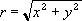

# WorksheetFunction.ImPower Method (Excel)

Returns a complex number in x + yi or x + yj text format raised to a power.

## Syntax

 _expression_ . **ImPower**( **_Arg1_** , **_Arg2_** )

 _expression_ A variable that represents a **WorksheetFunction** object.

### Parameters

|**Name**|**Required/Optional**|**Data Type**|**Description**|
|:-----|:-----|:-----|:-----|
| _Arg1_|Required| **Variant**|Inumber - a complex number you want to raise to a power.|
| _Arg2_|Required| **Variant**|Number - the power to which you want to raise the complex number.|

### Return Value

String

## Remarks

- Use COMPLEX to convert real and imaginary coefficients into a complex number.
    
- If number is nonnumeric, IMPOWER returns the #VALUE! error value.
    
- Number can be an integer, fractional, or negative.
    
- A complex number raised to a power is calculated as follows:
where: 
and: 
and: 

    

## See also

#### Concepts

[WorksheetFunction Object](worksheetfunction-object-excel.md)

