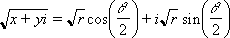

# WorksheetFunction.ImSqrt Method (Excel)

Returns the square root of a complex number in x + yi or x + yj text format.

## Syntax

 _expression_ . **ImSqrt**( **_Arg1_** )

 _expression_ A variable that represents a **WorksheetFunction** object.

### Parameters

|**Name**|**Required/Optional**|**Data Type**|**Description**|
|:-----|:-----|:-----|:-----|
| _Arg1_|Required| **Variant**|Inumber - a complex number for which you want the square root.|

### Return Value

String

## Remarks

- Use COMPLEX to convert real and imaginary coefficients into a complex number.
    
- The square root of a complex number is:
where: 
and: 
and: 

    

## See also

#### Concepts

[WorksheetFunction Object](worksheetfunction-object-excel.md)

