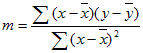
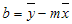

# WorksheetFunction.LinEst Method (Excel)

Calculates the statistics for a line by using the "least squares" method to calculate a straight line that best fits your data, and returns an array that describes the line. Because this function returns an array of values, it must be entered as an array formula.

## Syntax

 _expression_ . **LinEst**( **_Arg1_** , **_Arg2_** , **_Arg3_** , **_Arg4_** )

 _expression_ A variable that represents a **WorksheetFunction** object.

### Parameters

|**Name**|**Required/Optional**|**Data Type**|**Description**|
|:-----|:-----|:-----|:-----|
| _Arg1_|Required| **Variant**|Known_y's - the set of y-values you already know in the relationship y = mx + b.|
| _Arg2_|Optional| **Variant**|Known_x's - an optional set of x-values that you may already know in the relationship y = mx + b.|
| _Arg3_|Optional| **Variant**|Const - a logical value specifying whether to force the constant b to equal 0.|
| _Arg4_|Optional| **Variant**|Stats - a logical value specifying whether to return additional regression statistics.|

### Return Value

Variant

## Remarks

The equation for the line is:

y = mx + b or

y = m1x1 + m2x2 + ... + b (if there are multiple ranges of x-values)

where the dependent y-value is a function of the independent x-values. The m-values are coefficients corresponding to each x-value, and b is a constant value. Note that y, x, and m can be vectors. The array that LINEST returns is {mn,mn-1,...,m1,b}. LINEST can also return additional regression statistics.

- If the array known_y's is in a single column, then each column of known_x's is interpreted as a separate variable.
    
- If the array known_y's is in a single row, then each row of known_x's is interpreted as a separate variable.
    

- The array known_x's can include one or more sets of variables. If only one variable is used, known_y's and known_x's can be ranges of any shape, as long as they have equal dimensions. If more than one variable is used, known_y's must be a vector (that is, a range with a height of one row or a width of one column).
    
- If known_x's is omitted, it is assumed to be the array {1,2,3,...} that is the same size as known_y's.
    

- If const is TRUE or omitted, b is calculated normally.
    
- If const is FALSE, b is set equal to 0 and the m-values are adjusted to fit y = mx.
    

- If stats is TRUE, LINEST returns the additional regression statistics, so the returned array is {mn,mn-1,...,m1,b;sen,sen-1,...,se1,seb;r2,sey;F,df;ssreg,ssresid}.
    
- If stats is FALSE or omitted, LINEST returns only the m-coefficients and the constant b.
    
The additional regression statistics are as follows. 

|**Statistic**|**Description**|
|:-----|:-----|
|se1,se2,...,sen|The standard error values for the coefficients m1,m2,...,mn.|
|seb|The standard error value for the constant b (seb = #N/A when const is FALSE).|
|r2|The coefficient of determination. Compares estimated and actual y-values, and ranges in value from 0 to 1. If it is 1, there is a perfect correlation in the sample ? there is no difference between the estimated y-value and the actual y-value. At the other extreme, if the coefficient of determination is 0, the regression equation is not helpful in predicting a y-value. For information about how r2 is calculated, see "Remarks" later in this topic.|
|sey|The standard error for the y estimate.|
|F|The F statistic, or the F-observed value. Use the F statistic to determine whether the observed relationship between the dependent and independent variables occurs by chance.|
|df|The degrees of freedom. Use the degrees of freedom to help you find F-critical values in a statistical table. Compare the values you find in the table to the F statistic returned by LINEST to determine a confidence level for the model.|
|ssreg|The regression sum of squares.|
|ssresid|The residual sum of squares. For information about how ssreg and ssresid are calculated, see "Remarks" later in this topic.|
The following illustration shows the order in which the additional regression statistics are returned. 

- You can describe any straight line with the slope and the y-intercept: Slope (m):  To find the slope of a line, often written as m, take two points on the line, (x1,y1) and (x2,y2); the slope is equal to (y2 - y1)/(x2 - x1). Y-intercept (b): The y-intercept of a line, often written as b, is the value of y at the point where the line crosses the y-axis. The equation of a straight line is y = mx + b. Once you know the values of m and b, you can calculate any point on the line by plugging the y- or x-value into that equation. You can also use the TREND function.
    
- When you have only one independent x-variable, you can obtain the slope and y-intercept values directly by using the following formulas: Slope:  =INDEX(LINEST(known_y's,known_x's),1) Y-intercept: =INDEX(LINEST(known_y's,known_x's),2)
    
- The accuracy of the line calculated by LINEST depends on the degree of scatter in your data. The more linear the data, the more accurate the LINEST model. LINEST uses the method of least squares for determining the best fit for the data. When you have only one independent x-variable, the calculations for m and b are based on the following formulas:

where x and y are sample means, i.e., x = AVERAGE(known x's) and y = AVERAGE(known_y's). 
    
- The line- and curve-fitting functions LINEST and LOGEST can calculate the best straight line or exponential curve that fits your data. However, you have to decide which of the two results best fits your data. You can calculate TREND(known_y's,known_x's) for a straight line, or GROWTH(known_y's, known_x's) for an exponential curve. These functions, without the new_x's argument, return an array of y-values predicted along that line or curve at your actual data points. You can then compare the predicted values with the actual values. You may want to chart them both for a visual comparison.
    
- In regression analysis, Microsoft Excel calculates for each point the squared difference between the y-value estimated for that point and its actual y-value. The sum of these squared differences is called the residual sum of squares, ssresid. Microsoft Excel then calculates the total sum of squares, sstotal. When const = TRUE, or omitted, the total sum of squares is the sum of the squared differences between the actual y-values and the average of the y-values. When const = FALSE, the total sum of squares is the sum of the squares of the actual y-values (without subtracting the average y-value from each individual y-value). Then regression sum of squares, ssreg, can be found from: ssreg = sstotal - ssresid. The smaller the residual sum of squares is, compared with the total sum of squares, the larger the value of the coefficient of determination, r2, which is an indicator of how well the equation resulting from the regression analysis explains the relationship among the variables. r2 equals ssreg/sstotal.
    
- In some cases, one or more of the X columns (assume that Y?s and X?s are in columns) may have no additional predictive value in the presence of the other X columns. In other words, eliminating one or more X columns might lead to predicted Y values that are equally accurate. In that case these redundant X columns should be omitted from the regression model. This phenomenon is called ?collinearity? because any redundant X column can be expressed as a sum of multiples of the non-redundant X columns. LINEST checks for collinearity and removes any redundant X columns from the regression model when it identifies them. Removed X columns can be recognized in LINEST output as having 0 coefficients as well as 0 se?s. If one or more columns are removed as redundant, then df is affected because df depends on the number of X columns actually used for predictive purposes. If df is changed because redundant X columns are removed, values of sey and F are also affected. Collinearity should be relatively rare in practice. However, one case where it is more likely to arise is when some X columns contain only 0?s and 1?s as indicators of whether a subject in an experiment is or is not a member of a particular group. If const = TRUE or omitted, LINEST effectively inserts an additional X column of all 1?s to model the intercept. If you have a column with a 1 for each subject if male, or 0 if not, and you also have a column with a 1 for each subject if female, or 0 if not, this latter column is redundant because entries in it can be obtained from subtracting the entry in the ?male indicator? column from the entry in the additional column of all 1?s added by LINEST.
    
- df is calculated as follows when no X columns are removed from the model due to collinearity: if there are k columns of known_x?s and const = TRUE or omitted, then df = n ? k ? 1. If const = FALSE, then df = n - k. In both cases, each X column removed due to collinearity increases df by 1.
    
- Formulas that return arrays must be entered as array formulas.
    
- When entering an array constant such as known_x's as an argument, use commas to separate values in the same row and semicolons to separate rows. Separator characters may be different depending on your locale setting in  **Regional and Language Options** in **Control Panel**.
    
- Note that the y-values predicted by the regression equation may not be valid if they are outside the range of the y-values you used to determine the equation.
    
- The underlying algorithm used in the LINEST function is different than the underlying algorithm used in the SLOPE and INTERCEPT functions. The difference between these algorithms can lead to different results when data is undetermined and collinear. For example, if the data points of the known_y's argument are 0 and the data points of the known_x's argument are 1: 
    
      - LINEST returns a value of 0. The LINEST algorithm is designed to return reasonable results for collinear data, and in this case at least one answer can be found.
    
  - SLOPE and INTERCEPT return a #DIV/0! error. The SLOPE and INTERCEPT algorithm is designed to look for one and only one answer, and in this case there can be more than one answer.
    

## See also

#### Concepts

[WorksheetFunction Object](worksheetfunction-object-excel.md)

