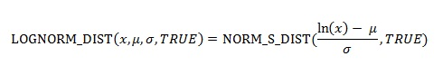

# WorksheetFunction.LogNorm_Dist Method (Excel)

Returns the lognormal distribution of x, where ln(x) is normally distributed with parameters mean and standard_dev. Use this function to analyze data that has been logarithmically transformed.

## Syntax

 _expression_ . **LogNorm_Dist**( **_Arg1_** , **_Arg2_** , **_Arg3_** )

 _expression_ A variable that represents a **[WorksheetFunction](worksheetfunction-object-excel.md)** object.

### Parameters

|**Name**|**Required/Optional**|**Data Type**|**Description**|
|:-----|:-----|:-----|:-----|
| _Arg1_|Required| **Double**|X - The value at which to evaluate the function.|
| _Arg2_|Required| **Double**|Mean - The mean of ln(x).|
| _Arg3_|Required| **Double**|Standard_dev - The standard deviation of ln(x).|
| _Arg4_|Optional| **Variant**|Cumulative - A logical value that determines the form of the function. If cumulative is TRUE, LOGNORM_DIST returns the cumulative distribution function; if FALSE, it returns the probability density function.|

### Return Value

Double

## Remarks

- If any argument is nonnumeric, LOGNORM_DIST returns the #VALUE! error value.
    
- If x ? 0 or if standard_dev ? 0, LOGNORM_DIST returns the #NUM! error value.
    
- The equation for the lognormal cumulative distribution function is:

    

## See also

#### Concepts

[WorksheetFunction Object](worksheetfunction-object-excel.md)

