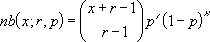

# WorksheetFunction.NegBinom_Dist Method (Excel)

Returns the negative binomial distribution. NEGBINOM_DIST returns the probability that there will be number_f failures before the number_s-th success, when the constant probability of a success is probability_s. This function is similar to the binomial distribution, except that the number of successes is fixed, and the number of trials is variable. Like the binomial, trials are assumed to be independent.

## Syntax

 _expression_ . **NegBinom_Dist**( **_Arg1_** , **_Arg2_** , **_Arg3_** )

 _expression_ A variable that represents a **[WorksheetFunction](worksheetfunction-object-excel.md)** object.

### Parameters

|**Name**|**Required/Optional**|**Data Type**|**Description**|
|:-----|:-----|:-----|:-----|
| _Arg1_|Required| **Double**|Number_f - the number of failures.|
| _Arg2_|Required| **Double**|Number_s - the threshold number of successes.|
| _Arg3_|Required| **Double**|Probability_s - the probability of a success.|
| _Arg4_|Optional| **Variant**|Cumulative - A logical value that determines the form of the function. If cumulative is TRUE, NEGBINOM_DIST returns the cumulative distribution function; if FALSE, it returns the probability density function.|

### Return Value

Double

## Remarks

For example, you need to find 10 people with excellent reflexes, and you know the probability that a candidate has these qualifications is 0.3. NEGBINOM_DIST calculates the probability that you will interview a certain number of unqualified candidates before finding all 10 qualified candidates: 

- Number_f and number_s are truncated to integers.
    
- If any argument is nonnumeric, NEGBINOM_DIST returns the #VALUE! error value.
    
- If probability_s < 0 or if probability > 1, NEGBINOM_DIST returns the #NUM! error value.
    
- If number_f < 0 or number_s < 1, NEGBINOM_DIST returns the #NUM! error value.
    
- The equation for the negative binomial distribution is:
where: x is number_f, r is number_s, and p is probability_s. 
    

## See also

#### Concepts

[WorksheetFunction Object](worksheetfunction-object-excel.md)

