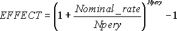

# WorksheetFunction.Nominal Method (Excel)

Returns the nominal annual interest rate, given the effective rate and the number of compounding periods per year.

## Syntax

 _expression_ . **Nominal**( **_Arg1_** , **_Arg2_** )

 _expression_ A variable that represents a **WorksheetFunction** object.

### Parameters

|**Name**|**Required/Optional**|**Data Type**|**Description**|
|:-----|:-----|:-----|:-----|
| _Arg1_|Required| **Variant**|Effect_rate - the effective interest rate.|
| _Arg2_|Required| **Variant**|Npery - the number of compounding periods per year.|

### Return Value

Double

## Remarks

- Npery is truncated to an integer.
    
- If either argument is nonnumeric, NOMINAL returns the #VALUE! error value.
    
- If effect_rate ? 0 or if npery < 1, NOMINAL returns the #NUM! error value.
    
- NOMINAL is related to EFFECT as shown in the following equation:

    

## See also

#### Concepts

[WorksheetFunction Object](worksheetfunction-object-excel.md)

