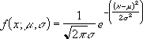

# WorksheetFunction.Norm_Dist Method (Excel)

Returns the normal distribution for the specified mean and standard deviation. This function has a wide range of applications in statistics, including hypothesis testing.

## Syntax

 _expression_ . **Norm_Dist**( **_Arg1_** , **_Arg2_** , **_Arg3_** , **_Arg4_** )

 _expression_ A variable that represents a **[WorksheetFunction](worksheetfunction-object-excel.md)** object.

### Parameters

|**Name**|**Required/Optional**|**Data Type**|**Description**|
|:-----|:-----|:-----|:-----|
| _Arg1_|Required| **Double**|X - The value for which you want the distribution.|
| _Arg2_|Required| **Double**|Mean - The arithmetic mean of the distribution.|
| _Arg3_|Required| **Double**|Standard_dev - The standard deviation of the distribution.|
| _Arg4_|Required| **Boolean**|Cumulative - A logical value that determines the form of the function. If cumulative is TRUE, NORM_DIST returns the cumulative distribution function; if FALSE, it returns the probability mass function.|

### Return Value

Double

## Remarks

- If mean or standard_dev is nonnumeric, NORM_DIST returns the #VALUE! error value.
    
- If standard_dev ? 0, NORM_DIST returns the #NUM! error value.
    
- If mean = 0, standard_dev = 1, and cumulative = TRUE, NORM_DIST returns the standard normal distribution, NORM_S_DIST.
    
- The equation for the normal density function (cumulative = FALSE) is:

    
- When cumulative = TRUE, the formula is the integral from negative infinity to x of the given formula. 
    

## See also

#### Concepts

[WorksheetFunction Object](worksheetfunction-object-excel.md)

