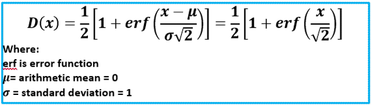

# WorksheetFunction.NormSDist Method (Excel)

Returns the standard normal cumulative distribution function. The distribution has a mean of 0 (zero) and a standard deviation of one. Use this function in place of a table of standard normal curve areas.

 **Important**  This function has been replaced with one or more new functions that may provide improved accuracy and whose names better reflect their usage. This function is still available for compatibility with earlier versions of Excel. However, if backward compatibility is not required, you should consider using the new functions from now on, because they more accurately describe their functionality.

For more information about the new function, see the [Norm_S_Dist](worksheetfunction-norm_s_dist-method-excel.md) method.

## Syntax

 _expression_ . **NormSDist**( **_Arg1_** )

 _expression_ A variable that represents a **[WorksheetFunction](worksheetfunction-object-excel.md)** object.

### Parameters

|**Name**|**Required/Optional**|**Data Type**|**Description**|
|:-----|:-----|:-----|:-----|
| _Arg1_|Required| **Double**|Z - the value for which you want the distribution.|

### Return Value

Double

## Remarks

- If z is nonnumeric, NORMSDIST returns the #VALUE! error value.
    
- The equation for the standard normal cumulative distribution function is: 
    
    

    

## See also

#### Concepts

[WorksheetFunction Object](worksheetfunction-object-excel.md)

