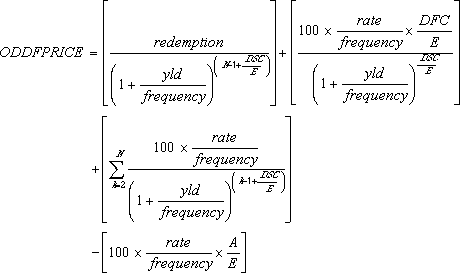
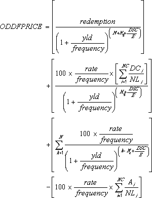

# WorksheetFunction.OddFPrice Method (Excel)

Returns the price per $100 face value of a security having an odd (short or long) first period.

## Syntax

 _expression_ . **OddFPrice**( **_Arg1_** , **_Arg2_** , **_Arg3_** , **_Arg4_** , **_Arg5_** , **_Arg6_** , **_Arg7_** , **_Arg8_** , **_Arg9_** )

 _expression_ A variable that represents a **WorksheetFunction** object.

### Parameters

|**Name**|**Required/Optional**|**Data Type**|**Description**|
|:-----|:-----|:-----|:-----|
| _Arg1_|Required| **Variant**|Settlement - the security's settlement date. The security settlement date is the date after the issue date when the security is traded to the buyer.|
| _Arg2_|Required| **Variant**|Maturity - the security's maturity date. The maturity date is the date when the security expires.|
| _Arg3_|Required| **Variant**|Issue - the security's issue date.|
| _Arg4_|Required| **Variant**|First_coupon - the security's first coupon date.|
| _Arg5_|Required| **Variant**|Rate - the security's interest rate.|
| _Arg6_|Required| **Variant**|Yld - the security's annual yield.|
| _Arg7_|Required| **Variant**|Redemption - the security's redemption value per $100 face value.|
| _Arg8_|Required| **Variant**|Frequency - the number of coupon payments per year. For annual payments, frequency = 1; for semiannual, frequency = 2; for quarterly, frequency = 4.|
| _Arg9_|Optional| **Variant**|Basis - the type of day count basis to use.|

### Return Value

Double

## Remarks

|**Basis**|**Day count basis**|
|:-----|:-----|
|0 or omitted|US (NASD) 30/360|
|1|Actual/actual|
|2|Actual/360|
|3|Actual/365|
|4|European 30/360|

- Microsoft Excel stores dates as sequential serial numbers so they can be used in calculations. By default, January 1, 1900 is serial number 1, and January 1, 2008 is serial number 39448 because it is 39,448 days after January 1, 1900. Microsoft Excel for the Macintosh uses a different date system as its default.
    
     **Note**  Visual Basic for Applications (VBA) calculates serial dates differently than Excel. In VBA, serial number 1 is December 31, 1899, rather than January 1, 1900. 
- The settlement date is the date a buyer purchases a coupon, such as a bond. The maturity date is the date when a coupon expires. For example, suppose a 30-year bond is issued on January 1, 2008, and is purchased by a buyer six months later. The issue date would be January 1, 2008, the settlement date would be July 1, 2008, and the maturity date would be January 1, 2038, which is 30 years after the January 1, 2008, issue date.
    
- Settlement, maturity, issue, first_coupon, and basis are truncated to integers.
    
- If settlement, maturity, issue, or first_coupon is not a valid date, ODDFPRICE returns the #VALUE! error value.
    
- If rate < 0 or if yld < 0, ODDFPRICE returns the #NUM! error value.
    
- If basis < 0 or if basis > 4, ODDFPRICE returns the #NUM! error value.
    
- The following date condition must be satisfied; otherwise, ODDFPRICE returns the #NUM! error value: maturity > first_coupon > settlement > issue 
    
- ODDFPRICE is calculated as follows: Odd short first coupon: 
where: A = number of days from the beginning of the coupon period to the settlement date (accrued days). DSC = number of days from the settlement to the next coupon date. DFC = number of days from the beginning of the odd first coupon to the first coupon date. E = number of days in the coupon period. N = number of coupons payable between the settlement date and the redemption date. (If this number contains a fraction, it is raised to the next whole number.) Odd long first coupon: 
where: Ai = number of days from the beginning of the ith, or last, quasi-coupon period within odd period. DCi = number of days from dated date (or issue date) to first quasi-coupon (i = 1) or number of days in quasi-coupon (i = 2,..., i = NC). DSC = number of days from settlement to next coupon date. E = number of days in coupon period. N = number of coupons payable between the first real coupon date and redemption date. (If this number contains a fraction, it is raised to the next whole number.) NC = number of quasi-coupon periods that fit in odd period. (If this number contains a fraction, it is raised to the next whole number.) NLi = normal length in days of the full ith, or last, quasi-coupon period within odd period. Nq = number of whole quasi-coupon periods between settlement date and first coupon. 
    

## See also

#### Concepts

[WorksheetFunction Object](worksheetfunction-object-excel.md)

