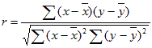

# WorksheetFunction.Pearson Method (Excel)

Returns the Pearson product moment correlation coefficient, r, a dimensionless index that ranges from -1.0 to 1.0 inclusive and reflects the extent of a linear relationship between two data sets.

## Syntax

 _expression_ . **Pearson**( **_Arg1_** , **_Arg2_** )

 _expression_ A variable that represents a **WorksheetFunction** object.

### Parameters

|**Name**|**Required/Optional**|**Data Type**|**Description**|
|:-----|:-----|:-----|:-----|
| _Arg1_|Required| **Variant**|Array1 - a set of independent values.|
| _Arg2_|Required| **Variant**|Array2 - a set of dependent values.|

### Return Value

Double

## Remarks

- The arguments must be either numbers or names, array constants, or references that contain numbers.
    
- If an array or reference argument contains text, logical values, or empty cells, those values are ignored; however, cells with the value zero are included.
    
- If array1 and array2 are empty or have a different number of data points, PEARSON returns the #N/A error value.
    
- The formula for the Pearson product moment correlation coefficient, r, is:
where x and y are the sample means AVERAGE(array1) and AVERAGE(array2). 
    

## See also

#### Concepts

[WorksheetFunction Object](worksheetfunction-object-excel.md)

