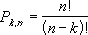

# WorksheetFunction.Permut Method (Excel)

Returns the number of permutations for a given number of objects that can be selected from number objects. A permutation is any set or subset of objects or events where internal order is significant. Permutations are different from combinations, for which the internal order is not significant. Use this function for lottery-style probability calculations.

## Syntax

 _expression_ . **Permut**( **_Arg1_** , **_Arg2_** )

 _expression_ A variable that represents a **WorksheetFunction** object.

### Parameters

|**Name**|**Required/Optional**|**Data Type**|**Description**|
|:-----|:-----|:-----|:-----|
| _Arg1_|Required| **Double**|Number - an integer that describes the number of objects.|
| _Arg2_|Required| **Double**|Number_chosen - an integer that describes the number of objects in each permutation.|

### Return Value

Double

## Remarks

- Both arguments are truncated to integers.
    
- If number or number_chosen is nonnumeric, PERMUT returns the #VALUE! error value.
    
- If number ? 0 or if number_chosen < 0, PERMUT returns the #NUM! error value.
    
- If number < number_chosen, PERMUT returns the #NUM! error value.
    
- The equation for the number of permutations is:

    

## See also

#### Concepts

[WorksheetFunction Object](worksheetfunction-object-excel.md)

