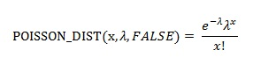
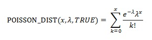

# WorksheetFunction.Poisson_Dist Method (Excel)

Returns the Poisson distribution. A common application of the Poisson distribution is predicting the number of events over a specific time, such as the number of cars arriving at a toll plaza in one minute.

## Syntax

 _expression_ . **Poisson_Dist**( **_Arg1_** , **_Arg2_** , **_Arg3_** )

 _expression_ A variable that represents a **[WorksheetFunction](worksheetfunction-object-excel.md)** object.

### Parameters

|**Name**|**Required/Optional**|**Data Type**|**Description**|
|:-----|:-----|:-----|:-----|
| _Arg1_|Required| **Double**|X - The number of events.|
| _Arg2_|Required| **Double**|Mean - The expected numeric value.|
| _Arg3_|Required| **Boolean**|Cumulative - A logical value that determines the form of the probability distribution returned. If cumulative is TRUE, POISSON_DIST returns the cumulative Poisson probability that the number of random events occurring will be between 0 (zero) and x inclusive; if FALSE, it returns the Poisson probability mass function that the number of events occurring will be exactly x.|

### Return Value

Double

## Remarks

- If x is not an integer, it is truncated.
    
- If x or mean is nonnumeric, POISSON_DIST returns the #VALUE! error value.
    
- If x < 0, POISSON_DIST returns the #NUM! error value.
    
- If mean ? 0, POISSON_DIST returns the #NUM! error value.
    
- POISSON_DIST is calculated as follows. For cumulative = FALSE: 
For cumulative = TRUE: 

    

## See also

#### Concepts

[WorksheetFunction Object](worksheetfunction-object-excel.md)

