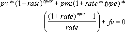

# WorksheetFunction.Pv Method (Excel)

Returns the present value of an investment. The present value is the total amount that a series of future payments is worth now. For example, when you borrow money, the loan amount is the present value to the lender.

## Syntax

 _expression_ . **Pv**( **_Arg1_** , **_Arg2_** , **_Arg3_** , **_Arg4_** , **_Arg5_** )

 _expression_ A variable that represents a **WorksheetFunction** object.

### Parameters

|**Name**|**Required/Optional**|**Data Type**|**Description**|
|:-----|:-----|:-----|:-----|
| _Arg1_|Required| **Double**|Rate - the interest rate per period. For example, if you obtain an automobile loan at a 10 percent annual interest rate and make monthly payments, your interest rate per month is 10%/12, or 0.83%. You would enter 10%/12, or 0.83%, or 0.0083, into the formula as the rate.|
| _Arg2_|Required| **Double**|Nper - the total number of payment periods in an annuity. For example, if you get a four-year car loan and make monthly payments, your loan has 4*12 (or 48) periods. You would enter 48 into the formula for nper.|
| _Arg3_|Required| **Double**|Pmt - the payment made each period and cannot change over the life of the annuity. Typically, pmt includes principal and interest but no other fees or taxes. For example, the monthly payments on a $10,000, four-year car loan at 12 percent are $263.33. You would enter -263.33 into the formula as the pmt. If pmt is omitted, you must include the fv argument.|
| _Arg4_|Optional| **Variant**|Fv - the future value, or a cash balance you want to attain after the last payment is made. If fv is omitted, it is assumed to be 0 (the future value of a loan, for example, is 0). For example, if you want to save $50,000 to pay for a special project in 18 years, then $50,000 is the future value. You could then make a conservative guess at an interest rate and determine how much you must save each month. If fv is omitted, you must include the pmt argument.|
| _Arg5_|Optional| **Variant**|Type - the number 0 or 1 and indicates when payments are due.|

### Return Value

Double

## Remarks

|**Set type equal to**|**If payments are due**|
|:-----|:-----|
|0 or omitted|At the end of the period|
|1|At the beginning of the period|

- Make sure that you are consistent about the units you use for specifying rate and nper. If you make monthly payments on a four-year loan at 12 percent annual interest, use 12%/12 for rate and 4*12 for nper. If you make annual payments on the same loan, use 12% for rate and 4 for nper.
    
- The following functions apply to annuities: An annuity is a series of constant cash payments made over a continuous period. For example, a car loan or a mortgage is an annuity. For more information, see the description for each annuity function.
    

|CUMIPMT|PPMT|
|CUMPRINC|PV|
|FV|RATE|
|FVSCHEDULE|XIRR|
|IPMT|XNPV|
|PMT||
- In annuity functions, cash you pay out, such as a deposit to savings, is represented by a negative number; cash you receive, such as a dividend check, is represented by a positive number. For example, a $1,000 deposit to the bank would be represented by the argument -1000 if you are the depositor and by the argument 1000 if you are the bank.
    
- Microsoft Excel solves for one financial argument in terms of the others. If rate is not 0, then:
If rate is 0, then: (pmt * nper) + pv + fv = 0 
    

## See also

#### Concepts

[WorksheetFunction Object](worksheetfunction-object-excel.md)

