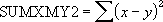

# WorksheetFunction.SumXMY2 Method (Excel)

Returns the sum of squares of differences of corresponding values in two arrays.

## Syntax

 _expression_ . **SumXMY2**( **_Arg1_** , **_Arg2_** )

 _expression_ A variable that represents a **WorksheetFunction** object.

### Parameters

|**Name**|**Required/Optional**|**Data Type**|**Description**|
|:-----|:-----|:-----|:-----|
| _Arg1_|Required| **Variant**|Array_x - the first array or range of values.|
| _Arg2_|Required| **Variant**|Array_y - the second array or range of values.|

### Return Value

Double

## Remarks

- The arguments should be either numbers or names, arrays, or references that contain numbers.
    
- If an array or reference argument contains text, logical values, or empty cells, those values are ignored; however, cells with the value zero are included.
    
- If array_x and array_y have a different number of dimensions, SUMXMY2 returns the #N/A error value.
    
- The equation for the sum of squared differences is:

    

## See also

#### Concepts

[WorksheetFunction Object](worksheetfunction-object-excel.md)

