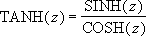

# WorksheetFunction.Tanh Method (Excel)

Returns the hyperbolic tangent of a number.

## Syntax

 _expression_ . **Tanh**( **_Arg1_** )

 _expression_ A variable that represents a **WorksheetFunction** object.

### Parameters

|**Name**|**Required/Optional**|**Data Type**|**Description**|
|:-----|:-----|:-----|:-----|
| _Arg1_|Required| **Double**|Number - any real number.|

### Return Value

Double

## Remarks

The formula for the hyperbolic tangent is: 

## See also

#### Concepts

[WorksheetFunction Object](worksheetfunction-object-excel.md)

