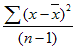

# WorksheetFunction.Var_S Method (Excel)

Estimates variance based on a sample.

## Syntax

 _expression_ . **Var_S**( **_Arg1_** , **_Arg2_** , **_Arg3_** , **_Arg4_** , **_Arg5_** , **_Arg6_** , **_Arg7_** , **_Arg8_** , **_Arg9_** , **_Arg10_** , **_Arg11_** , **_Arg12_** , **_Arg13_** , **_Arg14_** , **_Arg15_** , **_Arg16_** , **_Arg17_** , **_Arg18_** , **_Arg19_** , **_Arg20_** , **_Arg21_** , **_Arg22_** , **_Arg23_** , **_Arg24_** , **_Arg25_** , **_Arg26_** , **_Arg27_** , **_Arg28_** , **_Arg29_** , **_Arg30_** )

 _expression_ A variable that represents a **[WorksheetFunction](worksheetfunction-object-excel.md)** object.

### Parameters

|**Name**|**Required/Optional**|**Data Type**|**Description**|
|:-----|:-----|:-----|:-----|
| _Arg1 - Arg30_|Required| **Variant**|Number1, number2, ... - 1 to 30 number arguments corresponding to a sample of a population.|

### Return Value

Double

## Remarks

- VAR_S assumes that its arguments are a sample of the population. If your data represents the entire population, then compute the variance by using VAR_P.
    
- Arguments can either be numbers or names, arrays, or references that contain numbers.
    
- Logical values and text representations of numbers that you type directly into the list of arguments are counted.
    
- If an argument is an array or reference, only numbers in that array or reference are counted. Empty cells, logical values, text, or error values in the array or reference are ignored.
    
- Arguments that are error values or text that cannot be translated into numbers cause errors.
    
- VAR_S uses the following formula:
where x is the sample mean AVERAGE(number1,number2,?) and n is the sample size. 
    

## See also

#### Concepts

[WorksheetFunction Object](worksheetfunction-object-excel.md)

