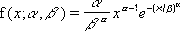
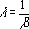

# WorksheetFunction.Weibull_Dist Method (Excel)

Returns the Weibull distribution. Use this distribution in reliability analysis, such as calculating the mean time to failure for a device.

## Syntax

 _expression_ . **Weibull_Dist**( **_Arg1_** , **_Arg2_** , **_Arg3_** , **_Arg4_** )

 _expression_ A variable that represents a **[WorksheetFunction](worksheetfunction-object-excel.md)** object.

### Parameters

|**Name**|**Required/Optional**|**Data Type**|**Description**|
|:-----|:-----|:-----|:-----|
| _Arg1_|Required| **Double**|X - The value at which to evaluate the function.|
| _Arg2_|Required| **Double**|Alpha - A parameter to the distribution.|
| _Arg3_|Required| **Double**|Beta - A parameter to the distribution.|
| _Arg4_|Required| **Boolean**|Cumulative - Determines the form of the function.|

### Return Value

Double

## Remarks

- If x, alpha, or beta is non-numeric, WEIBULL_DIST returns the #VALUE! error value.
    
- If x < 0, WEIBULL_DIST returns the #NUM! error value.
    
- If alpha ? 0 or if beta ? 0, WEIBULL_DIST returns the #NUM! error value.
    
- The equation for the Weibull cumulative distribution function is:

    
- The equation for the Weibull probability density function is:

    
- When alpha = 1, WEIBULL_DIST returns the exponential distribution with:

    

## See also

#### Concepts

[WorksheetFunction Object](worksheetfunction-object-excel.md)

