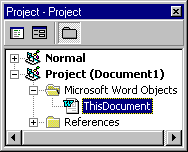

# Project Explorer

Displays a hierarchical list of the projects and all of the items contained in and referenced by each of the projects.

## Window Elements

 **View Code**

Displays the  **Code** window so you can write and edit code associated with the selected item.

 **View Object**

Displays the  **Object** window for the selected item, an existing[Document](b8bdf64f-5920-1ae9-16d0-b26d09524a30.md) or UserForm.

 **Toggle Folders**

Hides and shows the object folders while still showing the individual items contained within them.

 **List window**

Lists the all loaded projects and the items included in each project.

- Project.
    
    
The project and items contained within it.
    
    
    
      - UserForms
 All .frm files associated with the project.
    
  - Document The document associated with the project. For example, in Microsoft Word, it is the Word document.
    
  - Modules
 All .bas modules for the project.
    
  - Class Modules
 All .cls files for the project.
    
  - ActiveX Designers
 All designers, .dsr files, in the project.
    
  - References
 References to other projects that you have set using the **References** command on the **Tools** menu.
    

    
    

