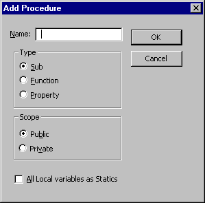

# Add Procedure Dialog Box

Inserts a new [Sub](vbe-glossary.md), [Function](vbe-glossary.md), or  **Property** procedure. The **Add** **Procedure** dialog box also allows you to set the[scope](vbe-glossary.md) to public or private, and make all local variables in the procedure static.

## Dialog Box Options

 **Name**

Lists a name for the new procedure.

 **Type**

Identifies the type of procedure to create.

- Sub — Creates a new  **Sub** procedure.
    
- Function — Creates a new  **Function** procedure.
    
- Property — Creates a new  **Let** property and **Get** property procedure pair.
    

 **Scope**

Sets the procedure's scope to either  **Public** or **Private**.

 **All Local Variables as Statics**

Adds the  **Static** keyword to the procedure definition.

 **OK**

Inserts the procedure template in the  **Code** window.

 **Cancel**

Closes the dialog box without inserting a new procedure.

