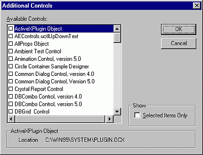

# Additional Controls Dialog Box

Allows you add controls to your project's  **Toolbox**.

## Dialog Box Options

 **Available Controls**

Displays the available custom controls.

 **Note**  You cannot remove a control that is used in your project.

 **Show**

Determines which items are listed in the Available Controls list. You can select any or all of the following options.

- Selected Items Only — Displays only those items in the Available Controls list which you have selected to include in the project.
    

 **Path**

Displays the path of the item selected in the Available Controls list.

