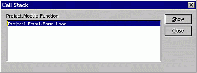

# Call Stack Dialog Box

Displays a list of currently active procedure calls during [break mode](vbe-glossary.md). When executing code in a procedure, that procedure is added to a list of active procedure calls. Each time a procedure calls another procedure, it is added to the list. Called procedures are removed from the list when execution returns to the calling procedure. Procedures called from the  **Immediate** window are also added to the calls list.

## Dialog Box Options

 **Project Module Function**

Lists the procedures.

 **Show**

Moves the insertion point to the location where the call was made and turns on the Call Stack indicator, 
.

